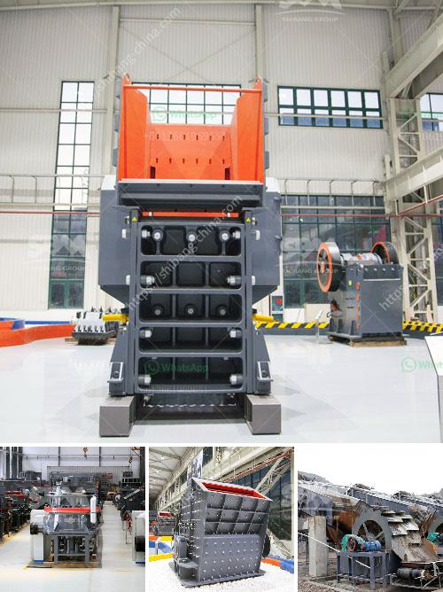

<h3>مصنع مطاحن الأسمنت بسعة 100 طن يومياً</h3>
تعتبر صناعة الأسمنت من الصناعات الهامة في العالم، حيث تشهد الحضارات تطورًا مستدامًا في البنية التحتية والمباني. يعتبر مصنع مطاحن الأسمنت بسعة 100 طن يوميًا أحد الوحدات الصناعية التي تلعب دورًا حاسمًا في تلبية الطلب المتزايد على الأسمنت في العالم.

يعد المصنع عبارة عن وحدة إنتاج تستخدم لطحن الكلنكر الأسمنتي، وهو المادة الخام الرئيسية لإنتاج الأسمنت، إلى مسحوق ناعم يسمى الإسمنت النهائي. تتوفر في المصنع معدات حديثة وتكنولوجيا متطورة للمساعدة في تحقيق هذا الهدف.

تتكون عملية تصنيع الأسمنت من عدة مراحل، حيث يتم سحق وطحن الكلنكر الأسمنتي مع مواد إضافية مثل الجبس والحجر الجيري لتنظيم معدل التصلب وخواص الأسمنت النهائي. يتم التحكم في نسب المكونات ودرجة الطحن بشكل مستمر ودقيق، مما يساهم في إنتاج أسمنت ذي جودة عالية وخصائص محددة.

لا يقتصر دور المصنع على إنتاج الأسمنت فقط، بل يشمل أيضًا الجوانب البيئية والاقتصادية. فيما يتعلق بالبيئة، يتم اتخاذ تدابير للحد من انبعاثات ثاني أكسيد الكربون والغازات السامة الأخرى في مراحل الإنتاج. على سبيل المثال، يمكن استخدام نظام الفلترة وأجهزة الفصل الهوائية لتقليل انبعاثات الغبار والهالة الزرقاء.

من ناحية الجوانب الاقتصادية، يوفر المصنع فرص عمل للعديد من العاملين ويسهم في تنمية المجتمع المحلي. بالإضافة إلى ذلك، يعمل المصنع على توفير الأسمنت بأسعار معقولة للبنية التحتية والمشاريع الإنشائية المختلفة.

باختصار، مصنع مطاحن الأسمنت بسعة 100 طن يوميًا يعتبر وحدة صناعية حيوية لتلبية الطلب المتزايد على الأسمنت في العالم. إنه يعزز التنمية الاقتصادية ويلعب دورًا بارزًا في بناء البنية التحتية المستدامة. كما يركز على المسائل البيئية ويكافح للحد من انبعاثات الغازات السامة، مما يساهم في الحفاظ على البيئة النظيفة والصحية.
<h3>Contact us</h3><ul><li><strong>Whatsapp:&nbsp;<a href="https://wa.me/8613661969651">+8613661969651</a></strong></li><li><a href="https://swt.shibang-china.com/?git&amp;zhl&amp;مصنع مطاحن الأسمنت بسعة 100 طن يومياً"><strong>Online Service(chat now)</strong></a></li></ul><h3>Related</h3><ul><li><a href='تصميم مصنع تكسير وتخطيطه.md'>تصميم مصنع تكسير وتخطيطه</a></li><li><a href='مصنع كسارة الصخور بسعة 150 طن.md'>مصنع كسارة الصخور بسعة 150 طن</a></li><li><a href='مصنعين للكسارات المتنقلة.md'>مصنعين للكسارات المتنقلة</a></li><li><a href='شركات أعمال الحجر في عمان.md'>شركات أعمال الحجر في عمان</a></li><li><a href='مطرقة إندونيسيا للبيع.md'>مطرقة إندونيسيا للبيع</a></li></ul>