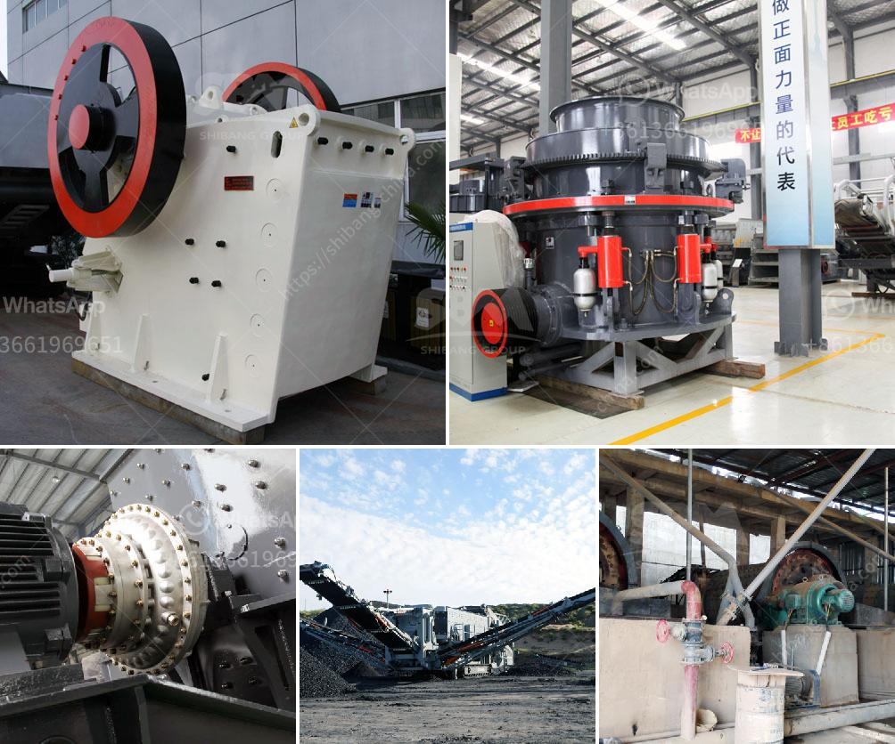

<h3>مصنع مطحنة الكرة في باكستان</h3>
تعد مطحنة الكرة واحدة من أهم المصانع الصناعية في باكستان. تستخدم هذه المطاحن لطحن العديد من المواد الخام والمنتجات النهائية في الصناعات المختلفة مثل صناعة الأسمنت والسيراميك والمعادن والكيماويات.

تعتبر مطحنة الكرة في باكستان من المصانع الرائدة في العالم، حيث تتمتع بعدة مزايا تجعلها مرغوبة في السوق العالمية. تعتمد تقنية الطحن في هذه المطاحن على استخدام الكرات المعدنية الثقيلة الموجودة داخل الأسطوانة المدورة. وبفضل قوة الطحن العالية للكرات، يتمكن المصنع من طحن المواد الخام بفعالية وسرعة عاليتين.

بالإضافة إلى ذلك، تتميز مطاحن الكرة في باكستان بكونها مصممة بشكل مثالي لعملية الطحن. فهي تحتوي على أنبوبة طويلة وعريضة مع شبكة داخلية مثقوبة لتصفية المواد المطحونة وفصلها عن الهواء. هذا يضمن حصول المنتج النهائي على حبيبات مطحونة دقيقة ومنتظمة.

تعمل مطاحن الكرة في باكستان على تحسين كفاءة العمليات الإنتاجية في الصناعات المختلفة. فهي تقوم بتحسين جودة المنتج النهائي وتقليل الفاقد، كما تحسن أداء معدات الإنتاج بأكملها عن طريق تقليل وقت الطحن وتقليل تكلفة الصيانة.

علاوة على ذلك، فإن مطاحن الكرة في باكستان تلعب دورًا حاسمًا في دعم النمو الاقتصادي للبلاد. حيث تعمل هذه المصانع على توفير فرص العمل للعديد من العمال المهرة وتساهم في تنمية قطاع الصناعة وزيادة الإنتاجية.

وبشكل عام، يُعتبر مصنع مطحنة الكرة في باكستان من المصانع الحديثة والمتقدمة. تستخدم التكنولوجيا الحديثة والمواد الخام عالية الجودة لضمان تحقيق أفضل النتائج في عمليات الطحن. وبفضل المزايا التنافسية التي تتمتع بها، فإن هذه المطاحن تستحق الترويج والاهتمام من قبل العملاء في جميع أنحاء العالم.
<h3>Contact us</h3><ul><li><strong>Whatsapp:&nbsp;<a href="https://wa.me/8613661969651">+8613661969651</a></strong></li><li><a href="https://swt.shibang-china.com/?git&amp;zhl&amp;مصنع مطحنة الكرة في باكستان"><strong>Online Service(chat now)</strong></a></li></ul><h3>Related</h3><ul><li><a href='شركة تصنيع لطحن الكلنكر.md'>شركة تصنيع لطحن الكلنكر</a></li><li><a href='مطحنة الكرة مطرقة مطحنة مطحنة أسطوانية آلة.md'>مطحنة الكرة مطرقة مطحنة مطحنة أسطوانية آلة</a></li><li><a href='كيفية غسل الرمل للبناء.md'>كيفية غسل الرمل للبناء</a></li><li><a href='سعر مصنع التكسير.md'>سعر مصنع التكسير</a></li><li><a href='كسارة محمولة من Propel.md'>كسارة محمولة من Propel</a></li></ul>