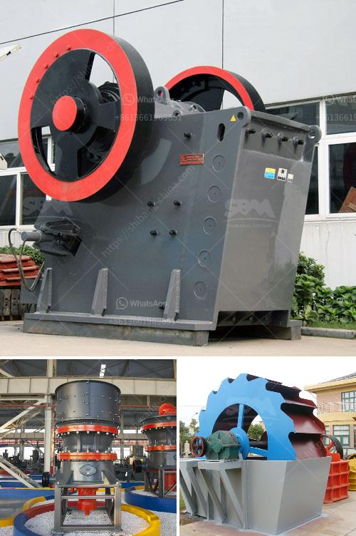

<h3>مصنع مطحنة الكرة للأسطوانة</h3>
مطحنة الكرة للأسطوانة هي جهاز يستخدم في عمليات الطحن والسحق في الصناعات التعدينية ومعالجة المواد الخام. تعتبر هذه المطاحن من أكثر الآلات استخدامًا وانتشارًا في صناعة تكسير المعادن والمواد الخام.

وتتألف مطاحن الكرة للأسطوانة عادةً من أسطوانة دوارة مع طحانات معدنية تُستخدم للسحق والطحن. يتم إدخال المواد الخام في المطحنة من خلال فتحة التغذية، ويتم تحريك الأسطوانة بسرعة دوران عالية مما يتيح للكرات المعدنية داخل المطحنة سحق المواد الخام بفعالية عالية.

تستخدم مطاحن الكرة للأسطوانة في مجموعة واسعة من التطبيقات المختلفة. تُستخدم في العديد من صناعات التعدين مثل التعدين الحديد وصناعة الأسمنت والسيراميك وصناعة الكيماويات والزجاج والميناء. تتنوع مواد الإدخال باختلاف التطبيق، ويمكن أن تكون المواد الخام قطع صخرية ضخمة أو خامات عالية الرطوبة.

من أهم المزايا التي تميز مطاحن الكرة للأسطوانة هي سرعة الطحن العالية وكفاءة السحق العالية. بفضل تصميمها الهندسي المحكم، يمكن لهذه المطاحن سحق وطحن المواد بكفاءة عالية وبأقل استهلاك للطاقة. كما تتميز بالاستخدام السهل والصيانة المريحة، مما يجعلها خيارًا مفضلاً في سلسلة الإنتاج الصناعي.

ومن الجدير بالذكر أنه على الرغم من فعالية مطاحن الكرة للأسطوانة، إلا أنه يجب الأخذ في الاعتبار بعض العيوب. فعلى سبيل المثال، قد تحتاج هذه المطاحن إلى طاقة كهربائية عالية لتعمل على السرعة اللازمة. علاوة على ذلك، يجب مراقبة درجة حرارة المطحنة بشكل دوري لتجنب حدوث مشاكل في الأداء. هذه المطاحن تتطلب أيضًا الصيانة الدورية للحفاظ على أداءها الأمثل.

في الختام، مطاحن الكرة للأسطوانة لعمليات الطحن والسحق هي أدوات أساسية في صناعة التعدين ومعالجة المواد الخام. تقدم هذه المطاحن فعالية وكفاءة عالية في طحن المواد الخام وسحقها. وعلى الرغم من بعض العيوب التي يجب مراعاتها، فإن استخدام مطاحن الكرة للأسطوانة يعد خيارًا مناسبًا لتلبية احتياجات الصناعات المعدنية والمواد الخام المختلفة.
<h3>Contact us</h3><ul><li><strong>Whatsapp:&nbsp;<a href="https://wa.me/8613661969651">+8613661969651</a></strong></li><li><a href="https://swt.shibang-china.com/?git&amp;zhl&amp;مصنع مطحنة الكرة للأسطوانة"><strong>Online Service(chat now)</strong></a></li></ul><h3>Related</h3><ul><li><a href='مصنع آلات مطحنة الكرة.md'>مصنع آلات مطحنة الكرة</a></li><li><a href='آلة طحن وتلميع الصخور.md'>آلة طحن وتلميع الصخور</a></li><li><a href='مصنع تكسير في مالي.md'>مصنع تكسير في مالي</a></li><li><a href='مطحنة المطرقة للبيع في دبي.md'>مطحنة المطرقة للبيع في دبي</a></li><li><a href='أفضل موردين كسارة الفحم في جنوب أفريقيا.md'>أفضل موردين كسارة الفحم في جنوب أفريقيا</a></li></ul>