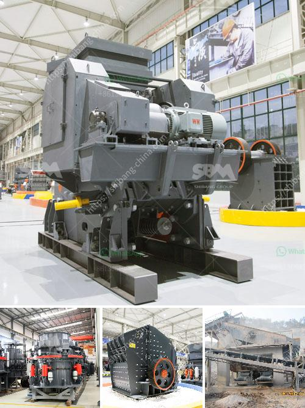

<h3>مصنع مطحنة ريموند في الهند</h3>
يعد مصنع مطحنة ريموند في الهند واحدًا من أبرز المصانع الصناعية في البلاد. يقع هذا المصنع في مدينة وركنج بجوار مومباي، وهو يعمل في صناعة طحن المواد الخام.

تأسس مصنع مطحنة ريموند في الهند منذ أكثر من قرن على يد السيد جي م ثاكرسي الذي شهد انطلاقتها في عام 1925. منذ ذلك الحين، توسع المصنع بشكل كبير وتطور ليصبح واحدًا من أكبر مصانع النسيج في العالم.

يتميز مصنع مطحنة ريموند بالتكنولوجيا الحديثة والتجهيزات العالية الجودة. يستخدم المصنع أحدث المعدات والآلات لضمان أفضل جودة للمنتجات التي ينتجها، وبالتالي يحظى بسمعة طيبة وتقدير كبير في صناعة النسيج.

تعمل مطحنة ريموند على طحن مجموعة متنوعة من المواد الخام مثل الفحم والجبس والميكا والغبار الصناعي والكاولين. تستخدم هذه المواد الخام في مجموعة متنوعة من الصناعات مثل صناعة الورق والزجاج والطلاء.

تتميز مطاحن ريموند بالكفاءة والدقة في طحن المواد الخام. تعتمد المطاحن على نظام يسمى "نظام الطحن المغلق"، وهو يعود إلى تصميمها الفريد. يضمن هذا النظام المزيج المثالي من الهواء والمواد الخام لتشكيل مسحوق ناعم وعالي الجودة.

تعتبر مطاحن ريموند أكثر الخيارات شيوعًا في عمليات الطحن الصناعية. توفر هذه المطاحن قدرة عالية لطحن المواد المختلفة بأحجام وأشكال مختلفة، وتضمن تكسيراً دقيقًا للمواد.

تُستخدم مطاحن ريموند في العديد من الصناعات مثل صناعة الأسمنت والتعدين والكيماويات. بفضل تصميمها المبتكر وفعاليتها، تعتبر مطاحن ريموند الخيار الأمثل لمصانع الصناعات المختلفة في الهند.

باختصار، يعد مصنع مطحنة ريموند في الهند واحدًا من أبرز المصانع الصناعية في البلاد. يتميز بتقديم تقنيات حديثة ومعدات عالية الجودة لصناعة طحن المواد الخام. وبفضل كفاءتها ودقتها، تستخدم مطاحن ريموند في العديد من الصناعات المختلفة، وتوفر أفضل جودة للمنتجات التي تنتجها.
<h3>Contact us</h3><ul><li><strong>Whatsapp:&nbsp;<a href="https://wa.me/8613661969651">+8613661969651</a></strong></li><li><a href="https://swt.shibang-china.com/?git&amp;zhl&amp;مصنع مطحنة ريموند في الهند"><strong>Online Service(chat now)</strong></a></li></ul><h3>Related</h3><ul><li><a href='شركة تبيع كسارة الحجر في كينيا.md'>شركة تبيع كسارة الحجر في كينيا</a></li><li><a href='كسارة مخروطية بوزولانا 100 طن في الساعة.md'>كسارة مخروطية بوزولانا 100 طن في الساعة</a></li><li><a href='كسارة حجر إيطالية.md'>كسارة حجر إيطالية</a></li><li><a href='آلات الفحم للبيع في جنوب أفريقيا.md'>آلات الفحم للبيع في جنوب أفريقيا</a></li><li><a href='مصنع غسل الذهب المحمول للبيع.md'>مصنع غسل الذهب المحمول للبيع</a></li></ul>