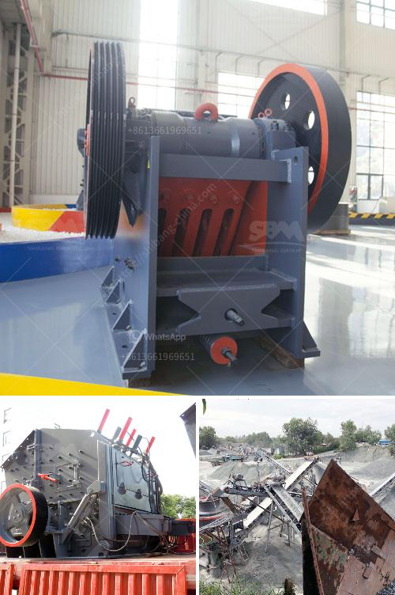

<h3>مصنع معالجة أكسيد النحاس</h3>
يعتبر مصنع معالجة أكسيد النحاس أحد أهم المصانع في صناعة النحاس. يتم تحويل خام النحاس إلى أكسيد النحاس عن طريق مجموعة من التقنيات والعمليات المتطورة. يتم استخدام هذا النوع من المصانع في عملية تكرير النحاس واستخلاص المعدن النقي بنسبة عالية.

يتضمن عملية معالجة أكسيد النحاس عدة خطوات مهمة. الخطوة الأولى هي سحق الخام بحيث يتم تفتيته إلى حجم صغير. بعد ذلك، يتم إضافة الماء إلى الخام المسحوق وتسخينه في وعاء كبير. تحتوي هذه المرحلة على مزيج من عمليات التحلية والتركيز. تهدف هذه العمليات إلى فصل النحاس عن الشوائب والمواد الأخرى.

بمجرد فصل النحاس عن الشوائب، يتم تحويله إلى أكسيد النحاس عن طريق تعريضه لحمض النتريك. هذا الأكسدة تسبب في إنتاج أكسيد النحاس الأحمر، المعروف أيضًا باسم كوبرا. يتم من ثم تحويل هذا الأكسيد إلى أكسيد النحاس الأسود عن طريق وضعه في فرن خاص تحت درجات حرارة معينة.

عملية تحويل أكسيد النحاس إلى معدن النحاس النقي تشمل استخدام أفران عالية الحرارة. يتم تسخين الأكسيد الأسود إلى درجة حرارة تفوق 1000 درجة مئوية ويتم تعريضه لأكسجين الهواء المحترق بشكل دوري لإزالة الشوائب المتبقية. في النهاية، يتم استخلاص المعدن النحاس النقي وصناعة القضبان النحاسية أو الأسلاك النحاسية وغيرها من المنتجات ذات القيمة العالية.

يتطلب مصنع معالجة أكسيد النحاس تكنولوجيا متقدمة وعملية دقيقة. يتم استخدام معدات متطورة مثل الكسارات والفرن العالي ومعدات النقل وغيرها. يلتزم هذا المصنع بتطبيق معايير الجودة العالية لضمان حصول المنتجات على المواصفات المطلوبة. كما يهتم بالحفاظ على البيئة وتنفيذ تقنيات المعالجة النظيفة لتقليل التأثير البيئي لعملية الانتاج.

يتم استخدام معالجة أكسيد النحاس في العديد من الصناعات المهمة مثل صناعة الأسلاك الكهربائية والموصلات الكهربائية والإلكترونيات. توفر هذه الصناعات منتجات ذات جودة عالية وموثوقة للاستخدام الشخصي والتجاري. بالإضافة إلى ذلك، تساهم صناعة معالجة أكسيد النحاس في تعزيز الاقتصاد المحلي من خلال توفير فرص عمل وزيادة الإنتاج والتصدير.

في الختام، يعد مصنع معالجة أكسيد النحاس مصدرًا هامًا لصناعة النحاس ومنتجاته. يستخدم تكنولوجيا متقدمة وعملية دقيقة لضمان الحصول على منتجات عالية الجودة والقيمة. كما يلتزم بالبيئة ويعمل على تحسين عملياته لتعزيز الاستدامة. إن صناعة معالجة أكسيد النحاس تساهم في تعزيز التنمية الاقتصادية وتلبية احتياجات السوق للنحاس بشكل مستدام.
<h3>Contact us</h3><ul><li><strong>Whatsapp:&nbsp;<a href="https://wa.me/8613661969651">+8613661969651</a></strong></li><li><a href="https://swt.shibang-china.com/?git&amp;zhl&amp;مصنع معالجة أكسيد النحاس"><strong>Online Service(chat now)</strong></a></li></ul><h3>Related</h3><ul><li><a href='كسارات الطوب للبيع في أستراليا.md'>كسارات الطوب للبيع في أستراليا</a></li><li><a href='سعر كسارة الطاحونة الصناعية.md'>سعر كسارة الطاحونة الصناعية</a></li><li><a href='كسارات الحجر في بوكارامانجا.md'>كسارات الحجر في بوكارامانجا</a></li><li><a href='كسارة الحجر في أوغندا.md'>كسارة الحجر في أوغندا</a></li><li><a href='طحن الحجر الجيري.md'>طحن الحجر الجيري</a></li></ul>