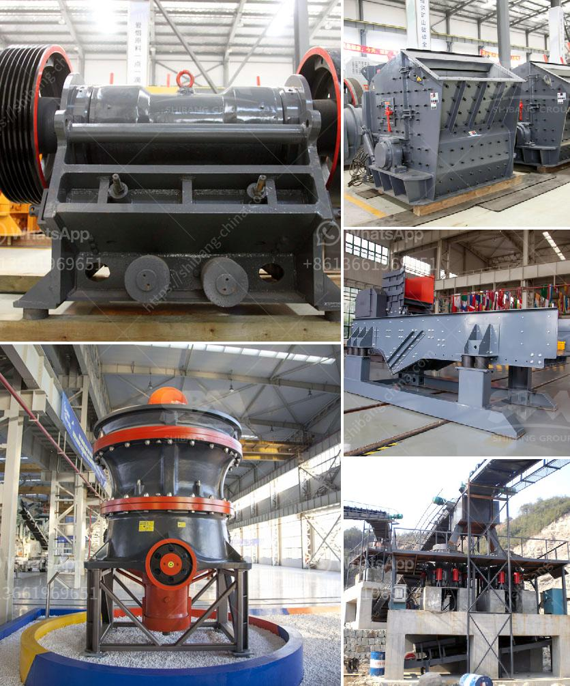

<h3>مصنع معالجة الإسمنت</h3>
تعد مصانع معالجة الإسمنت من أهم المنشآت الصناعية في قطاع البناء والتشييد. إذ يمثل الإسمنت المادة الأساسية في صناعة الخرسانة، والتي تستخدم في بناء الأبنية والجسور والطرق والمنشآت الأخرى. يعمل مصنع المعالجة على طحن ومعالجة المواد الخام لإنتاج الإسمنت النهائي.

يتكون مصنع معالجة الإسمنت عادةً من عدة أقسام ومراحل عمل مختلفة، تشمل تخزين وتجهيز المواد الخام، مرحلة الطحن، مرحلة الخلط، مرحلة الحرق، ومرحلة الطحن النهائي. يتم تخزين المواد الخام المكونة للإسمنت، مثل الحجر الجيري والطين والسيليكات، في صوامع تخزين كبيرة. بعدها، يتم نقل المواد الخام إلى مطحنة الطحن، حيث يتم طحنها إلى مسحوق دقيق.

بعد ذلك، يتم خلط المواد الخام المطحونة مع مواد إضافية مثل الجبس والرماد المتطاير، لتحسين خواص الإسمنت النهائي. يتم خلط المكونات في خلاط كبير حتى الحصول على تركيبة متجانسة. ثم يتم تشكيل الخليط إلى قوالب معينة أو أكياس للنقل.

في مرحلة الحرق، يتم تسخين الإسمنت المشكل إلى درجة حرارة عالية جدًا، تتراوح من 1400 إلى 1600 درجة مئوية. يتم تعريضه للحرارة في أفران خاصة، مما يسمح بتفاعلات كيميائية تحول المكونات الأساسية إلى مركبات الإسمنت. تُطلق هذه المرحلة الحرارة العالية على الإسمنت المشكل، مما يؤدي إلى تجانسه وتعزيز قوته وقدرته على التصاق المواد المختلفة.

في المرحلة الأخيرة، يتم طحن الإسمنت الناتج من الحرق إلى مسحوق ناعم. يستخدم طاحونة خاصة لهذا الغرض، حيث يتم تفتيت القوالب أو الأكياس الصلبة إلى جسيمات أصغر. يتم تعبئة الإسمنت النهائي في أكياس أو تخزينه في صوامع تخزين كبيرة تستخدم للتوزيع والتسويق.

يعد مصنع معالجة الإسمنت منشأة معقدة تتطلب استخدام التكنولوجيا الحديثة والمواد الخام عالية الجودة لضمان إنتاج الإسمنت النهائي بجودة عالية. كما يجب اتباع إجراءات السلامة والحفاظ على البيئة أثناء عملية الإنتاج. تلعب مصانع معالجة الإسمنت دورًا حاسمًا في تلبية احتياجات البنية التحتية وتطوير الصناعات العمرانية في المجتمعات.
<h3>Contact us</h3><ul><li><strong>Whatsapp:&nbsp;<a href="https://wa.me/8613661969651">+8613661969651</a></strong></li><li><a href="https://swt.shibang-china.com/?git&amp;zhl&amp;مصنع معالجة الإسمنت"><strong>Online Service(chat now)</strong></a></li></ul><h3>Related</h3><ul><li><a href='شراء كسارة الحجر sbm في الفلبين.md'>شراء كسارة الحجر sbm في الفلبين</a></li><li><a href='خط إنتاج طلاء الحجر.md'>خط إنتاج طلاء الحجر</a></li><li><a href='ورقة تدفق معالجة الحجر الجيري.md'>ورقة تدفق معالجة الحجر الجيري</a></li><li><a href='خط إنتاج الحجر الجيري.md'>خط إنتاج الحجر الجيري</a></li><li><a href='مورد معدات الكسارة في غانا.md'>مورد معدات الكسارة في غانا</a></li></ul>