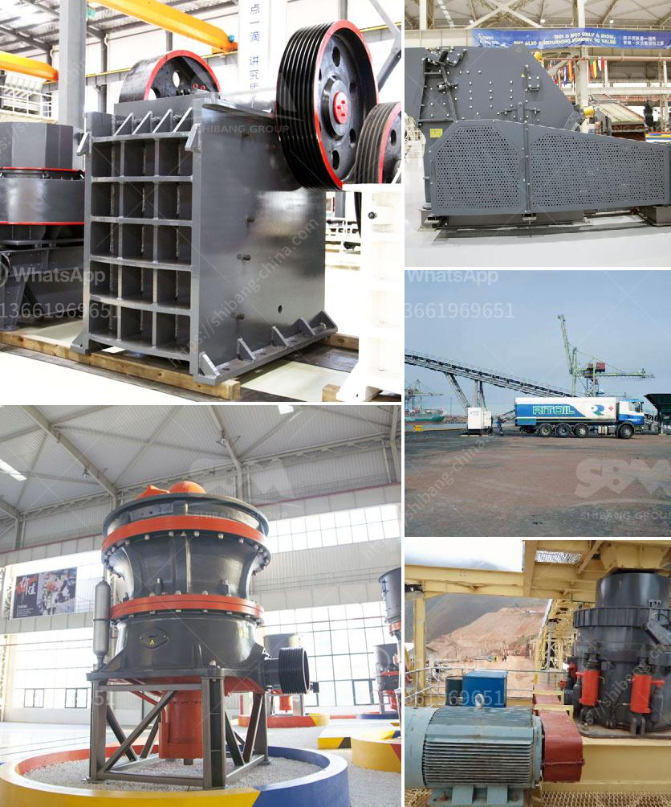

<h3>مصنع معالجة الباريت</h3>
يُعد مصنع معالجة الباريت منشأة هامة في صناعة التعدين، حيث يتم إنتاج مادة الباريت الأساسية التي تستخدم في العديد من الصناعات. يتم تصنيع ومعالجة الباريت في المصنع لتلبية متطلبات السوق وتوفير المنتجات عالية الجودة.

يبدأ عملية معالجة الباريت في المصنع عندما يتم استخراج الباريت من منجم التعدين. يتم تكسير الصخور وطحنها إلى جسيمات صغيرة باستخدام الكسارات والمطاحن، ثم يتم إزالة الشوائب عن طريق الفصل الجاذبي والتعويم، حيث يتم فصل المواد الغير مرغوب فيها من الباريت.

بعد ذلك، يتم تصنيف الباريت حسب حجم الجسيمات، حيث تتم إزالة الجسيمات الكبيرة والصغيرة غير المرغوب فيها، وتُفصل الجسيمات المثالية المطلوبة. يتم أيضًا قياس خصائص الباريت مثل الكثافة واللون والنقاوة لضمان جودة المنتج النهائي.

عملية تجفيف الباريت هي الخطوة الأخيرة في مصنع معالجة الباريت. يتم تجفيف الباريت باستخدام آلات تجفيف خاصة تساعد على إزالة الرطوبة المتبقية في المادة. يتم ضبط درجة الحرارة والوقت المناسبين للتجفيف لضمان عدم حصول أي تلف في الباريت والحفاظ على جودته.

بعد انتهاء عملية معالجة وتجفيف الباريت، يتم تعبئته وتغليفه بشكل صحيح لتوفير الحماية اللازمة وتسهيل عمليات الشحن والتخزين. تمامًا مثل غيرها من المنتجات المعدنية، يعتبر الباريت منتجًا قابلًا لإعادة التدوير، حيث يمكن إعادة استخدام المواد الناتجة عن عمليات معالجة الباريت.

في النهاية، يعتبر مصنع معالجة الباريت منشأة حاسمة في صناعة التعدين، حيث يتم إنتاج وتجهيز الباريت الأساسي. يساهم هذا المصنع في توفير المنتجات عالية الجودة وفي تلبية احتياجات السوق. كما يساهم في زيادة فرص العمل وتطوير الاقتصاد المحلي في المنطقة.
<h3>Contact us</h3><ul><li><strong>Whatsapp:&nbsp;<a href="https://wa.me/8613661969651">+8613661969651</a></strong></li><li><a href="https://swt.shibang-china.com/?git&amp;zhl&amp;مصنع معالجة الباريت"><strong>Online Service(chat now)</strong></a></li></ul><h3>Related</h3><ul><li><a href='مصنع كامل لاستخراج النحاس للبيع.md'>مصنع كامل لاستخراج النحاس للبيع</a></li><li><a href='كسارات محمولة في اليابان.md'>كسارات محمولة في اليابان</a></li><li><a href='سعر مصنع معالجة الحجر الجيري.md'>سعر مصنع معالجة الحجر الجيري</a></li><li><a href='خطة عمل تعدين الجرانيت.md'>خطة عمل تعدين الجرانيت</a></li><li><a href='آلة كسارة في الصين.md'>آلة كسارة في الصين</a></li></ul>