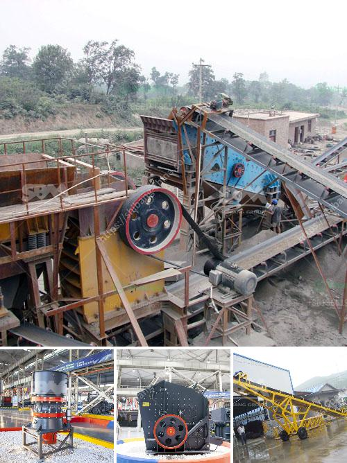

<h3>مصنع معالجة البازلت</h3>
يعتبر مصنع معالجة البازلت مثالاً حياً على التطور التكنولوجي في صناعة البناء والتشييد. البازلت هو نوع من الصخور البركانية الطبيعية التي توجد في الطبيعة وهي مادة رئيسية في صناعة البناء. فقد أثبتت الدراسات أن البازلت يمتلك خواص ممتازة مثل المتانة، والصلابة، والمقاومة للحرارة والتأثيرات البيئية.

يتم معالجة البازلت في المصنع لاستخراج منتجات بناء ذات جودة عالية واستخدامها في مختلف المشاريع العمرانية والصناعية. يعتبر معالجة البازلت أمراً ضرورياً لتطوير البنية التحتية في المدن وتعزيز جودة المشاريع المعمارية.

تشمل عمليات معالجة البازلت في المصنع العديد من الخطوات الهامة. أولاً، يتم جمع وتجهيز البازلت من موقع التعدين، حيث يتم فحص الصخور وفصل الشوائب والأتربة. بعد ذلك، يتم سحق الصخور إلى أحجام مختلفة باستخدام الكسارات والمطاحن.

يتم بعد ذلك نقل البازلت المصغر إلى مصنع المعالجة حيث يتم طحنه بعناية للحصول على القوام المطلوب. يتم خلط البازلت المطحون مع المواد اللازمة الأخرى مثل الرمل والأسمنت والماء لتكوين الخليط المناسب للبناء.

ثم يتم تشكيل البازلت المعالج إلى أشكال مختلفة بواسطة القوالب والمغازل والقوالب المعدنية. يتم تسخين الخليط وتشكيله، ويتم تهديده عن طريق مروره في آلة الضغط.

بعد ذلك، يتم تبريد الأشكال أو المنتجات وإخضاعها لعملية التجفيف. هذه العملية تساعد على إضفاء المتانة والصلابة النهائية على المنتجات المصنعة.

وأخيرًا، يتم فحص المنتجات النهائية لضمان جودتها والتأكد من توافقها مع المواصفات المطلوبة. يتم تخزين وتغليف المنتجات النهائية قبل توزيعها إلى العملاء.

يتم استخدام منتجات مصنع معالجة البازلت في العديد من المشاريع البنائية مثل الطرق والجسور والأبنية التجارية والسكنية. فالبازلت المعالج يعتبر بديلاً مستداماً وفعالًا للخرسانة التقليدية، حيث يمتلك خواصًا ميكانيكية وفيزيائية استثنائية.

باختصار، يعتبر مصنع معالجة البازلت ملحوظاً في صناعة البناء والتشييد. فإن تطبيق التكنولوجيا الحديثة في معالجة البازلت يتيح إنتاج منتجات بناء ذات جودة عالية ومتانة تستخدم في المشاريع العمرانية المختلفة. يعتبر البازلت المعالج بديلاً مستداماً للمواد التقليدية ويساهم في تطوير البنية التحتية للمدن وتعزيز الجودة العمرانية.
<h3>Contact us</h3><ul><li><strong>Whatsapp:&nbsp;<a href="https://wa.me/8613661969651">+8613661969651</a></strong></li><li><a href="https://swt.shibang-china.com/?git&amp;zhl&amp;مصنع معالجة البازلت"><strong>Online Service(chat now)</strong></a></li></ul><h3>Related</h3><ul><li><a href='أسعار مطاحن المطرقة في الرأس الشرقي.md'>أسعار مطاحن المطرقة في الرأس الشرقي</a></li><li><a href='موردين طاحونة الفحم.md'>موردين طاحونة الفحم</a></li><li><a href='مطحنة الكرة لطحن الفلسبار.md'>مطحنة الكرة لطحن الفلسبار</a></li><li><a href='مصنع معدات تعدين الرمال في جنوب أفريقيا.md'>مصنع معدات تعدين الرمال في جنوب أفريقيا</a></li><li><a href='كسارة حجر مستعملة في أونتاريو.md'>كسارة حجر مستعملة في أونتاريو</a></li></ul>