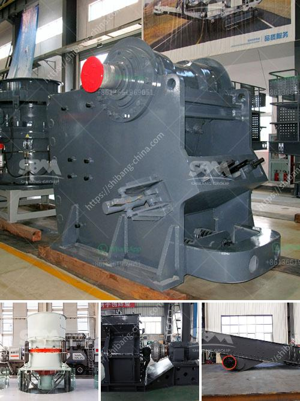

<h3>مصنع معالجة التنغستن في الهند</h3>
يعد التنغستن أحد المعادن ذات القيمة العالية والذي يستخدم في العديد من الصناعات المختلفة، بدءًا من العمليات الكيميائية وصولاً إلى صناعة الفضاء والطيران. ولتلبية احتياجات السوق المتزايدة على هذا المعدن الثمين، تأسست الهند مصنع معالجة التنغستن. يعتبر هذا المصنع من أهم المصانع بهندسة وتكنولوجيا متطورة لتعدين وتصنيع وتصدير التنغستن.

يقع مصنع معالجة التنغستن في ولاية راجاستان في الهند، حيث توجد به العديد من المناجم التي تستخرج خام التنغستن. يعتبر تنغستن الهند من أيضًا من أفضل منتجي هذا المعدن في العالم، وذلك بفضل محتواه العالي من التنغستن بالإضافة إلى جودته العالية.

يتم استخراج وتنقية خام التنغستن في المصنع باستخدام أحدث التقنيات والمعدات المتطورة. وتشمل عمليات التصنيع إزالة الشوائب والتلوث من الخام بواسطة الغسيل والفصل المغناطيسي والترشيح الرطب والتحليل الكيميائي. بحيث يتم الحصول على خام التنغستن النقي الذي يتم إدخاله في عمليات التصنيع اللاحقة.

بعد التنقية، يتم تحويل خام التنغستن النقي إلى منتجات نهائية تستخدم في الصناعات المختلفة. يتم ذلك من خلال عمليات الطحن والتجفيف والتشكيل والتلدين. وفي النهاية، يتم فحص واختبار المنتجات لضمان أعلى مستوى من الجودة والمواصفات المطلوبة.

تلعب الهند دورًا مهمًا في سوق التنغستن العالمية، حيث تصدر معظم إنتاجها إلى العديد من البلدان حول العالم. تعد تكنولوجيا المصنع الحديثة والقدرة الإنتاجية الكبيرة للمصنع أحد الأسباب الرئيسية لنجاحه في تلبية متطلبات السوق بكفاءة عالية.

في النهاية، يعتبر مصنع معالجة التنغستن في الهند مصدرًا رئيسيًا لهذا المعدن الثمين، حيث يقدم إسهامًا هامًا في تلبية احتياجات الصناعات العالمية المختلفة. كما يساهم هذا المصنع في توفير فرص عمل مهمة للمجتمع المحلي وتحسين الاقتصاد المحلي في المنطقة المحيطة به.
<h3>Contact us</h3><ul><li><strong>Whatsapp:&nbsp;<a href="https://wa.me/8613661969651">+8613661969651</a></strong></li><li><a href="https://swt.shibang-china.com/?git&amp;zhl&amp;مصنع معالجة التنغستن في الهند"><strong>Online Service(chat now)</strong></a></li></ul><h3>Related</h3><ul><li><a href='عملية تصنيع كسارة الطين المكلس.md'>عملية تصنيع كسارة الطين المكلس</a></li><li><a href='موردين لمعدات التعدين في جنوب أفريقيا.md'>موردين لمعدات التعدين في جنوب أفريقيا</a></li><li><a href='كيفية صنع مطحنة الكرة pdf.md'>كيفية صنع مطحنة الكرة pdf</a></li><li><a href='مقترح مشروع حول مصنع تكسير الحجر.md'>مقترح مشروع حول مصنع تكسير الحجر</a></li><li><a href='مصانع فحص الركام.md'>مصانع فحص الركام</a></li></ul>