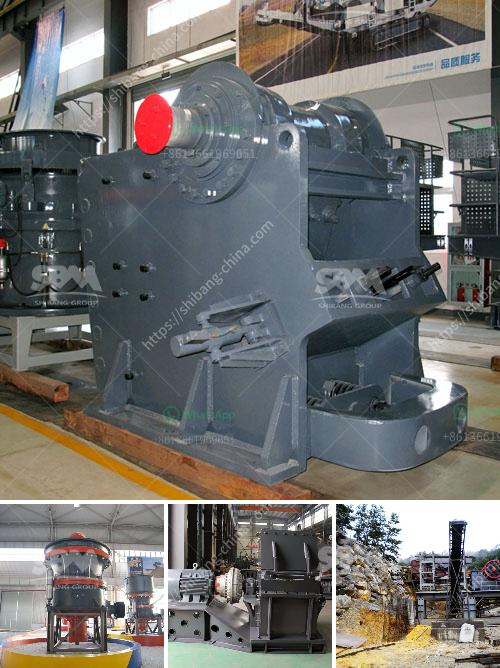

<h3>مصنع معالجة الجبس</h3>
يعتبر مصنع معالجة الجبس أحد الصناعات الهامة التي تعمل على استخلاص وتكرير الموارد الطبيعية للجبس وتحويلها إلى منتجات ذات قيمة مضافة. يتم استخدام الجبس في العديد من التطبيقات المختلفة مثل صناعة البناء والعزل والديكور، وله فوائد اقتصادية وبيئية عديدة.

يبدأ عمل مصنع معالجة الجبس بتعدين خام الجبس من المناجم. يتم استخراج الجبس عن طريق تفتيش الأرض ومراقبة الكمية ونقلها إلى المصنع. يتم تنقية الجبس وفصله عن الشوائب والأتربة والأحجار الكبيرة بعد ذلك يتم نقلها إلى مكان المعالجة الأساسي.

يتم تحويل الجبس المعدني إلى مسحوق ناعم خلال عملية الكسارة والطحن. يتم إضافة الماء إلى المسحوق لتشكيل معجون يمكن استخدامه في العديد من التطبيقات. يتم إزالة الزائد من الماء بعد ذلك.

بعدها يتم رفع المعجون إلى مجفف حيث يتم إزالة الماء المتبقي ويتم تجفيف المعجون حتى يتم الحصول على منتج نهائي بشكل صلب. يتم تحميل المنتج النهائي في حاويات للتوزيع والبيع.

يتم استخدام المنتجات المشتقة من الجبس في صناعة البناء بشكل رئيسي. يمكن استخدامها في صناعة الجص والجبس النشّاب والجبس المعدني ومحارة الجبس. إضافة إلى ذلك، يمكن استخدامها أيضًا في صناعة العزل الحراري والصوتي والديكورات الداخلية.

يعتبر مصنع معالجة الجبس مكونًا هامًا في الصناعة، حيث يوفر منتجات ذات جودة عالية ومعايير مستدامة. يتم اتباع إجراءات مشددة لضمان سلامة العاملين والحفاظ على البيئة. بالإضافة إلى ذلك، يعُتبر تدوير المخلفات وإعادة استخدامها جزءًا من عملية إنتاج الجبس المستدامة.

في الختام، يُعد مصنع معالجة الجبس منشأة حيوية تلعب دورًا حاسمًا في صناعة البناء والديكور والعزل. يوفر المصنع منتجات عالية الجودة ومواصفات مستدامة، ويعمل على توفير فرص عمل وتنمية اقتصادية في المجتمع. يجب دعم هذه الصناعة وتطويرها لتحقيق التنمية المستدامة وتلبية احتياجات السوق المتزايدة على المدى القريب والبعيد.
<h3>Contact us</h3><ul><li><strong>Whatsapp:&nbsp;<a href="https://wa.me/8613661969651">+8613661969651</a></strong></li><li><a href="https://swt.shibang-china.com/?git&amp;zhl&amp;مصنع معالجة الجبس"><strong>Online Service(chat now)</strong></a></li></ul><h3>Related</h3><ul><li><a href='مصنع كسارة الحجر التلقائي.md'>مصنع كسارة الحجر التلقائي</a></li><li><a href='مطاحن تحضير الدولوميت.md'>مطاحن تحضير الدولوميت</a></li><li><a href='تكلفة تشغيل الكسارة في لاس فيغاس.md'>تكلفة تشغيل الكسارة في لاس فيغاس</a></li><li><a href='كسارة حجرية مستعملة للبيع.md'>كسارة حجرية مستعملة للبيع</a></li><li><a href='موردين مطحنة الأسطوانة الرأسية.md'>موردين مطحنة الأسطوانة الرأسية</a></li></ul>