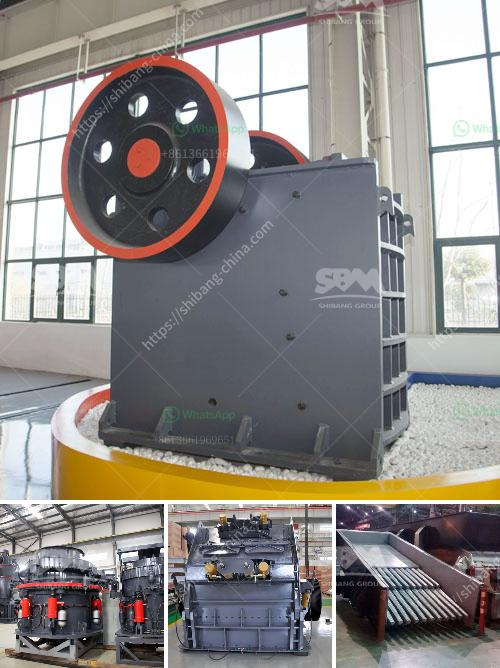

<h3>مصنع معالجة الحجر الجيري في الفلبين</h3>
تعد الفلبين واحدة من الدول الرائدة في صناعة معالجة الحجر الجيري. تعتبر هذه الصناعة أحد القطاعات الأساسية في الاقتصاد الفلبيني وتلعب دورًا هامًا في تعزيز التنمية الصناعية وتوفير الوظائف.

تتميز صناعة معالجة الحجر الجيري في الفلبين بتواجد مصانع حديثة ومتقدمة تستخدم أحدث التقنيات في عمليات التصنيع والتركيب. يتم استخدام الحجر الجيري في العديد من الصناعات مثل البناء والأسمنت والصناعات الكيماوية والزراعة والتعدين.

يعتبر مصنع معالجة الحجر الجيري في الفلبين من الروافد الرئيسية في هذه الصناعة. يقوم المصنع بتحويل الحجر الجيري إلى مختلف المنتجات المعالجة مثل البودرة الجيرية والحبيبات والصخور المكسرة. يتم استخدام هذه المنتجات في العديد من التطبيقات مثل صناعة الأسمنت وإعداد الأراضي الزراعية وإنتاج المبيدات الحشرية.

يتميز مصنع معالجة الحجر الجيري في الفلبين بوجود فريق فني متخصص ومدرب جيدًا. يقوم هذا الفريق بإجراء العديد من الاختبارات والتحاليل المتخصصة لضمان جودة المنتجات والامتثال للمعايير الدولية. يتم الاهتمام بجميع جوانب الإنتاج، بدءًا من تحليل الخام وانتهاءً بالتخزين والتوزيع.

تعتبر صناعة معالجة الحجر الجيري في الفلبين مكملًا مهمًا لصناعة البناء والتشييد في البلاد. حيث يعتبر الحجر الجيري مكونًا أساسيًا في الخرسانة والأسمنت والجبس. كما يستخدم الحجر الجيري أيضًا في تطبيقات أخرى مثل إزالة التربة الحمضية وتحسين جودة التربة الزراعية.

تساهم صناعة معالجة الحجر الجيري في الفلبين في تعزيز التنمية الاقتصادية وتوفير العديد من فرص العمل. تساهم الصناعة أيضًا في تلبية الطلب المحلي والعالمي على المنتجات المعالجة من الحجر الجيري.

في الختام، تعتبر صناعة معالجة الحجر الجيري في الفلبين من القطاعات الاقتصادية الحيوية. توجد مصانع حديثة ومتقدمة تقوم بتوفير منتجات عالية الجودة للاستخدام في العديد من الصناعات المختلفة.
<h3>Contact us</h3><ul><li><strong>Whatsapp:&nbsp;<a href="https://wa.me/8613661969651">+8613661969651</a></strong></li><li><a href="https://swt.shibang-china.com/?git&amp;zhl&amp;مصنع معالجة الحجر الجيري في الفلبين"><strong>Online Service(chat now)</strong></a></li></ul><h3>Related</h3><ul><li><a href='إنتاج الإسمنت الأبيض من مسحوق الرخام.md'>إنتاج الإسمنت الأبيض من مسحوق الرخام</a></li><li><a href='تكلفة تعدين الفحم في جنوب أفريقيا للطن الواحد.md'>تكلفة تعدين الفحم في جنوب أفريقيا للطن الواحد</a></li><li><a href='حول شركة تكسير الفحم في إثيوبيا.md'>حول شركة تكسير الفحم في إثيوبيا</a></li><li><a href='سعر معدات معالجة المنغنيز.md'>سعر معدات معالجة المنغنيز</a></li><li><a href='المعدات المطلوبة لعمل محجر الجرانيت.md'>المعدات المطلوبة لعمل محجر الجرانيت</a></li></ul>