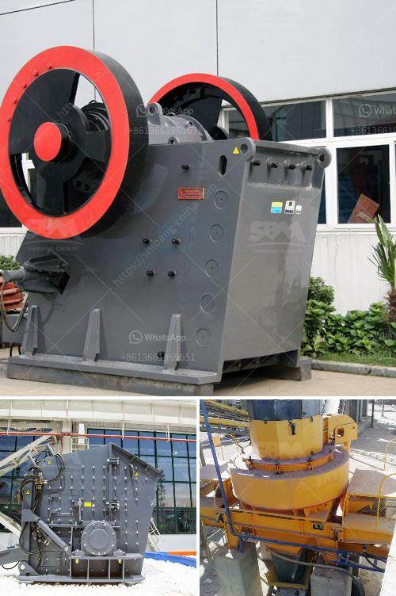

<h3>مصنع معالجة الحجر الجيري</h3>
مصنع معالجة الحجر الجيري يعتبر منشأة صناعية متخصصة في تحويل الحجر الجيري إلى منتجات مختلفة تستخدم في العديد من الصناعات. يتم استخراج الحجر الجيري من المحاجر الجبلية ونقله إلى المصنع حيث يتم تنقيته وتكسيره.

يتكون مصنع معالجة الحجر الجيري من مراحل مختلفة لتحقيق عملية التحويل. الخطوة الأولى هي تكسير الحجر الجيري إلى قطع صغيرة باستخدام المعدات المخصصة مثل كسارة الفك أو الكسارة الصدمية. يتم ثم فرز الحجر الجيري وتصنيفه وفقًا لحجمه وجودته.

بعد ذلك يتم نقل الحجر الجيري المكسور إلى مطحنة الأسطوانات حيث يتم طحنه وتفتيته إلى حجم معين. تستخدم هذه العملية لضمان توحيد حجم الحبيبات وتحسين جودة المنتج النهائي.

تليها عملية الشطف حيث تتم إزالة الشوائب والأتربة من الحجر الجيري. تستخدم معدات الغسيل والفصل الميكانيكية لتنقية المنتج النهائي من أية مواد غريبة قد تؤثر على جودته.

بعد إتمام عملية الشطف، يتم نقل الحجر الجيري إلى المجفف حيث يتم تجفيفه بشكل كامل. تستخدم المجففات الحرارية لإزالة الرطوبة من الحجر الجيري وتعزيز عامل الاستقرار الكيميائي للمنتج النهائي.

أخيرًا، يتم تعبئة المنتج النهائي في حاويات أو أكياس قابلة للتخزين والتوزيع. يتم تصنيف المنتج النهائي إلى فئات مختلفة حسب الحجم والاستخدام المقصود، مثل الركام الجيري للبناء أو الجص الجيري لصناعة الأسمنت.

يتم توجيه هذه الفئات المختلفة إلى الصناعات المختلفة وتستخدم في البناء، صناعة الحديد والصلب، الزجاج، الكيماويات، وغيرها من الصناعات. المصانع المعدنية تعتبر من العملاء الرئيسيين لمنتجات معالجة الحجر الجيري حيث يتم استخدامها في عمليات التحميض، تنقية المعادن وإزالة الشوائب.

باختصار، مصنع معالجة الحجر الجيري يلعب دورًا حيويًا في تحويل المادة الخام إلى منتج نهائي مفيد وقيم. يساهم في تلبية الاحتياجات العالمية في العديد من الصناعات ويساهم في النمو الاقتصادي والتنمية المستدامة.
<h3>Contact us</h3><ul><li><strong>Whatsapp:&nbsp;<a href="https://wa.me/8613661969651">+8613661969651</a></strong></li><li><a href="https://swt.shibang-china.com/?git&amp;zhl&amp;مصنع معالجة الحجر الجيري"><strong>Online Service(chat now)</strong></a></li></ul><h3>Related</h3><ul><li><a href='آلة سحق نقاء الشورا.md'>آلة سحق نقاء الشورا</a></li><li><a href='وحدة طحن الكلنكر الأسمنتي.md'>وحدة طحن الكلنكر الأسمنتي</a></li><li><a href='كسارة محجر الجرانيت في نيجيريا.md'>كسارة محجر الجرانيت في نيجيريا</a></li><li><a href='مصنع كسارة الحصى الجرانيت.md'>مصنع كسارة الحصى الجرانيت</a></li><li><a href='وظائف كسارة مخروطية.md'>وظائف كسارة مخروطية</a></li></ul>