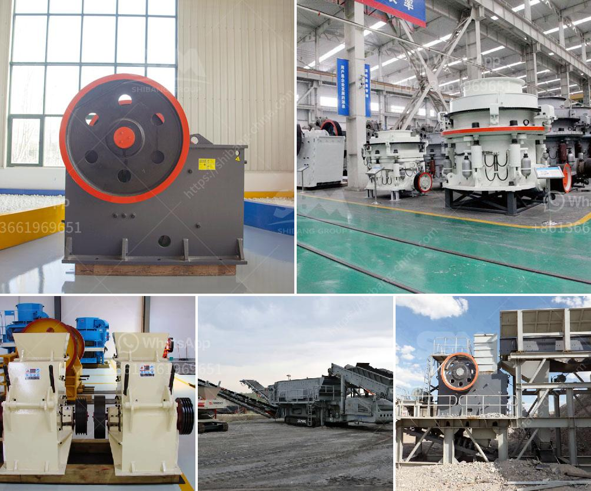

<h3>مصنع معالجة الحجر الفلدسباري</h3>
تعد معالجة الحجر الفلدسباري من العمليات الحيوية والضرورية في صناعة الزجاج والسيراميك والشوائب المعدنية. وفي السنوات الأخيرة، أصبحت تلك الصناعة من الصناعات الإستراتيجية والمهمة للاقتصادات المحلية والعالمية.

يهدف مصنع معالجة الحجر الفلدسباري إلى تحسين وصقل نوعية الفلدسبار المنتج بغرض تلبية متطلبات الزبائن والعملاء في السوق. ويتم ذلك من خلال عدة خطوات وعمليات.

أولاً، يتم جمع الحجر الفلدسباري من المناجم وتوصيله إلى المصنع. يتم فصله عن غيره من الشوائب والأحجار الأخرى الموجودة في المناجم من خلال العديد من الطرق، مثل الفصل بالغربال والتعويم.

ثم يتم تنقيته وتنظيفه بدقة لإزالة أي شوائب ضارة قد تؤثر على عملية الإنتاج وجودة المنتج النهائي. يتم استخدام الطرق الفيزيائية والكيميائية المناسبة لتنقية الحجر الفلدسباري، مثل الغسل المعدني والطفو المحسن.

بعد ذلك، يتم طحن الحجر الفلدسباري إلى حجم مطلوب. يتم تحويله إلى شكل مسحوق ناعم يمكن استخدامه في عملية الإنتاج. يتم ضمان توفر الجودة المطلوبة من خلال استخدام معدات طحن عالية الجودة ومتطورة.

بعد ذلك، يتم فحص الحجر الفلدسباري للتأكد من الامتثال للمعايير والمواصفات المطلوبة. يتم فحصه بواسطة أجهزة قياس متقدمة للتحقق من نسبة النقاء والخواص الفيزيائية والكيميائية للمنتج.

أخيرًا، يتم تعبئة وتغليف الحجر الفلدسباري المنتج بشكل صحيح في حاويات مناسبة للنقل والتخزين. يجب أن يكون التغليف محكمًا لمنع أي تلوث أو تلف للمنتج.

باختصار، يعتبر مصنع معالجة الحجر الفلدسباري مهمًا جدًا في صناعة الزجاج والسيراميك والشوائب المعدنية. يهدف هذا المصنع إلى إنتاج وتوريد حجر فلدسباري عالي الجودة، ملائم لمختلف الاستخدامات والاحتياجات في السوق. يعتمد ذلك على عمليات تجهيز وتنقية وطحن الحجر الفلدسباري بدقة وجودة عالية، بالاعتماد على تقنيات ومعدات حديثة ومتقدمة.
<h3>Contact us</h3><ul><li><strong>Whatsapp:&nbsp;<a href="https://wa.me/8613661969651">+8613661969651</a></strong></li><li><a href="https://swt.shibang-china.com/?git&amp;zhl&amp;مصنع معالجة الحجر الفلدسباري"><strong>Online Service(chat now)</strong></a></li></ul><h3>Related</h3><ul><li><a href='كسارات صخور cec للبيع.md'>كسارات صخور cec للبيع</a></li><li><a href='عمليات كسارة وغسل الحجر.md'>عمليات كسارة وغسل الحجر</a></li><li><a href='مطحنة أسطوانية عمودية للفحم.md'>مطحنة أسطوانية عمودية للفحم</a></li><li><a href='شركة مصنعة مشهورة للكسارة والطاحونة في فرنسا.md'>شركة مصنعة مشهورة للكسارة والطاحونة في فرنسا</a></li><li><a href='مواصفات مطحنة الأسطوانة 3.md'>مواصفات مطحنة الأسطوانة 3</a></li></ul>