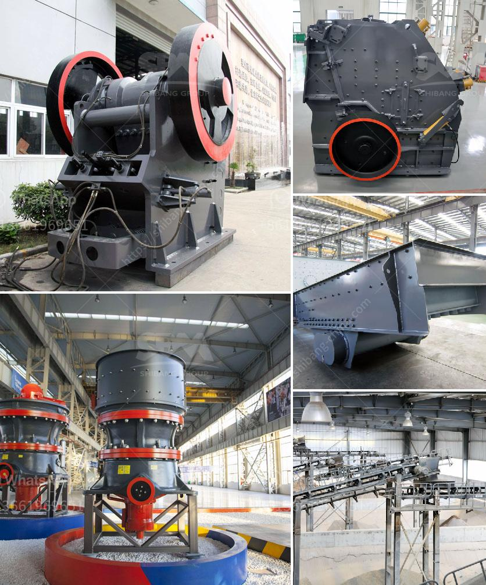

<h3>مصنع معالجة الذهب المحمول مع السعر</h3>
يعتبر تعدين الذهب واحدًا من الصناعات الرئيسية في العالم، حيث يتم استخراج الذهب من المناجم والأنهار والبحار. ومن أجل معالجة الذهب المستخرج، يتم استخدام مصنع معالجة الذهب. ومع تطور التكنولوجيا، أصبحت هناك تقنيات متعددة لمصنع معالجة الذهب، بما في ذلك المصانع المحمولة.

تتميز المصانع المحمولة لمعالجة الذهب بأنها مرافق صغيرة الحجم يمكن نقلها بسهولة إلى مناطق التعدين المختلفة. فعندما يتم استخراج الذهب من المنجم أو النهر، يتم نقل الصخور والتربة المحتوية على الذهب إلى المصنع المحمول. يتم فيه فصل الذهب عن المواد الأخرى وتنقيته للحصول على الذهب النقي الصالح للاستخدام.

وتعتمد مصانع معالجة الذهب المحمولة على استخدام التقنيات الحديثة والمعدات المتطورة مثل أجهزة الاهتزاز وأجهزة الفصل الكهربائي لفصل الذهب عن المواد الأخرى. كما تستخدم تقنيات الغسيل والفرز لفصل الذهب عن الحصى والأتربة.

يعتبر السعر من أهم العوامل التي يجب مراعاتها عند شراء مصنع معالجة الذهب المحمول. يتراوح سعر المصانع المحمولة بين 200 و 400 دولار، حسب الحجم والسعة والتقنيات المستخدمة. ويعتمد السعر أيضًا على جودة المعدات ومتطلبات المصنع.

يعد استثمار مبلغ ما بين 200 و 400 دولار في مصنع معالجة الذهب المحمول فرصة جيدة للأشخاص الذين يهتمون بصناعة تعدين الذهب. حيث يمكن تحقيق أرباح جيدة من خلال استخراج وتنقية الذهب. بالإضافة إلى ذلك، يمكن للمصانع المحمولة ان تكون مربحة في المدى القصير، حيث يمكن نقلها بسهولة إلى مناطق التعدين الجديدة ومستغلة الفرص السريعة.

في النهاية، مصنع معالجة الذهب المحمول هو حلا رائعًا لمعالجة الذهب المستخرج من مناطق التعدين. فقد لا يكون الحل الأمثل للمقامرة الكبيرة في صناعة التعدين، ولكنه يوفر فرصة جيدة للأشخاص الذين يرغبون في الاستثمار في صناعة مستدامة وجديرة بالثقة.
<h3>Contact us</h3><ul><li><strong>Whatsapp:&nbsp;<a href="https://wa.me/8613661969651">+8613661969651</a></strong></li><li><a href="https://swt.shibang-china.com/?git&amp;zhl&amp;مصنع معالجة الذهب المحمول مع السعر"><strong>Online Service(chat now)</strong></a></li></ul><h3>Related</h3><ul><li><a href='مطحنة عمودية معلومات أيرلندا.md'>مطحنة عمودية معلومات أيرلندا</a></li><li><a href='آلات معالجة الكاولين للبيع.md'>آلات معالجة الكاولين للبيع</a></li><li><a href='خط إنتاج سحق الجرانيت.md'>خط إنتاج سحق الجرانيت</a></li><li><a href='مصنع كسارة الكاولين في أوزبكستان.md'>مصنع كسارة الكاولين في أوزبكستان</a></li><li><a href='قطع غيار كسارة مخروطية hp 500.md'>قطع غيار كسارة مخروطية hp 500</a></li></ul>