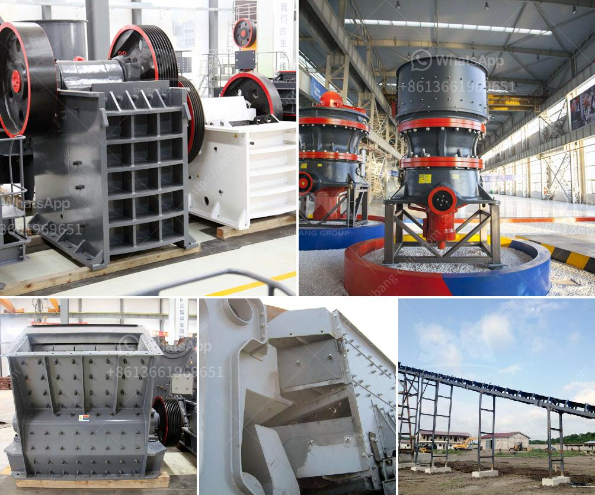

<h3>مصنع معالجة الصخور</h3>
تُعَدُّ مصانع معالجة الصخور أحد المنشآت الصناعية المهمة في صناعة البناء والمقاولات. وهذه المصانع تعمل على تكسير الصخور وفصلها إلى حجم صغير، بحيث يتم استخدامها في مجموعة واسعة من التطبيقات مثل إنتاج الأسمنت، صناعة الأسفلت، البناء، والهندسة المدنية.

تتكون مصانع معالجة الصخور عادة من معدات متخصصة مثل الكسارات، والغرابيل، والمناخل الاهتزازية. عملية معالجة الصخور تبدأ باستخراج الصخور من المحجر أو المنجم، وتتم أولاً عملية التكسير الأولية عن طريق الكسارات لفصل الصخور عن بعضها البعض.

بعد ذلك، تمر الصخور عبر غرابيل ومناخل اهتزازية لتصفية الحجم وفصل الصخور المكسورة حسب الحجم المطلوب. تستخدم هذه المناخل لفصل الصخور حسب قطرها، حيث يتم تصنيفها إلى مجموعات مختلفة مثل الرمل، والحصى، والحصى الصغير، والحصى الكبير، حسب الحجم النهائي المطلوب للمنتج المعالج.

تعتمد عملية المعالجة على مجموعة من العوامل مثل نوع الصخرة وصلابتها ونسبة الرطوبة في الصخور. وقد يكون هناك حاجة إلى خطوات إضافية مثل عمليات الغسيل والغربلة لإزالة الشوائب والأتربة عن الصخور المكسورة.

بعد الانتهاء من عملية المعالجة، تخزن الصخور المكسورة في مستودعات لاحقة، حيث يتم التحكم في جودة وحجم المنتج النهائي. وتستخدم تلك الصخور المعالجة في العديد من التطبيقات المختلفة مثل إنتاج الأسمنت لصناعة المباني والجسور والأعمدة، وكذلك في صناعة الأسفلت لطبقات الطرق والطرق السريعة.

باختصار، تُعَدُّ مصانع معالجة الصخور جزءًا حيويًا من صناعة البناء والمقاولات، حيث تسهم في تزويد الأسواق بالمواد اللازمة للبناء والتشييد بشكل سريع وفعال. تلعب هذه المصانع دورًا حاسمًا في تمكين الصناعة من استخدام مواد بناء جودة عالية وتلبية الاحتياجات المتزايدة للتطور العمراني والبنية التحتية.
<h3>Contact us</h3><ul><li><strong>Whatsapp:&nbsp;<a href="https://wa.me/8613661969651">+8613661969651</a></strong></li><li><a href="https://swt.shibang-china.com/?git&amp;zhl&amp;مصنع معالجة الصخور"><strong>Online Service(chat now)</strong></a></li></ul><h3>Related</h3><ul><li><a href='موردين لفات الناقل في جنوب أفريقيا.md'>موردين لفات الناقل في جنوب أفريقيا</a></li><li><a href='كسارة متنقلة في فيجي.md'>كسارة متنقلة في فيجي</a></li><li><a href='مصنع طحن كلنكر الإسمنت في الهند.md'>مصنع طحن كلنكر الإسمنت في الهند</a></li><li><a href='شاشات غسيل الركام في جنوب أفريقيا.md'>شاشات غسيل الركام في جنوب أفريقيا</a></li><li><a href='مطاحن زيمبابوي.md'>مطاحن زيمبابوي</a></li></ul>