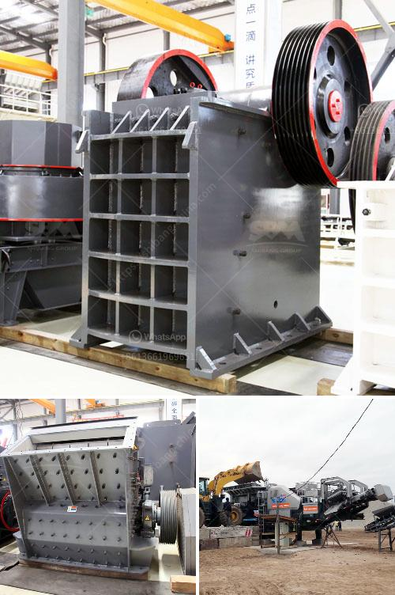

<h3>مصنع معالجة الفحم في الفلبين</h3>
تعتبر الفلبين واحدة من الدول التي تعتمد بشكل كبير على الفحم كمصدر رئيسي للطاقة. تعمل هناك العديد من مصانع معالجة الفحم التي تلعب دورًا هامًا في تحويل هذا المورد الطبيعي إلى طاقة كهربائية. سنلقي نظرة على مصنع معالجة الفحم في الفلبين ونناقش فعاليته والتحديات التي يواجهها.

يعد مصنع معالجة الفحم في الفلبين من أكبر المصانع في المنطقة. يتمتع بتقنيات حديثة وعمال مهرة يعملون على زيادة الكفاءة وتقليل الانبعاثات الضارة. يتبع هذا المصنع عمليات صارمة لمعالجة الفحم وتنقيته وتحويله إلى طاقة كهربائية. يتم استخدام أحدث التقنيات لفصل الشوائب والمواد الأخرى غير المرغوب فيها عن الفحم، مما يضمن حصولنا على طاقة نظيفة وفعالة.

ومع ذلك، فإن مصنع معالجة الفحم في الفلبين يواجه العديد من التحديات. أحدها هو تأثيره على البيئة. فعلى الرغم من أن المصنع يتبع معايير صارمة بشأن الانبعاثات، إلا أن استخدام الفحم كمصدر للطاقة ما زال يعتبر من المصادر غير المتجددة والتي تساهم في انبعاثات ثاني أكسيد الكربون وتغير المناخ. لذا فإن هناك حاجة ملحة للتحول إلى مصادر طاقة أخرى أكثر صديقة للبيئة مثل الطاقة الشمسية والرياح.

بالإضافة إلى ذلك، تواجه صناعة معالجة الفحم في الفلبين تحديات أخرى مثل الاستدامة والاتكالية على الفحم الوارد من الخارج. تشكل مشكلة التكلفة والتنقل والاعتمادية تحديات إضافية. وبالتالي، يجب على الفلبين البدء في استكشاف مصادر طاقة أخرى لتلبية احتياجاتها المستدامة للطاقة. يمكن أن تكون الاستثمارات في الطاقة المتجددة والتكنولوجيات الحديثة طريقة فعالة للتحول من اعتماد الفحم إلى الطاقة النظيفة.

باختصار، يعتبر مصنع معالجة الفحم في الفلبين نموذجًا يحتذى به في إنتاج الطاقة الكهربائية من الفحم. ومع ذلك، لا يمكن تجاهل التحديات التي تواجه هذه الصناعة. يجب على الفلبين التحول إلى مصادر طاقة أخرى لتحقيق الاستدامة البيئية وتلبية احتياجات الطاقة المستدامة على المدى الطويل. النهوض بالطاقة المتجددة وتحسين التكنولوجيا سيكونان مفتاحًا لتحقيق هذا الهدف.
<h3>Contact us</h3><ul><li><strong>Whatsapp:&nbsp;<a href="https://wa.me/8613661969651">+8613661969651</a></strong></li><li><a href="https://swt.shibang-china.com/?git&amp;zhl&amp;مصنع معالجة الفحم في الفلبين"><strong>Online Service(chat now)</strong></a></li></ul><h3>Related</h3><ul><li><a href='مصنع تكسير الحصى في جنوب أفريقيا.md'>مصنع تكسير الحصى في جنوب أفريقيا</a></li><li><a href='الكسارة المحمولة ١٥٠ طن في الساعة.md'>الكسارة المحمولة ١٥٠ طن في الساعة</a></li><li><a href='موردين طاحونة الأسمنت.md'>موردين طاحونة الأسمنت</a></li><li><a href='سعر stoner cusher في كينيا.md'>سعر stoner cusher في كينيا</a></li><li><a href='مطاحن الأسطوانات في الدول.md'>مطاحن الأسطوانات في الدول</a></li></ul>