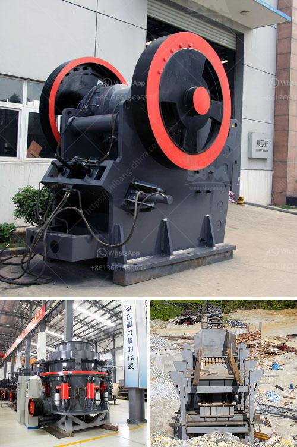

<h3>مصنع معالجة الكالسيوم</h3>
يعتبر مصنع معالجة الكالسيوم أحد المنشآت الصناعية الهامة التي تستخدم لاستخراج الكالسيوم من خاماته الطبيعية وتحويلها إلى منتجات مفيدة في العديد من الصناعات. يتم استخدام الكالسيوم في العديد من التطبيقات المختلفة مثل الصناعة الزراعية والبناء وصناعات الصابون والزجاج والأدوية.

تبدأ عملية معالجة الكالسيوم في المصنع بتعدين الخامات الكالسيوم الطبيعية من المحاجر أو البحار أو بحيرات الملح. يتم جمع الخامات وطحنها إلى جسيمات صغيرة لزيادة مساحة السطح وتسهيل عملية استخلاص الكالسيوم منها.

ثم يتم تسخين الخامات المطحونة في أفران خاصة تعمل بدرجات حرارة عالية. يتم الحفاظ على درجة حرارة الفرن ثابتة لضمان تفاعل الخام مع المواد الأخرى الموجودة في الفرن. هذا التفاعل يؤدي إلى إزالة الشوائب والعناصر غير المرغوب فيها من الخامات الكالسيوم مثل الكربون والأكسجين والسيليكا.

يتم التحكم في عملية استخراج الكالسيوم من الخامات المعالجة بواسطة إضافة المواد الكيميائية المناسبة. يتم استخدام مذيبات مثل الأمونيا أو الأسيتون لاستخلاص الكالسيوم من الخامات المطحونة وإزالة المواد الأخرى التي لا ترغب فيها.

بعد استخراج الكالسيوم، يتم تصفيته وغسله وتجفيفه للحصول على منتج نهائي نقي. يتم تعبئة المنتج في أكياس أو براميل جاهزة للاستخدام في الصناعات المختلفة.

يعتبر مصنع معالجة الكالسيوم أحد المصانع البيئية حيث يتم التعامل مع الخامات الطبيعية واستخراج الكالسيوم منها بطرق صديقة للبيئة. يتم تكييف المصانع للتحكم في انبعاثات الغازات الضارة والتقليل منها للحد الأدنى.

بالإضافة إلى ذلك، يعتبر مصنع معالجة الكالسيوم مصدراً هاماً للوظائف في المجتمع. فإن إنشاء وتشغيل مصنع معالجة الكالسيوم يعني توفير فرص عمل للعديد من العاملين في المجال الصناعي.

بشكل عام، يعتبر مصنع معالجة الكالسيوم أحد المصانع الحديثة التي تلعب دورًا حيويًا في تلبية الطلب المتزايد على الكالسيوم في الصناعات المختلفة. يساهم في دعم التنمية الصناعية وتعزيز الاقتصاد الوطني من خلال توفير منتجات عالية الجودة ذات التطبيقات المتعددة.
<h3>Contact us</h3><ul><li><strong>Whatsapp:&nbsp;<a href="https://wa.me/8613661969651">+8613661969651</a></strong></li><li><a href="https://swt.shibang-china.com/?git&amp;zhl&amp;مصنع معالجة الكالسيوم"><strong>Online Service(chat now)</strong></a></li></ul><h3>Related</h3><ul><li><a href='طحن خام بحجم يمر عبر الشبكة 200.md'>طحن خام بحجم يمر عبر الشبكة 200</a></li><li><a href='قائمة أسعار إعادة تدوير زجاج كونسول للطن.md'>قائمة أسعار إعادة تدوير زجاج كونسول للطن</a></li><li><a href='معدات طحن فائقة الدقة.md'>معدات طحن فائقة الدقة</a></li><li><a href='سعر كسارة الصخور.md'>سعر كسارة الصخور</a></li><li><a href='مصنع غسيل الماس في جنوب أفريقيا.md'>مصنع غسيل الماس في جنوب أفريقيا</a></li></ul>