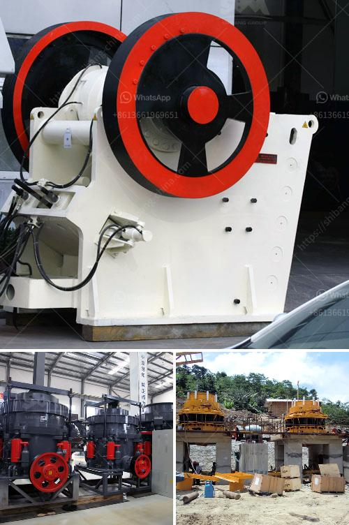

<h3>مصنع معالجة المنغنيز</h3>
يعد المنغنيز أحد المعادن الهامة والضرورية في صناعة الفولاذ والألمنيوم، حيث يستخدم كعنصر مساعد لتحسين خواص هذه الفلزات. يتم استخراج المنغنيز من خاماتها وإجراء معالجة له قبل استخدامه في الصناعة، ويتم ذلك في مصانع معالجة المنغنيز.

تتمثل عملية معالجة المنغنيز الأساسية في التفريغ والسحق والنقع والتعدين، وبعد ذلك يتم تصفيته وتجفيفه وتغليفه ليصل إلى السوق. ومع أن هذه العملية تعتبر ضرورية لاستخلاص المنغنيز من الخامات، إلا أن لها تأثيراً كبيراً على البيئة.

تتسبب عمليات التعدين والسحق في إنتاج كميات كبيرة من الغبار والحطام، مما يؤدي إلى تلوث الهواء والتربة والمياه المحيطة بالمنطقة المحيطة بمصانع معالجة المنغنيز. وقد يؤدي ذلك إلى تأثير سلبي على النباتات والحيوانات المحلية والأراضي الزراعية على مدى الوقت.

بالإضافة إلى ذلك، تقوم المصانع بإزالة المعادن الثقيلة والملوثات الأخرى من مياه الصرف قبل تفريغها في البيئة المحيطة. ومع ذلك، قد تحدث تسربات أو تلوث غير مقصود يمكن أن يؤثر في النظام البيئي المائي المحلي والكائنات الحية الدقيقة فيه.

للتغلب على هذه المشكلات البيئية، تعمل مصانع معالجة المنغنيز على تبني تقنيات واجراءات للتحكم في التسربات البيئية. فعلى سبيل المثال، يتم استخدام الأنظمة المتقدمة لمعالجة المياه العادمة والحفاظ على رص النفايات بطرق آمنة ومستدامة.

علاوة على ذلك، يتعاون المصنع المعالج مع السلطات المحلية والمجتمع المحلي لنشر التوعية المستدامة حول التأثير البيئي لعمليات المعالجة وتبني إجراءات بيئية أفضل. يتم ذلك من خلال تنفيذ برامج للحد من التلوث والاعتناء بالمحيط وتشجيع التنمية المستدامة في مناطق المصانع المعالجة.

في النهاية، يمكن القول أن مصانع معالجة المنغنيز لها أهمية كبيرة في صناعة الفولاذ والألمنيوم، ومع ذلك فإنه من الضروري تحسين طرق المعالجة واتخاذ التدابير اللازمة للحد من تأثيراتها البيئية السلبية. يجب مواصلة البحث والابتكار في هذا المجال لضمان الحفاظ على البيئة والحد من تأثيرات النشاط الصناعي على المجتمع المحلي والبيئة.
<h3>Contact us</h3><ul><li><strong>Whatsapp:&nbsp;<a href="https://wa.me/8613661969651">+8613661969651</a></strong></li><li><a href="https://swt.shibang-china.com/?git&amp;zhl&amp;مصنع معالجة المنغنيز"><strong>Online Service(chat now)</strong></a></li></ul><h3>Related</h3><ul><li><a href='مورد كسارة الحجر الجيري.md'>مورد كسارة الحجر الجيري</a></li><li><a href='تعدين المحاجر ومعدات البناء.md'>تعدين المحاجر ومعدات البناء</a></li><li><a href='معدات تعدين مستعملة للبيع في غانا.md'>معدات تعدين مستعملة للبيع في غانا</a></li><li><a href='آلة سحق مكعب الخرسانة.md'>آلة سحق مكعب الخرسانة</a></li><li><a href='تقرير المشروع على كسارة الخرسانة pdf.md'>تقرير المشروع على كسارة الخرسانة pdf</a></li></ul>