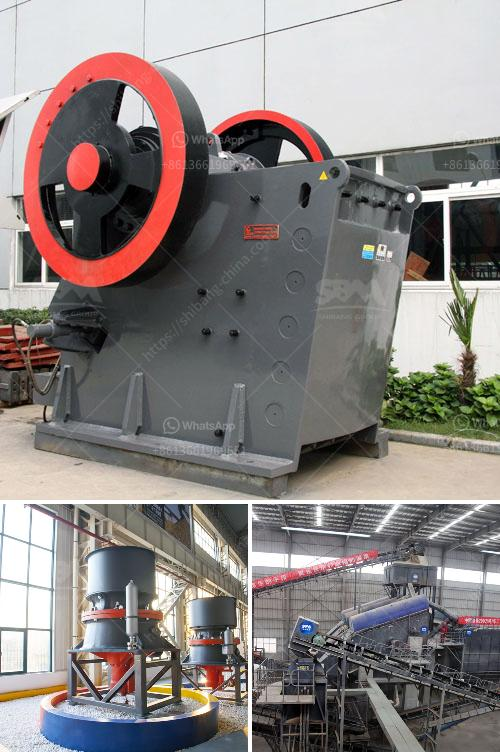

<h3>مصنع معالجة خام الذهب 200 طن في الساعة</h3>
يُعتبر مصنع معالجة خام الذهب بسعة 200 طن في الساعة من المصانع الهامة في صناعة التعدين. يعمل هذا المصنع على استخلاص الذهب من الخامات التي تحتوي على نسب مرتفعة من المعدن الثمين. يتكون العمل في هذا المصنع من عدة مراحل متتالية تهدف إلى تحويل الخام إلى مادة مكررة وجاهزة للاستخدام في صناعة الذهب.

تبدأ عملية المعالجة بتفتيت الخامة الخام إلى جسيمات صغيرة باستخدام الكسارات والمطاحن. يتم تخفيض حجم الخام حتى يتمكن المعالج من فصل الجسيمات المرغوب فيها. بعد ذلك، يتم نقل الخام إلى وحدة الفصل الجاذبية لفصل الجسيمات الثقيلة من الخفيفة. يتم تحويل الخام إلى غرامات أو شعيرات أو شظايا، ويتم فصلها بناءً على وزنها النوعي.

ثم يتم نقل الجسيمات الثقيلة إلى وحدة الطرد المركزي لفصل المواد الثقيلة عن الخفيفة باستخدام الطاقة الطاردة التي تطرح الجسيمات الثقيلة بعيدا عن الخفيفة. يتم تجهيز الجسيمات الثقيلة في وحدات متطورة لمعالجة الخام الذهبي، حيث يتم تحويلها إلى معدن الذهب الخام النقي. يراعى في هذه العملية استخدام الكميات الصحيحة من المواد الكيميائية مثل السيانيد والأملاح الأخرى لتحقيق نتائج فعالة وآمنة.

بعد التنقية، يتم تخزين الذهب المستخرج في مصانع التكرير والصهر لتحويله إلى ميداليات أو قطع مجوهرات. يتم تخزين الخامات الغير مرغوب فيها وفحصها لاستخلاص المعادن الأخرى الثمينة أو المفيدة. في بعض الحالات، يمكن استخدام المعادن النفيسة الأخرى في صناعات أخرى كالإلكترونيات أو صناعة السبائك.

يُعد هذا المصنع من الوحدات الهائلة التي تتطلب تكنولوجيا عالية واستثمارات كبيرة. فهو يوفر العديد من فرص العمل المباشرة وغير المباشرة للعديد من العاملين. بالإضافة إلى ذلك، فإن معالجة الخامات باستخدام هذا المصنع تعتبر أكثر فعالية ومستدامة بالمقارنة مع العمليات التقليدية الأخرى.

لا شك أن استثمار مثل هذه المصانع يساهم في توسيع نطاق إنتاج الذهب وتلبية احتياجات السوق بشكل أفضل. علاوة على ذلك، فإنه يعد خطوة مهمة للحفاظ على الموارد الطبيعية والبيئة، حيث يُمكن معالجة وتنقية الخامات بطريقة صديقة للبيئة وتقليل التأثيرات البيئية السلبية الناتجة عن تعدين الذهب.

في الختام، يُعد مصنع معالجة خام الذهب بسعة 200 طن في الساعة إنجازًا هائلا في عالم التعدين. يتميز بتكنولوجيا حديثة وعمليات متقنة، مما يساهم في زيادة إنتاج الذهب وتوفير فرص العمل والحفاظ على البيئة.
<h3>Contact us</h3><ul><li><strong>Whatsapp:&nbsp;<a href="https://wa.me/8613661969651">+8613661969651</a></strong></li><li><a href="https://swt.shibang-china.com/?git&amp;zhl&amp;مصنع معالجة خام الذهب 200 طن في الساعة"><strong>Online Service(chat now)</strong></a></li></ul><h3>Related</h3><ul><li><a href='طاحونة كرات لطحن الحجر الجيري.md'>طاحونة كرات لطحن الحجر الجيري</a></li><li><a href='آلة غسيل الرمل للبيع في سريلانكا.md'>آلة غسيل الرمل للبيع في سريلانكا</a></li><li><a href='تصميم محطة كسارة الحجر.md'>تصميم محطة كسارة الحجر</a></li><li><a href='كسارة مخروطية سلسلة CS.md'>كسارة مخروطية سلسلة CS</a></li><li><a href='آلة سحق كبيرة.md'>آلة سحق كبيرة</a></li></ul>