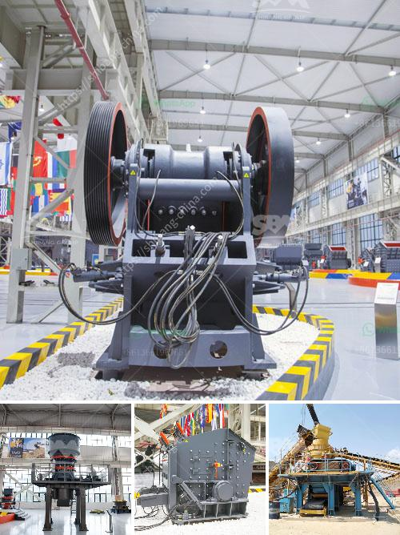

<h3>مصنع معالجة خام القصدير على نطاق صغير</h3>
تعتبر صناعة معالجة خام القصدير من الصناعات الهامة للاقتصاد العالمي، حيث يتم استخراج القصدير من الخامات المتوافرة في الطبيعة كالكاسيترايت والكريسوبرازيت. والنصيب الأكبر من إنتاج القصدير يستخدم في صناعة القصدير، وتدخل أيضًا في صناعة السبائك والإلكترونيات والكيماويات وغيرها.

يتم تشغيل مصانع معالجة خام القصدير على نطاق كبير في مناطق تواجد كميات كبيرة من الخامات، ولكن يمكن أيضاً إنشاء مصانع على نطاق صغير لمعالجة خام القصدير بشكل محلي. يعتبر هذا النوع من الصناعة فرصة مثالية للمشاريع الصغيرة والمتوسطة والعائلية.

لإنشاء مصنع معالجة خام القصدير على نطاق صغير، يتطلب الأمر بعض الخطوات والتجهيزات الأساسية. أولاً وقبل كل شيء، يجب تحديد موقع المصنع بعناية، حيث يفضل أن يكون قريبًا من مناطق تواجد المواد الخام بكميات كافية وأن يكون وصول المواد وتصريف المنتجات مسهلاً.

ثانيًا، يجب التفكير في الآلات والمعدات المطلوبة لعملية المعالجة. يتضمن ذلك الكسارات والمطاحن والفاصلات المغناطيسية وغيرها من الأجهزة اللازمة لفصل القصدير عن الخام. يجب أخذ الاعتبار أيضًا أن هذه الآلات يجب أن تكون متوافقة مع المعايير الصحية والبيئية المطبقة.

ثالثًا، يجب الاهتمام بتأمين الطاقة اللازمة لتشغيل المصنع، سواء كان ذلك من خلال الكهرباء العامة أو وجود نظام طاقة خاص بالمصنع مثل الطاقة الشمسية أو الرياح.

رابعًا، يجب توفير فريق عمل متميز ومدرب جيدًا للعمل في المصنع، يجب أن يكونوا على دراية بعمليات المعالجة ويستخدموا المعدات بأمان وفعالية.

أخيرًا، يجب أن يتم وضع خطة تسويقية جيدة للمنتجات التي ستنتجها المصنع. يمكن أن يتم بيع القصدير المعالج إما محليًا للصناعات المحلية أو تصديره للأسواق العالمية.

باختصار، إنشاء مصنع معالجة خام القصدير على نطاق صغير يتطلب اهتماماً بالتخطيط والاستثمار في المعدات والتكنولوجيا المناسبة، وضمان توفر الخامات والطاقة، وتشغيل فريق عمل مؤهل، ووضع خطة تسويقية هادفة. هذا المصنع يعتبر فرصة اقتصادية مثالية للبلدان التي تمتلك موارداً من خام القصدير، وقد يساهم في تحسين الأوضاع الاقتصادية وزيادة فرص العمل على المستوى المحلي.
<h3>Contact us</h3><ul><li><strong>Whatsapp:&nbsp;<a href="https://wa.me/8613661969651">+8613661969651</a></strong></li><li><a href="https://swt.shibang-china.com/?git&amp;zhl&amp;مصنع معالجة خام القصدير على نطاق صغير"><strong>Online Service(chat now)</strong></a></li></ul><h3>Related</h3><ul><li><a href='كسارة الأسطوانة لفحم متنوع الحجم.md'>كسارة الأسطوانة لفحم متنوع الحجم</a></li><li><a href='عملية الحجر الجيري.md'>عملية الحجر الجيري</a></li><li><a href='معدات كسارة الذهب.md'>معدات كسارة الذهب</a></li><li><a href='مصانع قديمة للبيع، استخدمت مطاحن الكرات.md'>مصانع قديمة للبيع، استخدمت مطاحن الكرات</a></li><li><a href='كسارات مخروط للإيجار في جنوب أفريقيا.md'>كسارات مخروط للإيجار في جنوب أفريقيا</a></li></ul>