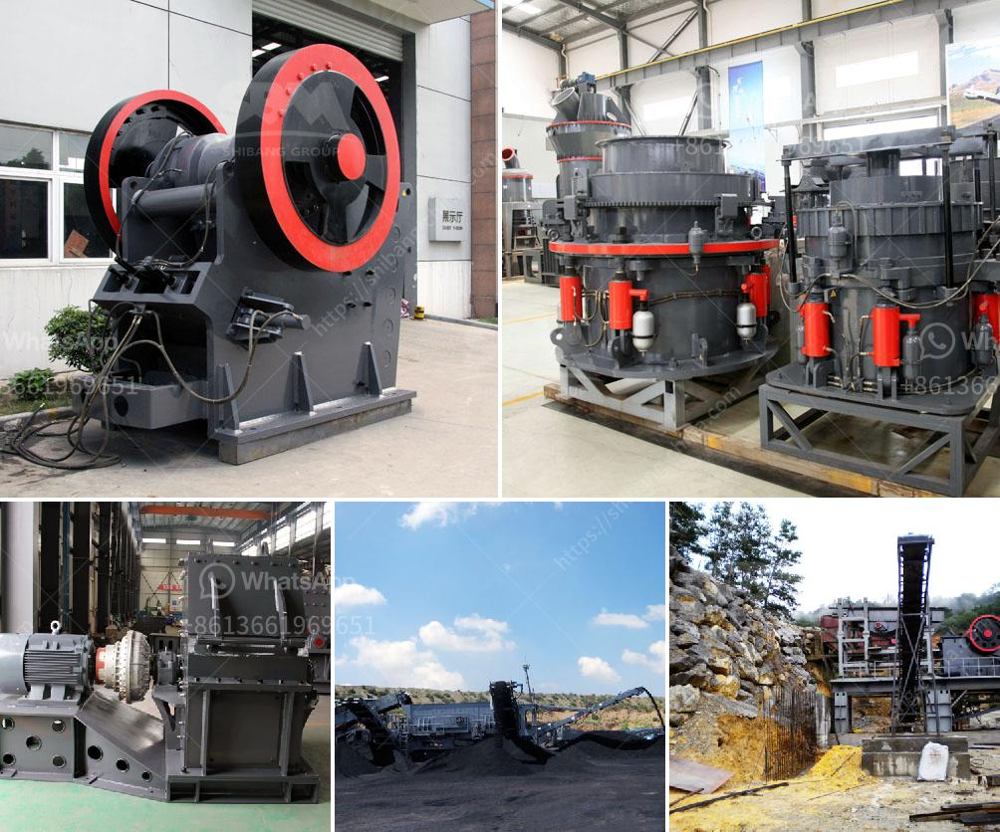

<h3>مصنع معالجة خام الكروم في الصين</h3>
تعد الصين واحدة من أكبر الدول المنتجة للكروم في العالم، حيث تمتلك العديد من المصانع المتخصصة في معالجة وتصنيع خام الكروم. يهدف هذا المصنع إلى استخلاص الفلز من الخام وتحويله إلى منتج نهائي يمكن استخدامه في صناعات متعددة.

عند وصول الخام إلى المصنع، يتم تفتيته وطحنه إلى قطع صغيرة لزيادة مساحة السطح، مما يزيد من فعالية عملية الاستخلاص. ثم يتم استخدام عملية التعويم لفصل الفلز عن الباقي، حيث يتم تعريض الخام المفتت إلى مواد كيميائية خاصة تجعل الفلز يطفو على سطح السائل، بينما يغرق الباقي.

بعد عملية التعويم، يتم جمع الفلز المطفوق على سطح السائل وفصله عن الباقي. ثم يتم إجراء التحضيرات اللازمة لتحويل الفلز المستخلص إلى منتج نهائي. عادةً ما يتم استخدام عمليات كهروكيميائية وتقنيات الاحتكاك والتسخين لتصنيع الفلز النهائي بجودة عالية وتصفيته وتشكيله على الشكل المطلوب.

ومن الجدير بالذكر أن هذا المصنع ليس مجرد مركز للاستخلاص والتصنيع، بل يهتم أيضًا بتقليل الآثار البيئية الناتجة عن عملية الصناعة. يتم اتباع إجراءات صارمة للحفاظ على جودة المياه والهواء والتربة في المنطقة المحيطة بالمصنع. تعتبر عملية التعويم الكيميائية، على سبيل المثال، مؤشرًا على الجهود المبذولة للحفاظ على البيئة، حيث يتم استخدام مواد كيميائية غير ضارة تمامًا ويتم التحكم في كمية المواد المستعملة وفي معدلها البيئي.

بهذا الشكل، يساهم هذا المصنع في تلبية احتياجات الصناعة المحلية والعالمية من خام الكروم وفلز الكروم. كما يشكل المصنع سوق عمل كبير يؤدي إلى توفير فرص عمل للعديد من السكان المحليين وتعزيز النمو الاقتصادي للمنطقة.

في النهاية، يظل هذا المصنع مثالًا ملهمًا لاستخدام التكنولوجيا والإدارة المستدامة في صناعة استخلاص وتصنيع الكروم. يساهم في نمو الصناعة المعدنية المحلية وفي تزويد العالم بمواد أساسية للعديد من الصناعات، مع الحفاظ على البيئة وتوفير فرص العمل المستدامة.
<h3>Contact us</h3><ul><li><strong>Whatsapp:&nbsp;<a href="https://wa.me/8613661969651">+8613661969651</a></strong></li><li><a href="https://swt.shibang-china.com/?git&amp;zhl&amp;مصنع معالجة خام الكروم في الصين"><strong>Online Service(chat now)</strong></a></li></ul><h3>Related</h3><ul><li><a href='مطحنة الكرة القديمة للبيع في الهند.md'>مطحنة الكرة القديمة للبيع في الهند</a></li><li><a href='كسارات الحجر الرئيسية.md'>كسارات الحجر الرئيسية</a></li><li><a href='تجهيز مسحوق الكوارتز السيليكا.md'>تجهيز مسحوق الكوارتز السيليكا</a></li><li><a href='مخطط تدفق التعدين ومعالجة المعادن للنيكل.md'>مخطط تدفق التعدين ومعالجة المعادن للنيكل</a></li><li><a href='آلة معالجة الجبس بسعة طن واحد.md'>آلة معالجة الجبس بسعة طن واحد</a></li></ul>