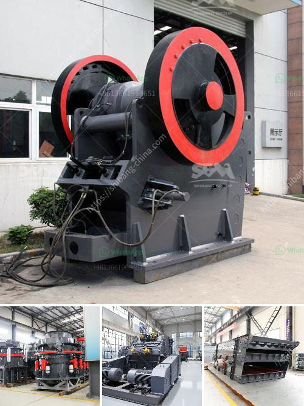

<h3>مصنع معالجة رمل الحديد للبيع في باكستان</h3>
تُعتبر صناعة الحديد والصلب من أهم الصناعات القائمة في العالم، وتشهد تطورًا مستمرًا في تكنولوجيا المعالجة والإنتاج. وفي هذا السياق، تعتبر باكستان واحدة من الدول التي تستثمر بشكل كبير في صناعة الحديد والصلب، حيث تمتلك العديد من مصانع معالجة رمل الحديد عالية الجودة والكفاءة.

من بين هذه المصانع، نجد مجموعة متنوعة من مصانع معالجة رمل الحديد في باكستان. تعمل هذه المصانع على انتزاع الحديد من رمال الحديد الطبيعية باستخدام عملية تسمى عملية الاستخلاص، ثم تنقية هذا الحديد بهدف الحصول على منتجات ذات جودة عالية قابلة للاستخدام في مجالات مختلفة.

تقوم هذه المصانع بتوريد المنتجات إلى السوق المحلية والعالمية، مما يساهم في تلبية الطلب المتزايد على الحديد والصلب. فعلى سبيل المثال، يستخدم الحديد المستخرج في هذه المصانع في صناعة المنتجات المعدنية، مثل السيارات والقطارات والأجهزة المنزلية والمباني الصناعية والعديد من المنتجات الأخرى.

تضم باكستان مصانع معالجة رمل الحديد مجهزة بأحدث التقنيات والآلات والمعدات المتطورة. وتهدف هذه المصانع إلى تحسين جودة المنتجات وزيادة الكفاءة، مما ينعكس إيجابيًا على تفوقها في السوق المحلية والعالمية.

بالإضافة إلى ذلك، تُعد صناعة معالجة رمل الحديد في باكستان مصدرًا رئيسيًا للوظائف، حيث يتوفر العديد من الفرص الوظيفية في هذا القطاع. كما أن هذه الصناعة تساهم بشكل فعال في تعزيز الاقتصاد المحلي من خلال زيادة الصادرات وتحسين العوائد المالية.

لذا، يمثل مصنع معالجة رمل الحديد في باكستان فرصة استثمارية جيدة للمستثمرين. فهو يوفر إمكانية تصنيع منتجات عالية الجودة وتحقيق أرباح مجزية. وبفضل الموارد الطبيعية الوفيرة والبنية التحتية المتقدمة، فإن باكستان تعتبر بيئة مناسبة لتنمية هذا القطاع.

في الختام، يُعد مصنع معالجة رمل الحديد في باكستان فرصة مثالية للاستثمار في صناعة الحديد والصلب. يتمتع القطاع بتقنيات حديثة ومعدات متطورة، ويساهم في توليد الوظائف وتحسين الاقتصاد المحلي. ومن خلال تطوير هذه الصناعة وتحسين جودة المنتجات المصنعة، يمكن لباكستان أن تحقق نجاحًا كبيرًا في سوق الحديد والصلب العالمية.
<h3>Contact us</h3><ul><li><strong>Whatsapp:&nbsp;<a href="https://wa.me/8613661969651">+8613661969651</a></strong></li><li><a href="https://swt.shibang-china.com/?git&amp;zhl&amp;مصنع معالجة رمل الحديد للبيع في باكستان"><strong>Online Service(chat now)</strong></a></li></ul><h3>Related</h3><ul><li><a href='كسارات البلارست في Alibaba.md'>كسارات البلارست في Alibaba</a></li><li><a href='أنواع الجبس.md'>أنواع الجبس</a></li><li><a href='كسارات محمولة للإيجار.md'>كسارات محمولة للإيجار</a></li><li><a href='كسارة صخرية للبيع.md'>كسارة صخرية للبيع</a></li><li><a href='مصنعو كسارات الجيري.md'>مصنعو كسارات الجيري</a></li></ul>