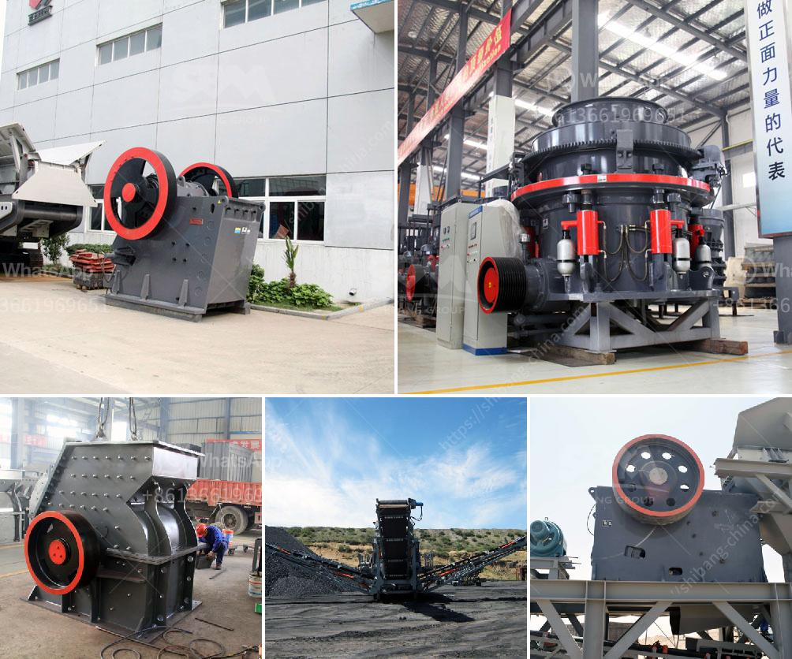

<h3>مصنع معالجة رمل السيليكا</h3>
مصنع معالجة رمل السيليكا هو مصنع يقوم بتحويل رمل السيليكا الخام إلى منتج نهائي قابل للاستخدام في العديد من الصناعات المختلفة. رمل السيليكا هو مادة طبيعية تتألف بشكل رئيسي من السيليكا (SiO2)، ويتم استخدامه بشكل واسع في صناعة الزجاج والسيراميك والإلكترونيات والبناء وصناعة الطلاء وغيرها.

عملية معالجة رمل السيليكا تبدأ بالتنقية والفصل للتخلص من الشوائب والشوائب الأخرى في الرمل الخام. يتم غسل الرمال وتنزيلها في حوض مائي لإزالة الأتربة والشوائب الغير مرغوب فيها. بعد ذلك، يتم نزح الماء وتجفيف الرمل المنقى تمامًا.

بعد التنظيف، يتم تحويل الرمل النقي إلى منتجات نهائية يمكن بيعها واستخدامها. يمكن استخدام رمل السيليكا المعالج في صناعة الزجاج عن طريق الذوبان في الفرن وصبه في قوالب لتشكيل الزجاج. كما يمكن استخدامه في صناعة السيراميك لتشكيل الأواني والأطباق والمجوهرات الخزفية. يستخدم أيضًا في صناعة الإلكترونيات لصنع الشرائح الإلكترونية والألواح الشمسية.

بالإضافة إلى ذلك، يتم استخدام رمل السيليكا المعالج في صناعة البناء لإنتاج الخرسانة والطوب والأسمنت الخاصة بالمباني والطرق. يعمل معالجة الرمل السيليكا على تحسين خصائص الرمل مثل قوة الضغط ومقاومة التآكل. كما يستخدم في صناعة الطلاء لمنح الأسطح مقاومة عالية للحرارة والعوامل البيئية.

يتم تشغيل مصنع معالجة رمل السيليكا بواسطة أجهزة ومعدات متطورة. تتضمن هذه المعدات فحص الأشعة السينية والغسيل والفصل والتجفيف والتشكيل. تستخدم التقنيات الحديثة لضمان جودة المنتج النهائي وتلبية متطلبات الصناعة المختلفة.

باختصار، يعد مصنع معالجة رمل السيليكا أحد المصانع الرئيسية في صناعة المواد الخام، حيث يقوم بتحويل الرمل الخام إلى منتج نهائي ذي جودة عالية يمكن استخدامه في العديد من الصناعات المختلفة. تستخدم التقنيات الحديثة والمعدات المتطورة لضمان الجودة وتحسين الخصائص المادية للرمل.
<h3>Contact us</h3><ul><li><strong>Whatsapp:&nbsp;<a href="https://wa.me/8613661969651">+8613661969651</a></strong></li><li><a href="https://swt.shibang-china.com/?git&amp;zhl&amp;مصنع معالجة رمل السيليكا"><strong>Online Service(chat now)</strong></a></li></ul><h3>Related</h3><ul><li><a href='المعدات المطلوبة لتعدين الذهب على نطاق واسع.md'>المعدات المطلوبة لتعدين الذهب على نطاق واسع</a></li><li><a href='خدمات مصنع معالجة التعدين المحمول.md'>خدمات مصنع معالجة التعدين المحمول</a></li><li><a href='مبدأ عمل مطحنة الهامر.md'>مبدأ عمل مطحنة الهامر</a></li><li><a href='مورد معدات آلات تكسير الحجر في الصين.md'>مورد معدات آلات تكسير الحجر في الصين</a></li><li><a href='آلة صنع الرمل في جنوب أفريقيا.md'>آلة صنع الرمل في جنوب أفريقيا</a></li></ul>