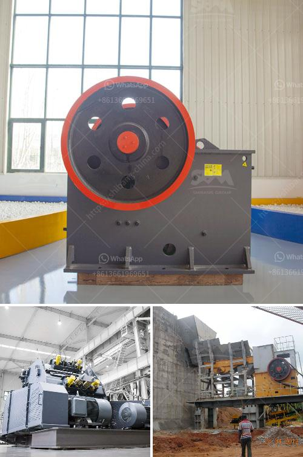

<h3>مصنع معالجة كروشر في ماليزيا</h3>
تعتبر ماليزيا واحدة من الدول الرائدة في صناعة النفط والغاز في جنوب شرق آسيا. وعلى الرغم من ذلك، فإنها تمتلك أيضًا صناعة قوية في مجال معالجة الكروشر. يوجد في ماليزيا عدد من المصانع المتخصصة في معالجة الكروشر، ومن أبرزها مصنع كروشر الكبير.

يقع مصنع معالجة كروشر في محافظة بيراك في شمال غرب ماليزيا، وهو يعد أحد أكبر المصانع في المنطقة. يستخدم المصنع تكنولوجيا حديثة وعمليات احترافية لمعالجة الكروشر بشكل فعال وآمن. يهدف المصنع إلى إنتاج كروشر عالي الجودة وملائم للاستخدامات المختلفة.

تحظى صناعة الكروشر في ماليزيا بأهمية كبيرة نظرًا لاستخداماتها المتعددة في العديد من الصناعات، بما في ذلك الصناعات الكيميائية والبتروكيماوية والتجميلية والغذائية. وبالإضافة إلى ذلك، يتم تصدير الكروشر المعالج من ماليزيا إلى عدد من الدول الأخرى لتلبية احتياجات السوق العالمية.

يُعتبر مصنع معالجة الكروشر في ماليزيا مثالاً للتميز في مجال الجودة والسلامة. يتبع المصنع معايير صارمة للجودة والسلامة في جميع جوانب عمله، بدءًا من الحصول على المواد الخام ذات الجودة العالية إلى عمليات التصنيع والتعبئة والتغليف. كما يستخدم المصنع تقنيات متقدمة للتحكم في الجودة ومراقبة العمليات بدقة.

يوفر مصنع معالجة الكروشر في ماليزيا فرص عمل كبيرة للمحليين، إذ يحتاج المصنع إلى فريق عمل مؤهل ومتخصص للعمل في مختلف المراحل الإنتاجية. بالإضافة إلى ذلك، يشجع المصنع على التدريب والتطوير المستمر للموظفين لتحسين مهاراتهم وزيادة كفاءتهم.

معالجة الكروشر في مصنع بيراك في ماليزيا تعتبر عملية صديقة للبيئة. يعمل المصنع على تقليل التأثيرات السلبية على البيئة من خلال ممارسات مستدامة في مجال إدارة النفايات والحفاظ على الموارد المائية والطاقة.

في الختام، يُعد مصنع معالجة الكروشر في ماليزيا نموذجًا ناجحًا للصناعة المتقدمة في البلاد. ينتج المصنع كروشر عالي الجودة ويحرص على الجودة والسلامة في جميع جوانب عمله، مما يجعله وجهة مثالية لتلبية الطلبات المحلية والعالمية على الكروشر. كما يساهم المصنع في توفير فرص عمل وتعزيز التنمية الاقتصادية في المنطقة.
<h3>Contact us</h3><ul><li><strong>Whatsapp:&nbsp;<a href="https://wa.me/8613661969651">+8613661969651</a></strong></li><li><a href="https://swt.shibang-china.com/?git&amp;zhl&amp;مصنع معالجة كروشر في ماليزيا"><strong>Online Service(chat now)</strong></a></li></ul><h3>Related</h3><ul><li><a href='تقرير الجدوى لاستفادة من خام النحاس.md'>تقرير الجدوى لاستفادة من خام النحاس</a></li><li><a href='كسارة الحجر للبيع في بيرو.md'>كسارة الحجر للبيع في بيرو</a></li><li><a href='مصنع محطم الدولوميت في ماليزيا.md'>مصنع محطم الدولوميت في ماليزيا</a></li><li><a href='مطحنة هامر ديزل في جنوب أفريقيا.md'>مطحنة هامر ديزل في جنوب أفريقيا</a></li><li><a href='سيور ناقلة للخرسانة.md'>سيور ناقلة للخرسانة</a></li></ul>