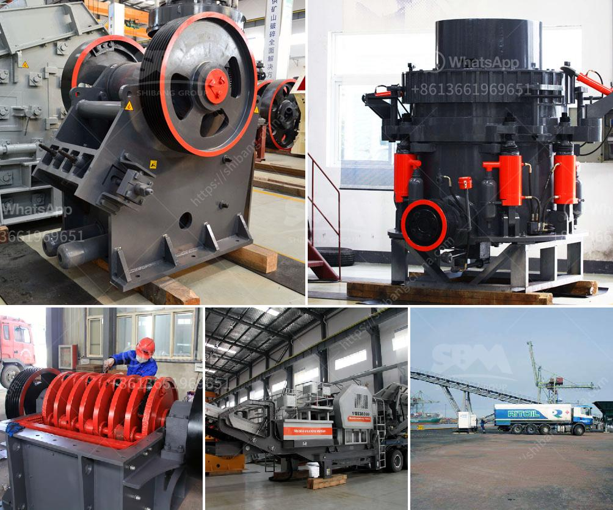

<h3>مصنع معالجة للبيع في جنوب أفريقيا</h3>
تعتبر جنوب أفريقيا من أكبر وأهم دول القارة الأفريقية من حيث الاقتصاد والتجارة. تضم البلاد مجموعة واسعة من الصناعات والقطاعات المتعددة، ومن بينها صناعة معالجة البضائع. وفي هذا السياق، يوجد مصنع معالجة للبيع في جنوب أفريقيا يقدم فرصاً مثيرة للمستثمرين الباحثين عن النجاح والازدهار.

يقع المصنع في منطقة استراتيجية في جنوب أفريقيا، مما يسهل عملية الوصول والتوزيع. يتمتع المصنع بمساحة واسعة تبلغ من 200000 إلى 400000 قدم مربع، مما يوفر مساحة كافية لعملية المعالجة وتخزين المنتجات. كما يحتوي المصنع على معدات وتجهيزات عالية الجودة يتم تجديدها وتوفيرها مع البيع.

يقدم المصنع فرصة ممتازة لتنويع المشاريع والمنتجات الموجودة بالفعل، مثل معالجة الأغذية والمشروبات، والمنتجات الزراعية، والمنتجات الكيماوية والبتروكيماوية. تعتبر صناعة معالجة الأغذية والمشروبات خاصة من أهم القطاعات الصناعية في جنوب أفريقيا، وتُعد الطلبات المحلية والعالمية على هذه المنتجات مستدامة ومتنامية.

بالإضافة إلى ذلك، يشتمل المصنع على مناطق مختلفة للإنتاج والتعبئة والتغليف، مما يوفر إمكانية للتوسع في الإنتاج وتلبية طلبات العملاء بكفاءة أعلى. يتمتع المصنع أيضًا بقاعة مستودعات كبيرة مجهزة بأحدث التقنيات لتخزين المواد الخام والمنتجات النهائية.

بفضل البيئة الاستثمارية المتينة والمستدامة التي توجد في جنوب أفريقيا، يمكن للمستثمرين أن يعملوا بكفاءة وينموا بنجاح. تعد جنوب أفريقيا مركزًا للتجارة والمعاملات في القارة الأفريقية، حيث تتواجد شبكة توزيع قوية ومتشابكة تمتد إلى جميع أنحاء البلاد وحتى أقاليم أخرى في القارة.

بالنظر إلى هذه الفرص المتاحة واحتمالات النمو المستقبلية، يعد هذا المصنع في جنوب أفريقيا فرصة فريدة للمستثمرين الذين يبحثون عن فرص استثمارية نجاحة في صناعة معالجة البضائع. يمثل المصنع منصة مثالية للمستثمرين الذين يسعون إلى توسيع أعمالهم وزيادة ربحيتهم في جنوب أفريقيا ومنطقة القارة الأفريقية بأكملها.

إذا كنت مهتمًا بشراء هذا المصنع المميز في جنوب أفريقيا، فيُنصح بالتواصل مع الوكيل المحلي المعتمد للحصول على مزيد من المعلومات وترتيب زيارة للاطلاع على المصنع بشكل مباشر. إن استثمارك في هذا المشروع قد يكون بداية الطريق نحو النجاح والازدهار في صناعة معالجة البضائع في جنوب أفريقيا.
<h3>Contact us</h3><ul><li><strong>Whatsapp:&nbsp;<a href="https://wa.me/8613661969651">+8613661969651</a></strong></li><li><a href="https://swt.shibang-china.com/?git&amp;zhl&amp;مصنع معالجة للبيع في جنوب أفريقيا"><strong>Online Service(chat now)</strong></a></li></ul><h3>Related</h3><ul><li><a href='مصانع معدات مصانع رمال الفراك.md'>مصانع معدات مصانع رمال الفراك</a></li><li><a href='كم تكلفة كسارة الفك.md'>كم تكلفة كسارة الفك</a></li><li><a href='مطحنة الكرة للصبغة.md'>مطحنة الكرة للصبغة</a></li><li><a href='تدفق عملية مصنع البنتونايت.md'>تدفق عملية مصنع البنتونايت</a></li><li><a href='آلة تكبير الفحم الدقيقة في الهند.md'>آلة تكبير الفحم الدقيقة في الهند</a></li></ul>