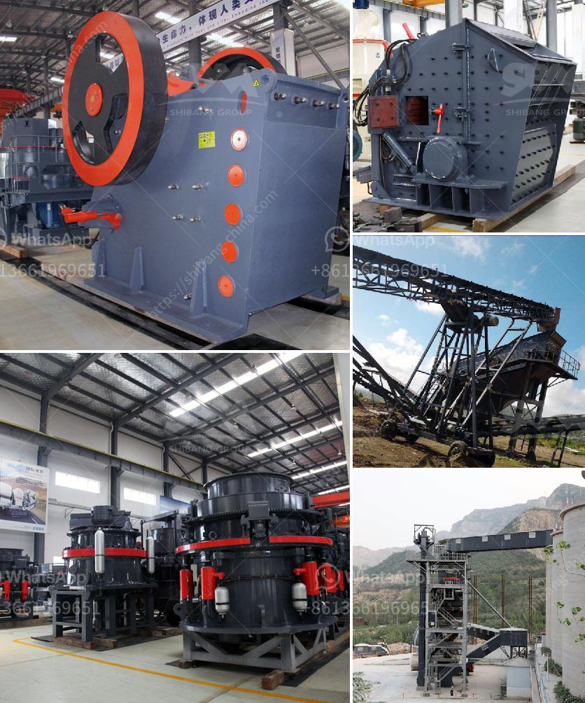

<h3>مصنع معالجة مسحوق الجبس في الهند</h3>
تعد الهند من أكبر منتجي مسحوق الجبس في العالم، وتحظى بعدد كبير من المصانع المتخصصة في معالجة مسحوق الجبس. سنقدم في هذه المقالة نظرة عامة على مصنع معالجة مسحوق الجبس في الهند ودوره في صناعة البناء.

يتم تصنيع مسحوق الجبس في مصانع متواجدة في عدة مناطق في الهند، ومن أبرزها ولاية راجستان وجوجارات وماديا براديش. يتم استخراج المواد الخام المستخدمة في تصنيع مسحوق الجبس من مناجم الجبس الواقعة في هذه المناطق.

يتم تحويل المواد الخام إلى مسحوق الجبس بواسطة الطحن والتجفيف وعمليات التجزيء الأخرى. يتم استخدام معدات متطورة وعمال مهرة لضمان حصول المصنع على جودة عالية من المنتج النهائي. يتم فحص المسحوق بعد عملية التصنيع للتأكد من جودته ومطابقته للمواصفات المطلوبة.

تستخدم الهند كميات كبيرة من مسحوق الجبس في صناعة البناء. يتم استخدام مسحوق الجبس في تصنيع كتل الجبس والجدران الجبسية وأشكال جبسية أخرى. يعتبر الجبس من المواد البنائية المفضلة في الهند بسبب مزاياه العديدة، مثل قوته ومرونته وسهولة التشكيل. يتم استخدامه أيضًا في العزل الحراري والعزل الصوتي وتنظيم درجة الحرارة في المباني.

إلى جانب استخدامه في البناء، يتم أيضًا استخدام مسحوق الجبس في صناعات أخرى مثل الزراعة والفحم النباتي والرخام الصناعي. يتم تصدير مسحوق الجبس المنتج في المصنع إلى عدة دول في جميع أنحاء العالم، مما يسهم في زيادة الإيرادات وتحقيق التنمية الاقتصادية للهند.

في النهاية، يعد مصنع معالجة مسحوق الجبس في الهند جزءًا هامًا من صناعة البناء والتجارة في البلاد. يوفر هذا المصنع فرص عمل للعديد من العمال والفنيين المهرة، بالإضافة إلى المساهمة في تلبية الطلب المحلي والعالمي على مسحوق الجبس. باستخدام تكنولوجيا حديثة ومعايير جودة عالية، يحقق هذا المصنع النجاح والتفوق في صناعة مسحوق الجبس.
<h3>Contact us</h3><ul><li><strong>Whatsapp:&nbsp;<a href="https://wa.me/8613661969651">+8613661969651</a></strong></li><li><a href="https://swt.shibang-china.com/?git&amp;zhl&amp;مصنع معالجة مسحوق الجبس في الهند"><strong>Online Service(chat now)</strong></a></li></ul><h3>Related</h3><ul><li><a href='آلة سحق نقاء الشورا.md'>آلة سحق نقاء الشورا</a></li><li><a href='إجمالي الطاقة لكسارة الفك 500 طن في الساعة.md'>إجمالي الطاقة لكسارة الفك 500 طن في الساعة</a></li><li><a href='حجم طحن البنتونيت.md'>حجم طحن البنتونيت</a></li><li><a href='كسارة الخرسانة للبيع في نيو جيرسي.md'>كسارة الخرسانة للبيع في نيو جيرسي</a></li><li><a href='أسعار كسارات نيجيريا الجديدة.md'>أسعار كسارات نيجيريا الجديدة</a></li></ul>