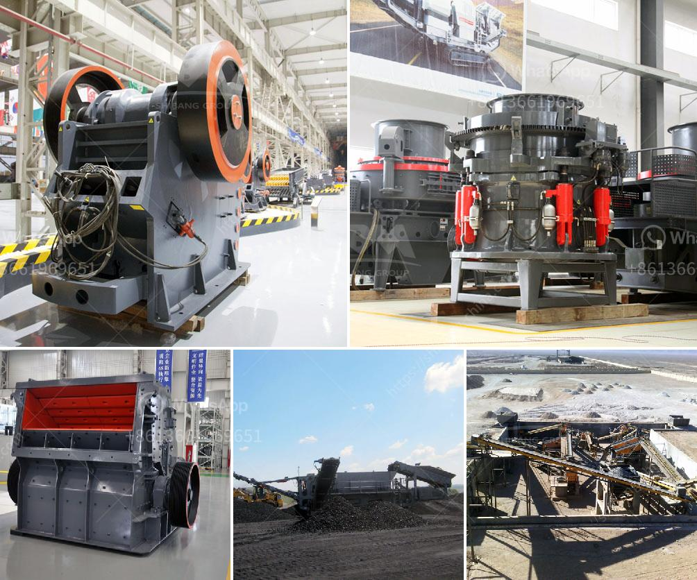

<h3>مصنع معالجة ملح الصخور</h3>
يعتبر مصنع معالجة ملح الصخور إحدى المنشآت الهامة في صناعة الكيمياء والتعدين. يتم استخراج ملح الصخور من طبقات الصخور الجيولوجية التي تكونت من تبخر المياه في الماضي. يحتوي ملح الصخور على نسبة عالية من الصوديوم والكلوريد، مما يجعله من أهم مصادر الملح في العالم.

يتم تركيز عملية معالجة ملح الصخور في المصنع للحصول على ملح نقي وصالح للاستخدام البشري والصناعي. العملية تتضمن عدة خطوات أساسية من بينها التكسير والطحن والترشيح والتجفيف.

أول خطوة في المعالجة هي التكسير، حيث يتم تكسير الصخور الكبيرة إلى قطع صغيرة لسهولة المعالجة. يتم ذلك عن طريق استخدام الكسارات والطواحين. بعد ذلك، تمر القطع الصغيرة بمرحلة الطحن حيث يتم طحنها بواسطة الطواحين الكروية أو الأسطوانية. تتم هذه العملية للحصول على مسحوق ناعم يحتوي على حبيبات ملح صغيرة جداً.

ثم، يتم ترشيح المسحوق المحصول من عملية الطحن لفصل الشوائب والأوساخ المتبقية. يتم ذلك باستخدام وحدات الترشيح التي تزيل المواد الصلبة الغير مرغوب فيها من الملح. يأخذ هذا الخطوة في تحسين نقاوة الملح.

بعد ذلك، يتم تجفيف الملح وذلك باستخدام أفران خاصة تحترق بها الحطب أو الغاز. يتم ذلك للتخلص من الرطوبة الموجودة في الملح ولتحسين مدة صلاحية المنتج. عندما يصبح الملح جافًا تماماً، يتم تعبئته في أكياس أو حاويات بلاستيكية أو قصديرية جاهزة للتسويق والتوزيع.

تحظى صناعة معالجة ملح الصخور بأهمية كبيرة في العالم بسبب استخداماته الواسعة. يستخدم الملح في العديد من الصناعات مثل صناعة الطعام والمشروبات، وصناعة التجميل والعناية الشخصية، وصناعة الملابس، وصناعة المنظفات والصابون. بالإضافة إلى ذلك، يعتبر الملح من العناصر الأساسية في حفظ الأطعمة وتخزينها لفترات طويلة.

باختصار، يعد مصنع معالجة ملح الصخور مصدراً مهماً للحصول على ملح نقي وذو جودة عالية. يتضمن عملية المعالجة عدة خطوات مهمة مثل التكسير والطحن والترشيح والتجفيف. الناتج النهائي يتم تعبئته في أكياس أو حاويات جاهزة للاستخدام والتوزيع في الأسواق المحلية والدولية. يستخدم الملح في العديد من الصناعات ويعتبر من العناصر الأساسية والضرورية في حياتنا اليومية.
<h3>Contact us</h3><ul><li><strong>Whatsapp:&nbsp;<a href="https://wa.me/8613661969651">+8613661969651</a></strong></li><li><a href="https://swt.shibang-china.com/?git&amp;zhl&amp;مصنع معالجة ملح الصخور"><strong>Online Service(chat now)</strong></a></li></ul><h3>Related</h3><ul><li><a href='موردي خط إنتاج الحبر.md'>موردي خط إنتاج الحبر</a></li><li><a href='مواصفات معدات مصنع طحن الحجر.md'>مواصفات معدات مصنع طحن الحجر</a></li><li><a href='استخدامات الصناعية لمسحوق الرخام الأبيض.md'>استخدامات الصناعية لمسحوق الرخام الأبيض</a></li><li><a href='شركات المحاجر في بوكواس وأماسامان.md'>شركات المحاجر في بوكواس وأماسامان</a></li><li><a href='كسارة للذهب.md'>كسارة للذهب</a></li></ul>