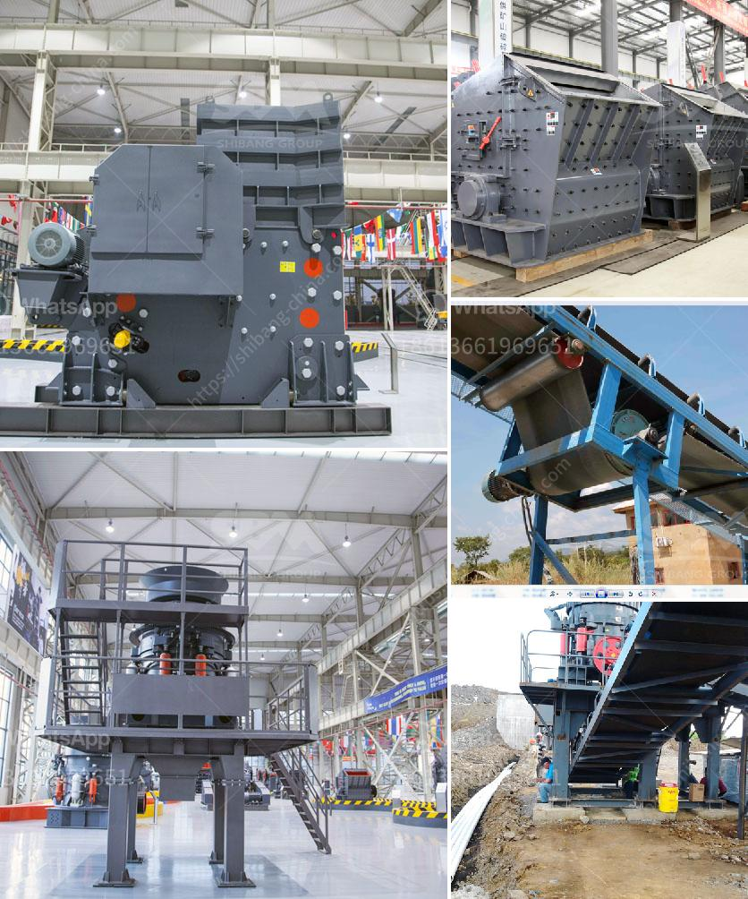

<h3>مصنع معدات التعدين للذهب</h3>
معدات التعدين للذهب تعتبر من العناصر الأساسية للصناعة والتنقيب عن الذهب. تحتاج شركات التعدين التي تُعنى بإستخراج الذهب إلى معدات فعالة وعالية الأداء للحصول على النتائج المرجوة. يوفر مصنع معدات التعدين للذهب هذه المعدات والأدوات اللازمة للتنقيب واستخلاص الذهب من المناجم.

يتضمن مصنع معدات التعدين للذهب مجموعة متنوعة من المعدات مثل الحفارات والقلاووظات والشاحنات التي يتم استخدامها في التنقيب. تُستخدم الحفارات لحفر الأرض والحصول على الصخور المليئة بالذهب. تعمل القلاووظات على سحق الصخور وتفتيتها للوصول إلى الجزيئات الصغيرة من الذهب. وتستخدم الشاحنات لنقل الصخور والمواد الأخرى إلى مواقع المعالجة.

بالإضافة إلى ذلك، يحتوي مصنع معدات التعدين للذهب على مرافق لمعالجة وفصل الذهب. تشمل هذه المرافق الكسارات والمطاحن والسيور الناقلة وتجهيزات أخرى. يتم استخدام الكسارات لتكسير الصخور الكبيرة إلى جزيئات صغيرة تُسمى الركام. ثم تمر هذه الجزيئات عبر المطاحن التي تعمل على طحنها إلى جسيمات أرضية ناعمة. وتنتقل الجسيمات عندئذ عبر السيور الناقلة الى مكان المعالجة النهائية.

إضافةً إلى ذلك، يعتبر مصنع معدات التعدين للذهب عملاقًا من حيث الحجم والتكنولوجيا المستخدمة. يستخدم المصنع أحدث التقنيات والتجهيزات لضمان الكفاءة والدقة في استخلاص الذهب. يُراقب المصنع عن كثب باستخدام أنظمة الكمبيوتر والمراقبة الآلية لضمان عملية استخراج الذهب بكفاءة.

في النهاية، يعتبر المصنع معدات التعدين للذهب أحد العوامل الرئيسية لنجاح شركات التنقيب والتعدين عن الذهب. يوفر المصنع الأدوات والتجهيزات اللازمة لتنفيذ عمليات التعدين بكفاءة وفاعلية ودقة عالية. بفضل تقنياته وتجهيزاته الحديثة، يمكن لشركات التعدين أن تزيد من إنتاجها وتقلص من تكاليف التشغيل وتحسين النتائج النهائية.
<h3>Contact us</h3><ul><li><strong>Whatsapp:&nbsp;<a href="https://wa.me/8613661969651">+8613661969651</a></strong></li><li><a href="https://swt.shibang-china.com/?git&amp;zhl&amp;مصنع معدات التعدين للذهب"><strong>Online Service(chat now)</strong></a></li></ul><h3>Related</h3><ul><li><a href='تكلفة آلة الكسارة.md'>تكلفة آلة الكسارة</a></li><li><a href='معدات تكسير وطحن التلك.md'>معدات تكسير وطحن التلك</a></li><li><a href='تصميم أحزمة الناقلين.md'>تصميم أحزمة الناقلين</a></li><li><a href='صورة لمصنع معالجة رمل السيليكا.md'>صورة لمصنع معالجة رمل السيليكا</a></li><li><a href='مطحنة ريموند 4 أسطوانات.md'>مطحنة ريموند 4 أسطوانات</a></li></ul>