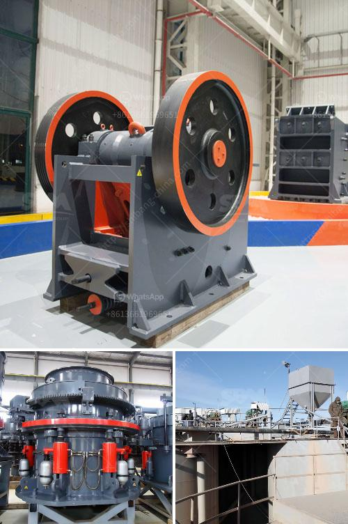

<h3>مصنع مكثف الزنك المحمول</h3>
يعتبر مصنع مكثف الزنك المحمول أحد أحدث التقنيات في صناعة الصناعات الثقيلة. وهو يشير إلى مصنع يستخدم في تصنيع مكثفات الزنك المحمولة التي تستخدم في العديد من التطبيقات الصناعية.

تتميز هذه الأنواع من المصانع بقدرتها على تصنيع مكثفات الزنك بطريقة محمولة، مما يتيح سهولة التركيب والنقل بين المواقع المختلفة. يتم تصميم المصانع النموذجية لتنتج مكثفات بطول يتراوح بين 200 إلى 400 ملم، ولكن يمكن تعديل الأبعاد حسب احتياجات العملاء.

تشتمل عملية تصنيع مكثف الزنك المحمول على عدة خطوات. أولاً، يتم جمع الزنك المعاد تدويره من مصادر مختلفة مثل البطاريات المستعملة ومخلفات الصناعات الأخرى. ثم يتم طحن الزنك وتنقيته من الشوائب والملوثات. يتم معالجة الزنك المطحون في أفران خاصة حيث يتم تسخينه إلى درجة حرارة عالية ليصبح شبيهاً بالمعدن السائل.

بعد ذلك، يتم صب الزنك الساخن في قوالب خاصة لتشكيل المكثفات المطلوبة. يتم تبريدها وفصلها عن القوالب للحصول على منتج نهائي جاهز للاستخدام. يتم تفتيت المكثفات إلى أجزاء صغيرة تستخدم في تصنيع البطاريات وغيرها من التطبيقات.

يعتبر مصنع مكثف الزنك المحمول مناسبًا للشركات الصغيرة والمتوسطة الحجم التي ترغب في توفير مصدر محلي وفعال لتصنيع المكثفات. يتميز هذا النوع من المصانع بسعره المعقول وحجمه الصغير، مما يجعلها مناسبة للحصول على ماكينة إنتاج حديثة وعالية الجودة بتكلفة منخفضة.

يعتبر مصنع مكثف الزنك المحمول مجرد مثال على التطور التكنولوجي في قطاع الصناعات الثقيلة. تلك المصانع توفر فرص عمل للكثير من العمال وتخفض من اعتماد الشركات على الاستيراد. نظرًا لقابليته للنقل والتثبيت، يمكن أن تلبي هذه المصانع الاحتياجات المتغيرة والعاجلة في السوق، مما يجعلها خيارًا مثاليًا للشركات التي تعمل في قطاع البطاريات والتكنولوجيا.
<h3>Contact us</h3><ul><li><strong>Whatsapp:&nbsp;<a href="https://wa.me/8613661969651">+8613661969651</a></strong></li><li><a href="https://swt.shibang-china.com/?git&amp;zhl&amp;مصنع مكثف الزنك المحمول"><strong>Online Service(chat now)</strong></a></li></ul><h3>Related</h3><ul><li><a href='مطاحن الرمل للتصنيع.md'>مطاحن الرمل للتصنيع</a></li><li><a href='آلات الفحم للبيع في جنوب أفريقيا.md'>آلات الفحم للبيع في جنوب أفريقيا</a></li><li><a href='خط سحق البازلت.md'>خط سحق البازلت</a></li><li><a href='مطحنة الكرة في التعدين.md'>مطحنة الكرة في التعدين</a></li><li><a href='آلات غسيل الفحم.md'>آلات غسيل الفحم</a></li></ul>