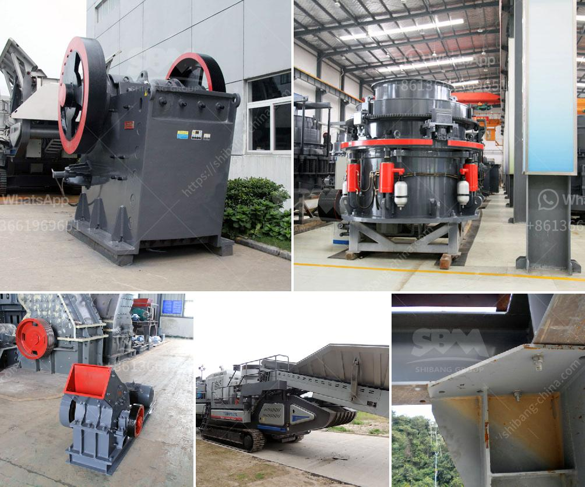

<h3>مصنعو آلات تكسير الحجر</h3>
يعد الحجر أحد المواد الأساسية التي تستخدم في البناء والإنشاءات، ويتم استخراج وتكسير الحجر في مصانع خاصة تتخصص في هذا المجال. تعد آلات تكسير الحجر أدوات حاسمة في هذه المصانع، حيث تعمل على تحويل الحجر من حجمه الكبير إلى قطع صغيرة وذات أحجام مختلفة يمكن استخدامها في مجموعة واسعة من التطبيقات.

تتألف آلات تكسير الحجر من معدات متنوعة تعمل معًا لتحقيق الغرض المطلوب. واحدة من أهم المعدات في مصانع تكسير الحجر هي الكسارة الفكية، حيث تقوم بتكسير الحجر الكبير إلى حجم أصغر باستخدام القوة الميكانيكية. تعمل الكسارة الفكية عن طريق الضغط على الحجر بين صفيحتين تتحركان لتقوم بتكسير الحجر.

بعد ذلك، تستخدم الكسارة المخروطية في عملية تكسير الحجر. تحتوي الكسارة المخروطية على قمع يستقبل الحجر الناتج من الكسارة الفكية ويقوم بتوجيهه نحو الأسفل باتجاه الكسارة المخروطية. تستخدم هذه الكسارة القوة المائية لتكسير الحجر إلى أجزاء أصغر وأدق.

بعد عملية الكسر، يتم استخدام الشاشة أو الغربال لفصل الحصى أو الرمال أو الكسور لتحقيق الحجم المطلوب. تتميز الشاشة بشبكة معدنية تحتوي على ثقوب صغيرة يمر عبرها الحجر المكسور بعد عملية التكسير. يتم فصل الحصى أو الرمل أو الكسور حسب حجمها المطلوب بواسطة شبكة الشاشة.

يجب أن تتمكن آلات تكسير الحجر من التعامل مع مجموعة متنوعة من أنواع الحجر وصلابتها المختلفة. لذلك، يتم استخدام مواد ذات جودة عالية في تصنيع هذه الآلات لتحمل تأثيرات عملية التكسير القوية. تضمن هذه المواد أن الآلات قادرة على العمل بكفاءة ودون أية أضرار أو تلف.

باختصار، يمكن القول إن مصنعو آلات تكسير الحجر يلعبون دورًا حيويًا في صناعة البناء والإنشاءات. توفر هذه الآلات القدرة على تحويل الحجر الكبير إلى قطع صغيرة وذات أحجام مختلفة، مما يسهل استخدامه في مجموعة متنوعة من التطبيقات. تعتبر آلات تكسير الحجر أدوات حاسمة للمصانع في هذه الصناعة، وتساهم في تحقيق احتياجات البناء بكفاءة وفعالية.
<h3>Contact us</h3><ul><li><strong>Whatsapp:&nbsp;<a href="https://wa.me/8613661969651">+8613661969651</a></strong></li><li><a href="https://swt.shibang-china.com/?git&amp;zhl&amp;مصنعو آلات تكسير الحجر"><strong>Online Service(chat now)</strong></a></li></ul><h3>Related</h3><ul><li><a href='كسارة الحجر الجيري المصنعة في باكستان.md'>كسارة الحجر الجيري المصنعة في باكستان</a></li><li><a href='معدات طحن رفيعة جداً رطبة.md'>معدات طحن رفيعة جداً رطبة</a></li><li><a href='آلة طحن الحجر الجيري المصنع.md'>آلة طحن الحجر الجيري المصنع</a></li><li><a href='تكلفة آلة معالجة الفلدسبار.md'>تكلفة آلة معالجة الفلدسبار</a></li><li><a href='معالجة تكسير الكاولين في الهند.md'>معالجة تكسير الكاولين في الهند</a></li></ul>