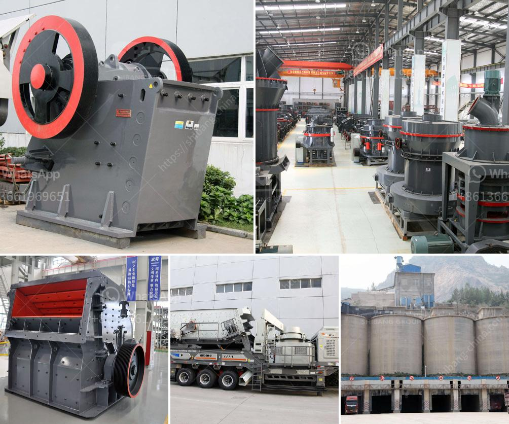

<h3>مصنعو الكرات في بنغالور</h3>
تعد بنغالور، المعروفة باسم "عاصمة تكنولوجيا المعلومات في الهند"، واحدة من أكبر المدن التكنولوجية في العالم. تشتهر بوجود العديد من الشركات التكنولوجية الرائدة، ولكن هناك صناعة أخرى مهمة أيضًا تحظى بتقدير كبير وتلعب دورًا هامًا في اقتصاد المدينة. إنها صناعة الكرات.

مصنعو الكرات في بنغالور هم جزء من سلسلة إنتاج الكرات البلاستيكية والمطاطية. تشمل هذه الكرات العديد من الأحجام والأشكال، مثل الكرات المستديرة والمرنة والمضادة للاهتزاز. تُستخدم هذه الكرات في العديد من الصناعات، بما في ذلك الصيدلانية والبناء والمستحضرات التجميلية وألعاب الأطفال.

تقع مصانع الكرات في مناطق صناعية خاصة في بنغالور، وتمتلك تقنيات متقدمة لإنتاج الكرات بجودة عالية وبسرعة فائقة. تتنوع عمليات الإنتاج في هذه المصانع بدءًا من تحضير مواد البلاستيك أو المطاط، ثم صب وتشكيل المواد لتكوين الكرات، وأخيرًا مرحلة التعبئة والتغليف.

يتم اختبار الجودة بدقة في كل مرحلة من مراحل الإنتاج، لضمان تحقيق معايير الجودة العالمية. إن احترافية مصنعي الكرات في بنغالور واهتمامهم بتوفير أفضل جودة يعزز سمعة هذه الصناعة على المستوى العالمي.

توجد العديد من الفوائد لمصنعي الكرات في بنغالور. أحد الفوائد الرئيسية هي الوصول إلى السوق العالمية، حيث يستورد العديد من البلدان الكرات المصنعة في بنغالور نظرًا لجودتها العالية وتنوعها. كما تساهم هذه الصناعة في توفير فرص العمل للسكان المحليين وزيادة النشاط الاقتصادي في المدينة.

علاوة على ذلك، فإن مصانع الكرات في بنغالور تلتزم بالممارسات البيئية المستدامة. تهتم هذه الصناعة بالاستدامة عن طريق التحكم في استهلاك الطاقة والمواد الخام وتوفير طرق فعالة لإعادة التدوير والتخلص من النفايات بطرق صديقة للبيئة.

في الختام، يعتبر مصنعو الكرات في بنغالور جزءًا أساسيًا من الاقتصاد المزدهر للمدينة. يلتزمون بتوفير جودة عالية وتوفير فرص العمل وحماية البيئة. وبفضل تطور التكنولوجيا والابتكار المستمر في هذه الصناعة، يتوقع أن تزدهر أعمال مصنعي الكرات وتستمر في تلبية الطلب المتزايد في السوق العالمية.
<h3>Contact us</h3><ul><li><strong>Whatsapp:&nbsp;<a href="https://wa.me/8613661969651">+8613661969651</a></strong></li><li><a href="https://swt.shibang-china.com/?git&amp;zhl&amp;مصنعو الكرات في بنغالور"><strong>Online Service(chat now)</strong></a></li></ul><h3>Related</h3><ul><li><a href='مطاحن الهامر المستخدمة في تعدين الذهب.md'>مطاحن الهامر المستخدمة في تعدين الذهب</a></li><li><a href='مصنع سحق محمول بدائرة مغلقة.md'>مصنع سحق محمول بدائرة مغلقة</a></li><li><a href='مصنع كسارة متنقلة.md'>مصنع كسارة متنقلة</a></li><li><a href='مطحنة الكرة في الصناعة.md'>مطحنة الكرة في الصناعة</a></li><li><a href='كسارات حجر مستعملة للبيع.md'>كسارات حجر مستعملة للبيع</a></li></ul>