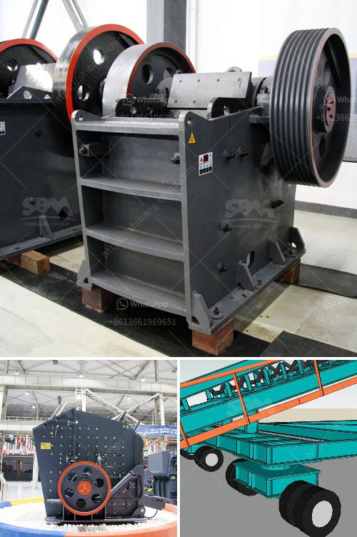

<h3>مصنعو كسارات الجيري</h3>
تعد صناعة الجيري من الصناعات الهامة التي تستخدم في العديد من القطاعات مثل البناء والإنشاءات والصناعات الكيماوية. ولإنتاج الجيري بشكل فعال وبكميات كبيرة، يتم الاستعانة بمصانع كسارات الجيري التي تعتبر أهم عناصر في سلسلة إنتاج الجيري.

تعتبر مصانع كسارات الجيري الأماكن التي يتم فيها سحق وطحن صخور الجيري للحصول على الجسيمات الصغيرة المطلوبة. وتتكون هذه المصانع من مجموعة من الآلات والمعدات المتخصصة التي تقوم بعملية السحق والطحن بشكل دقيق وفعال.

تتألف مصانع كسارات الجيري من العديد من الأجزاء المهمة مثل الكسارات الفكية والكسارات المخروطية والكسارات الصدمية. وتستخدم هذه الكسارات لكسر وسحق الصخور الكبيرة إلى جسيمات صغيرة ومتجانسة تستخدم في مجالات مختلفة. بالإضافة إلى ذلك، تحتوي المصانع على العديد من الآلات الأخرى مثل الناقلات والغرابيل والمطاحن والفرز الاهتزازي ونظام التحكم الآلي وأجهزة الإنذار والسلامة.

يعتمد أداء مصانع كسارات الجيري على الجودة والتقنية المتقدمة للمعدات المستخدمة. ويجب أن تكون هذه المعدات قوية ودقيقة ومتينة لتحمل الصعاب والتحميل الثقيل. كما يجب أن تكون تلك المصانع قادرة على تحمل الظروف القاسية في بيئة العمل مثل الرطوبة والغبار والحرارة المرتفعة.

إن توفير مصانع كسارات الجيري ذات التقنية المتقدمة والجودة العالية يلعب دورًا هامًا في زيادة إنتاجية الجيري وتقليل تكاليف الإنتاج. كما أنها تساهم في تحسين جودة المنتج النهائي وتوفيره بكميات كافية لتلبية احتياجات السوق.

بشكل عام، تعتبر مصانع كسارات الجيري أحد العناصر الرئيسية في صناعة الجيري. تعمل هذه المصانع على تحقيق الاستفادة القصوى من الصخور الجيرية بطرق فعالة ومستدامة. وبالاستفادة من التكنولوجيا المتقدمة وعمليات الإنتاج الدقيقة، يمكن للمصانع تلبية الطلب المتزايد على الجيري وتلبية متطلبات القطاعات الصناعية المختلفة.

إن مصانع كسارات الجيري تلعب دورًا حاسمًا في توفير الجيري اللازم للاستخدامات المختلفة. ومن خلال الاستثمار في تطوير هذه المصانع وتحديث معداتها وتقنياتها، يمكن تحقيق تقدم كبير في صناعة الجيري وتلبية احتياجات السوق المتنامية.
<h3>Contact us</h3><ul><li><strong>Whatsapp:&nbsp;<a href="https://wa.me/8613661969651">+8613661969651</a></strong></li><li><a href="https://swt.shibang-china.com/?git&amp;zhl&amp;مصنعو كسارات الجيري"><strong>Online Service(chat now)</strong></a></li></ul><h3>Related</h3><ul><li><a href='آلة سحق الدولوميت للبيع في دبي.md'>آلة سحق الدولوميت للبيع في دبي</a></li><li><a href='كسارات الحجر في غانا.md'>كسارات الحجر في غانا</a></li><li><a href='كسارة مخروطية HP 200.md'>كسارة مخروطية HP 200</a></li><li><a href='آلة معالجة النحاس.md'>آلة معالجة النحاس</a></li><li><a href='كسارات مخروط متنقلة.md'>كسارات مخروط متنقلة</a></li></ul>