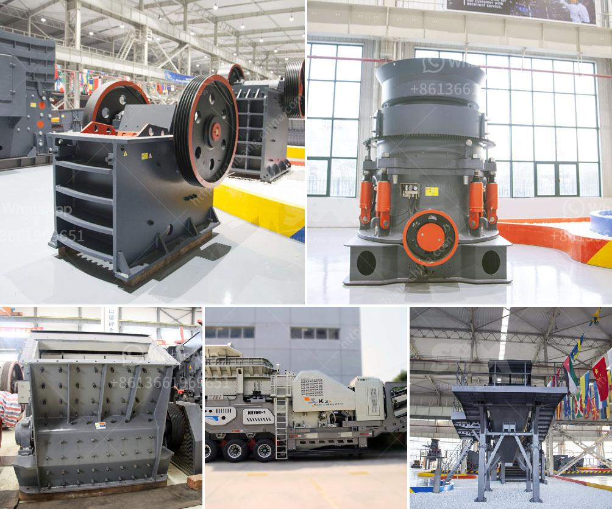

<h3>مصنعون صينيون للمعدات الإنشائية</h3>
تعتبر الصين واحدة من الدول الرائدة في صناعة المعدات الإنشائية حول العالم. فمن خلال الجهود الموجهة لتطوير البنية التحتية والإنشاءات الكبرى داخل البلاد، نجحت الصين في تطوير مصانع متقدمة لإنتاج معدات البناء عالية الجودة وفعالة من حيث التكلفة.

تتميز المعدات الإنشائية الصينية بالتكنولوجيا المتطورة والخبرة الطويلة في هذا المجال. يتم تصميم وتصنيع المعدات باستخدام أحدث التقنيات والمواد ذات الجودة العالية. وباستخدام المعدات الصينية، أصبحت عمليات البناء أكثر سرعة وكفاءة. وبفضل تصميمها المبتكر، يمكن استخدام المعدات لمجموعة متنوعة من التطبيقات الإنشائية.

ومن أهم المعدات الإنشائية التي تنتجها الشركات الصينية هي الحفارات والجرافات والمكابس والرافعات والمضخات والمعدات الثقيلة الأخرى. تشمل هذه المعدات أيضًا الحفارات الهيدروليكية، التي تعتبر من بين أفضل المعدات الصينية في هذا المجال. فهي تتميز بأداء قوي، وقدرة على التحرك بكفاءة في المناطق الضيقة، ومتانة تتحمل الظروف القاسية.

وتهتم الشركات الصينية أيضًا بالتنوع وتوفير مجموعة واسعة من المعدات لتلبية احتياجات العملاء المختلفة. فبفضل التنافس الشديد في هذا القطاع، تسعى الشركات الصينية إلى تقديم أفضل المنتجات بأسعار تنافسية. ونتيجة لذلك، أصبح من الممكن للعملاء في جميع أنحاء العالم الاستفادة من تلك المعدات العالية الجودة بتكلفة أقل.

لكن، يجب أن نعترف أيضًا بأن هناك تحديات تواجهها المعدات الإنشائية الصينية. فمع وجود عدد كبير من الشركات المصنعة، يصعب على المستهلكين اختيار الشركة المناسبة والجودة المضمونة. وهذا يعني أنه يجب على المشترين القيام بالبحث والتحقق والتأكد من سمعة الشركة قبل الشراء.

باختصار، يمثل المصنعون الصينيون للمعدات الإنشائية قطاعًا هامًا في صناعة البناء العالمية. تمتلك الصين التكنولوجيا والخبرة اللازمة لتلبية احتياجات العملاء وتوفير معدات عالية الجودة بأسعار تنافسية. التزامهم بالتحسين المستمر وتقديم حلول فعالة يجعل الصين تستحق الاعتراف كواحدة من أفضل الدول المصنعة للمعدات الإنشائية في العالم.
<h3>Contact us</h3><ul><li><strong>Whatsapp:&nbsp;<a href="https://wa.me/8613661969651">+8613661969651</a></strong></li><li><a href="https://swt.shibang-china.com/?git&amp;zhl&amp;مصنعون صينيون للمعدات الإنشائية"><strong>Online Service(chat now)</strong></a></li></ul><h3>Related</h3><ul><li><a href='كسارات مزدوجة التبديل.md'>كسارات مزدوجة التبديل</a></li><li><a href='مطحنة الكرة للجبس.md'>مطحنة الكرة للجبس</a></li><li><a href='مصنعين كسارات في روسيا.md'>مصنعين كسارات في روسيا</a></li><li><a href='خطة التحكم في تصنيع مطحنة الكرة.md'>خطة التحكم في تصنيع مطحنة الكرة</a></li><li><a href='حدود اهتزاز مطحنة الكرة.md'>حدود اهتزاز مطحنة الكرة</a></li></ul>