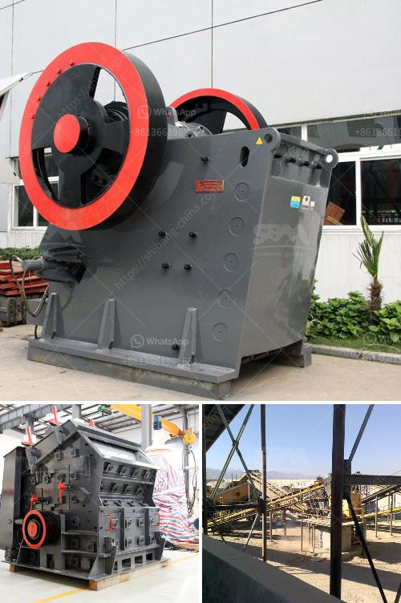

<h3>مصنعون لفاصل المغناطيسي في تركيا</h3>
تركيا هي واحدة من البلدان الرائدة في صناعة الفواصل المغناطيسية في العالم. يعود ذلك إلى استفادتها من الموارد الطبيعية الوفيرة والتكنولوجيا المتقدمة التي تتمتع بها البلاد. تتعدد استخدامات الفواصل المغناطيسية في الصناعات المختلفة مثل الصناعة الكهربائية والإلكترونية والطبية والسيارات والعديد من التطبيقات الأخرى.

يحتوي قطاع تصنيع الفواصل المغناطيسية في تركيا على العديد من الشركات والمصانع المتخصصة في هذا المجال. يقع العديد من هذه المصانع في مدن مثل إسطنبول وبورصة وأنقرة وأضنة وغيرها من المدن الصناعية الكبرى في البلاد. تتميز هذه المصانع بتوفيرها لمنتجات عالية الجودة وتقديم خدمة ممتازة لعملائها.

تستخدم الفواصل المغناطيسية في العديد من الصناعات. على سبيل المثال، تستخدم في صناعة المحركات الكهربائية لفصل المجالات المغناطيسية وضمان عمل المحرك بكفاءة عالية. كما تستخدم في صناعة المولدات الكهربائية والتوربينات لضمان توليد الكهرباء بكفاءة. بالإضافة إلى ذلك، تستخدم الفواصل المغناطيسية في الأجهزة الطبية مثل أجهزة التصوير بالرنين المغناطيسي لفصل الصورة النهائية بطريقة دقيقة وواضحة.

الفواصل المغناطيسية المصنوعة في تركيا تلقى اهتماماً كبيراً من قبل الشركات حول العالم. يلعب الابتكار والتطوير الدور الأساسي في نجاح صناعة الفواصل المغناطيسية في تركيا. تعتمد هذه المصانع على التكنولوجيا المتطورة والبحث والتطوير المستمر لتحسين مستوى جودة المنتجات وتطوير منتجات جديدة تلبي احتياجات السوق العالمية.

يوفر قطاع تصنيع الفواصل المغناطيسية في تركيا فرص عمل مهمة ويسهم في نمو الاقتصاد الوطني. بالإضافة إلى السواق الخارجية، يلبي الطلب المحلي على الفواصل المغناطيسية. حكومة تركيا تعزز هذا القطاع من خلال دعمها للشركات المصنعة وتوفير البنية التحتية اللازمة وتشجيع الاستثمار في تكنولوجيا التصنيع.

تعد تركيا وجهة مثالية للعملاء الذين يبحثون عن فواصل مغناطيسية ذات جودة عالية وبأسعار تنافسية. يعد قطاع تصنيع الفواصل المغناطيسية في تركيا مثالاً رائعاً على قوة صناعتها وقدرتها على المنافسة في الأسواق العالمية. من خلال الابتكار والجودة في التصنيع، تستمر تركيا في تعزيز مكانتها كواحدة من البلدان الرائدة في هذا المجال.
<h3>Contact us</h3><ul><li><strong>Whatsapp:&nbsp;<a href="https://wa.me/8613661969651">+8613661969651</a></strong></li><li><a href="https://swt.shibang-china.com/?git&amp;zhl&amp;مصنعون لفاصل المغناطيسي في تركيا"><strong>Online Service(chat now)</strong></a></li></ul><h3>Related</h3><ul><li><a href='بيع كسارة الحجر للبيع.md'>بيع كسارة الحجر للبيع</a></li><li><a href='كسارة الحجر من النوع الصغير.md'>كسارة الحجر من النوع الصغير</a></li><li><a href='كسارات صخور cec للبيع.md'>كسارات صخور cec للبيع</a></li><li><a href='مطحنة هامر في جنوب أفريقيا.md'>مطحنة هامر في جنوب أفريقيا</a></li><li><a href='كتالوج كسارة الفك بوزولانا.md'>كتالوج كسارة الفك بوزولانا</a></li></ul>