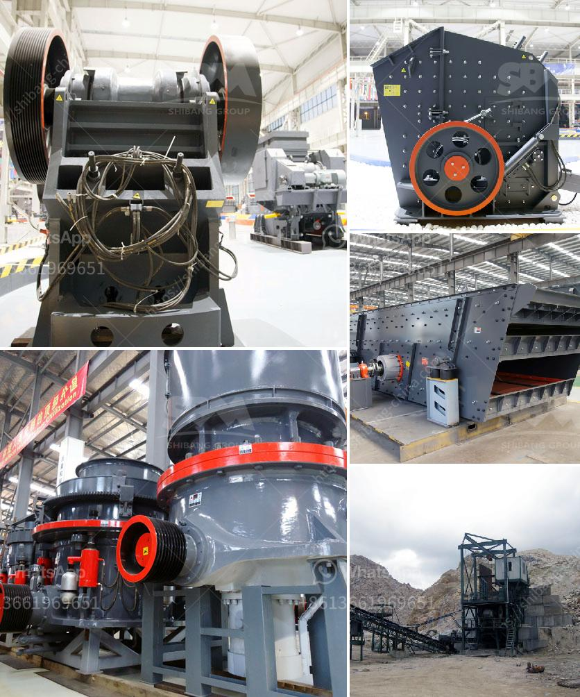

<h3>مصنعون لكسارات الصدم</h3>
تعتبر كسارات الصدم من أهم المعدات في صناعة التعدين والبناء، حيث تستخدم لتكسير المواد الصلبة والصخور الضخمة إلى قطع صغيرة قابلة للاستخدام في عمليات البناء والتشييد. ويتم تصنيع هذه الكسارات من قبل العديد من الشركات المتخصصة في هذا المجال.

في هذه المقالة، سنتحدث عن أهم مصنعي كسارات الصدم ودورهم في صناعة هذه المعدات الحيوية.

أحد أبرز مصنعي كسارات الصدم هو شركة Sandvik، التي تعتبر واحدة من أكبر الشركات العالمية في مجال تصنيع المعدات الثقيلة والمعدات المتخصصة في البناء. توفر Sandvik مجموعة واسعة من كسارات الصدم التي تلبي احتياجات العملاء المختلفة، سواء كانت للتعدين أو البناء. تتميز منتجات Sandvik بالجودة العالية والمتانة، وتعتبر خيارًا مثاليًا للشركات الكبيرة التي تبحث عن كسارات صلبة وفعالة.

أخرى من الشركات البارزة في هذا المجال هي شركة Metso، وهي شركة تصنع مجموعة واسعة من المعدات الثقيلة بما في ذلك كسارات الصدم. تكون كسارات Metso قوية وفعالة وتتمتع بتقنيات متطورة، مما يجعلها استثمارًا جيدًا للشركات الصناعية التي تحتاج إلى كسارات تعمل بكفاءة عالية.

بالإضافة إلى ذلك، هناك شركات أخرى متخصصة في تصنيع كسارات الصدم مثل Hazemag و Kleemann وغيرها الكثير. توفر هذه الشركات منتجات متنوعة تناسب احتياجات العملاء المختلفة، وتتميز بالتكنولوجيا الحديثة والجودة العالية.

يلعب مصنعو كسارات الصدم دورًا حيويًا في صناعة البناء والتعدين، حيث تعتبر هذه الكسارات أساسية في عملية التكسير وتحويل المواد إلى قطع قابلة للاستخدام. وبفضل التكنولوجيا المتقدمة والابتكار المستمر، يعمل هؤلاء المصنعون على تطوير وتحسين منتجاتهم بشكل مستمر من أجل تلبية احتياجات الصناعة.

في الختام، يمكن القول أن مصنعون كسارات الصدم يقدمون مجموعة متنوعة من المعدات عالية الجودة والتكنولوجيا المتقدمة. تلك المعدات تلعب دورًا حاسمًا في تسهيل عمليات التعدين والبناء، وتعزز الإنتاجية والكفاءة في الصناعة.
<h3>Contact us</h3><ul><li><strong>Whatsapp:&nbsp;<a href="https://wa.me/8613661969651">+8613661969651</a></strong></li><li><a href="https://swt.shibang-china.com/?git&amp;zhl&amp;مصنعون لكسارات الصدم"><strong>Online Service(chat now)</strong></a></li></ul><h3>Related</h3><ul><li><a href='أعمال تكسير الصخور في باكستان.md'>أعمال تكسير الصخور في باكستان</a></li><li><a href='مصنع سحق حجر كامل بسعة 300 طن.md'>مصنع سحق حجر كامل بسعة 300 طن</a></li><li><a href='كسارة الفك الصينية PE 150 250 في الفلبين.md'>كسارة الفك الصينية PE 150 250 في الفلبين</a></li><li><a href='كسارة الفك الجرانيت.md'>كسارة الفك الجرانيت</a></li><li><a href='كسارة الكاولين المحمولة في نيجيريا.md'>كسارة الكاولين المحمولة في نيجيريا</a></li></ul>