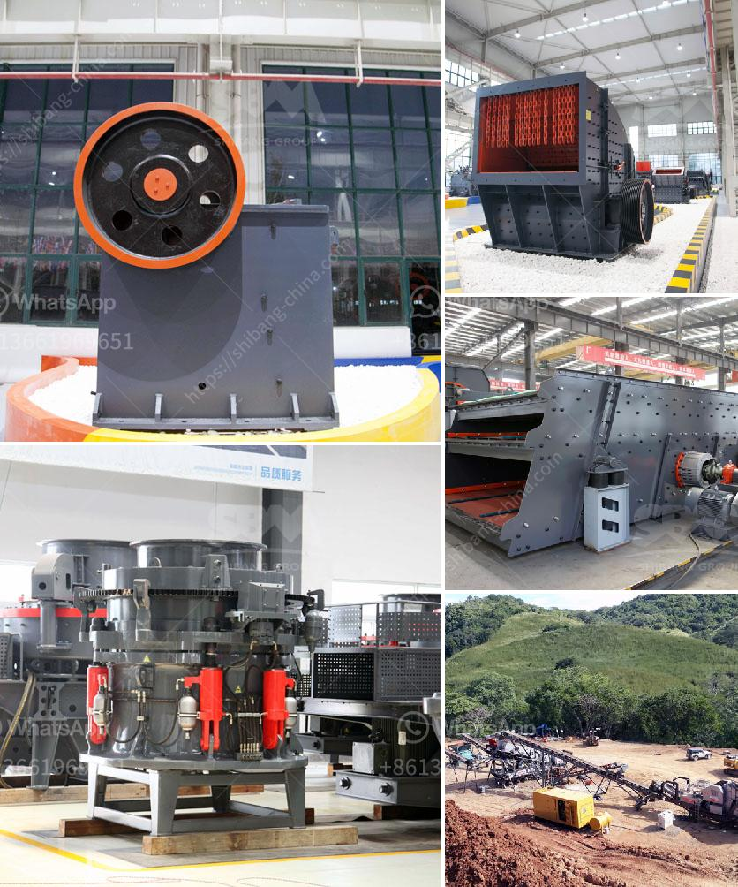

<h3>مصنعون لكسارات في أوروبا</h3>
تعتبر صناعة الكسارات من الصناعات المهمة لتكسير الصخور والحصى والمواد الخام لإنتاج الركام اللازم لمشاريع البناء. تعتبر أوروبا واحدة من أكبر أسواق صناعة الكسارات في العالم، حيث توجد فيها العديد من الشركات المتخصصة في تصنيع وتوفير هذه الآلات عالية الجودة.

تتميز مصنعون لكسارات في أوروبا بتوفيرهم أحدث التقنيات وأكثرها تطورًا في صناعة الكسارات. فهم يهتمون بالبحث والتطوير المستمر لتحسين أداء هذه الآلات وزيادة إنتاجيتها وكفاءتها وسلامتها. كما يسعون لتقديم الحلول الابتكارية التي تلبي احتياجات العملاء وتساعدهم في تحقيق أهدافهم.

واحدة من الشركات الرائدة في صناعة الكسارات في أوروبا هي شركة "ساندفيك" (Sandvik). تأسست الشركة في السويد في عام 1862 وتعد واحدة من أكبر الشركات المصنعة للمعدات والآلات الثقيلة في العالم. تعمل شركة ساندفيك على تطوير تكنولوجيا متقدمة في مجال صناعة الكسارات، وتقدم مجموعة واسعة من المنتجات بما في ذلك الكسارات الفكية والمخروطية والصدمية. تستخدم منتجات ساندفيك على نطاق واسع في مجالات البناء والتعدين وصناعة الركام.

بالإضافة إلى شركة ساندفيك، هناك العديد من الشركات الأخرى المتخصصة في تصنيع الكسارات في أوروبا مثل شركة "متسو" (Metso) وشركة "كيففمو" (Keestrack) وشركة "تيركس فضلاتراك" (Terex Finlay). جميع هذه الشركات معروفة بالجودة العالية لمنتجاتها وتتمتع بسمعة ممتازة في صناعة الكسارات.

في الختام، يتمتع مصنعون لكسارات في أوروبا بسمعة ممتازة في التصنيع والابتكار في هذه الصناعة المهمة. تعتبر منتجاتهم ذات جودة عالية وتلبي احتياجات العملاء من حيث الكفاءة والأداء. وبفضل التكنولوجيا المتقدمة والابتكار المستمر، تعد صناعة الكسارات في أوروبا قطاعًا حيويًا يلبي احتياجات السوق المحلية والعالمية للركام والمواد الخام المطلوبة لمشاريع البناء.
<h3>Contact us</h3><ul><li><strong>Whatsapp:&nbsp;<a href="https://wa.me/8613661969651">+8613661969651</a></strong></li><li><a href="https://swt.shibang-china.com/?git&amp;zhl&amp;مصنعون لكسارات في أوروبا"><strong>Online Service(chat now)</strong></a></li></ul><h3>Related</h3><ul><li><a href='تكلفة مطحنة مسحوق صغيرة.md'>تكلفة مطحنة مسحوق صغيرة</a></li><li><a href='خط إنتاج مسحوق الجبس الرسم التخطيطي.md'>خط إنتاج مسحوق الجبس الرسم التخطيطي</a></li><li><a href='سعر كسارة الحجر المحمولة في.md'>سعر كسارة الحجر المحمولة في</a></li><li><a href='مصنع كسارة الفحم المحمول 400 طن في الساعة.md'>مصنع كسارة الفحم المحمول 400 طن في الساعة</a></li><li><a href='علامات الناقل والكسارات في إندونيسيا.md'>علامات الناقل والكسارات في إندونيسيا</a></li></ul>