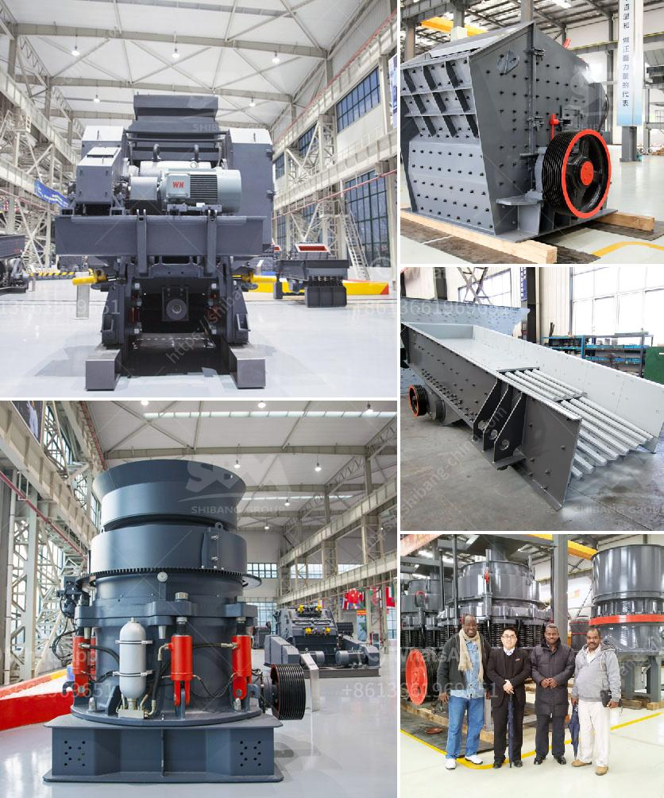

<h3>مصنعون لمسحوق الطين</h3>
يُعد مسحوق الطين واحدًا من المنتجات الطبيعية التي تُستخدم على نطاق واسع في مختلف الصناعات والتطبيقات. ويرجع ذلك إلى الخصائص الفريدة التي يوفرها المسحوق، وهي قدرته العالية على الامتصاص والتجميد والحفاظ على الرطوبة. تعد الطين سهلة التكوين والتحويل إلى مسحوق ، حيث يجفف ويطحن للحصول على النتيجة النهائية.

توجد الآن العديد من الشركات التي تعمل في مجال صناعة مساحيق الطين حول العالم. وتتراوح قدرة الإنتاج لهذه الشركات بين 200 إلى 400 طن في الساعة. وتهتم تلك الشركات بتقديم منتجات عالية الجودة تلبي توقعات العملاء في مختلف القطاعات.

تُعتبر صناعة مسحوق الطين عملية طويلة ومعقدة، حيث يتطلب تجهيز الطين الخام قبل بدء عملية التصنيع. تتضمن هذه العملية إزالة الشوائب والمواد الغريبة ثم تجفيف الطين باستخدام أجهزة تسخين خاصة. بعد ذلك، يتم سحق الطين إلى شكل مسحوق بواسطة الكسارات والمطاحن المختلفة. يتم تصنيف حجم الجسيمات وفقًا لمتطلبات العملاء النهائية والتطبيقات المختلفة.

تعمل شركات مصنعة لمسحوق الطين على تطوير مجموعة متنوعة من المنتجات والدرجات المختلفة لتلبية احتياجات السوق المتنوعة. فمن بين هذه المنتجات تشمل مساحيق الطين البنتونيت التي تستخدم في العديد من التطبيقات مثل صناعة الورق والبتروكيماويات والدهانات. وتُستخدم أيضًا مساحيق الطين في صناعات السيراميك والطوب والألوان والصبغات. كما تُستخدم في مجال العناية بالبشرة والمستحضرات التجميلية بسبب فوائدها العلاجية والمضادة للالتهابات.

بالإضافة إلى جودة المنتجات، يعتبر الالتزام بالجودة والسلامة والمسؤولية البيئية ضرورة في صناعة مسحوق الطين. تعمل الشركات المصنعة على تطبيق أعلى المعايير في إدارة الجودة واتباع التدابير البيئية للحد من التأثيرات السلبية. قد يشمل ذلك استخدام أنظمة مراقبة الجودة المتقدمة وتحليل المختبر وتطبيق إجراءات السلامة والتدابير الوقائية التي تحمي الموظفين والبيئة.

في النهاية، تُعد شركات مصنعة لمسحوق الطين روادًا في صناعة المواد الطبيعية، حيث تلبي تطلعات العملاء وتعزز التنمية المستدامة. ومن خلال تعزيز الجودة والابتكار والمسؤولية، تستمر هذه الشركات في تحقيق نجاحاتها وتوسيع انتشارها في الأسواق المحلية والعالمية.
<h3>Contact us</h3><ul><li><strong>Whatsapp:&nbsp;<a href="https://wa.me/8613661969651">+8613661969651</a></strong></li><li><a href="https://swt.shibang-china.com/?git&amp;zhl&amp;مصنعون لمسحوق الطين"><strong>Online Service(chat now)</strong></a></li></ul><h3>Related</h3><ul><li><a href='أصغر كسارة فك محمولة للبيع في جنوب أفريقيا.md'>أصغر كسارة فك محمولة للبيع في جنوب أفريقيا</a></li><li><a href='كسارة الحجر الصخري في الفلبين.md'>كسارة الحجر الصخري في الفلبين</a></li><li><a href='كسارات مزدوجة التبديل.md'>كسارات مزدوجة التبديل</a></li><li><a href='مطحنة فحم رولر.md'>مطحنة فحم رولر</a></li><li><a href='مصنع كربونات الكالسيوم المرسبة.md'>مصنع كربونات الكالسيوم المرسبة</a></li></ul>