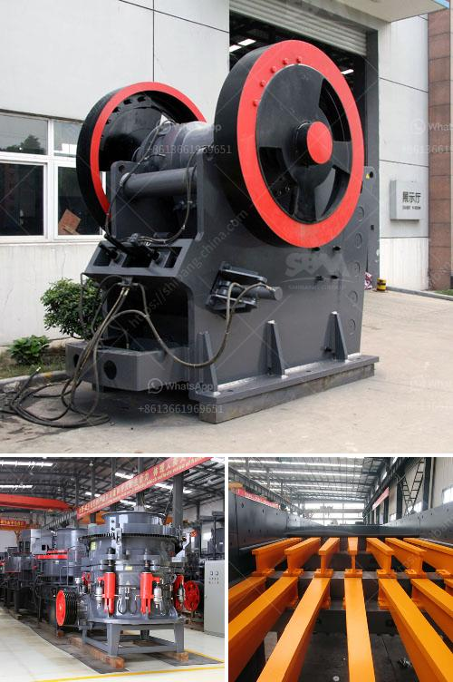

<h3>مصنعون لمصانع التكسير المتنقلة</h3>
مصنعون لمصانع التكسير المتنقلة: الابتكار والكفاءة في صناعة التكسير

تعتبر مصانع التكسير المتنقلة من الآلات الهامة في صناعة التكسير وتجهيز المعادن والحجارة. يعد توفير مصانع التكسير المتنقلة من قبل شركات متخصصة ومصنعين ذوي خبرة أمراً حاسماً للعديد من القطاعات مثل تعدين المحاجر والبناء وإعادة التدوير والطرق. سنتطرق في هذه المقالة إلى الدور الذي يقدمه مصنعون لمصانع التكسير المتنقلة في هذه الصناعة والتحديات التي يواجهونها.

أحد أهم الجوانب التي يواجهها المصنعون لمصانع التكسير المتنقلة هو التصميم والابتكار. فقد يحتاج العملاء إلى معدات تكسير متطورة وذات إنتاجية عالية تستطيع التعامل مع المواد الخام بكفاءة وجودة. لذلك، يقوم المصنعون بالتعاون مع الهندسة الميكانيكية والمادية لتصميم وتصنيع مصانع التكسير المتنقلة التي تلبي احتياجات العميل بدقة. مثلاً، يتم تطوير الآلات وتحسينها باستمرار لتحقيق أداء أفضل ووظائف متعددة، مثل وحدات الغربلة والفصل الذي يمكن تركيبها وتعديلها حسب احتياجات المشروع.

واحدة من التحديات الرئيسية التي تواجهها شركات تصنيع مصانع التكسير المتنقلة هي توفير معدات ذات جودة عالية بأسعار تنافسية. يعتبر تكلفة شراء وصيانة مصانع التكسير المتنقلة عاملًا مهمًا في قرار العملاء في اختيار المورد المناسب. لذلك، يقوم المصنعون بتحسين عمليات الإنتاج والتكنولوجيا لتحقيق تكاليف إنتاج منخفضة. تستخدم بعض الشركات تقنيات جديدة مثل الروبوتات والأتمتة لزيادة الإنتاجية وتقليل التكاليف.

بالإضافة إلى ذلك، يهتم المصنعون ببيئة العمل وسلامة العاملين. يعملون على تصميم وتصنيع المصانع المتنقلة بطريقة تحافظ على سلامة العاملين وتتبع القوانين واللوائح البيئية. فعلى سبيل المثال، تم تطوير نظم التحكم في الغبار والضوضاء للحفاظ على بيئة عمل صحية وآمنة.

في الختام، يمكن القول إن مصنعي مصانع التكسير المتنقلة يسهمون بشكل كبير في تقدم صناعة التكسير وتجهيز المواد. يعملون على تصميم وتصنيع معدات ذات جودة عالية وإنتاجية مع مراعاة الاحتياجات والمتطلبات المحددة لكل عميل. بالإضافة إلى ذلك، يسعون لتحقيق تكاليف منخفضة وزيادة الكفاءة بمساعدة التكنولوجيا والأتمتة. لذا، فإن اختيار مصنع موثوق به ومتخصص يعد خطوة حاسمة لتحقيق نتائج ممتازة ومستدامة في هذه الصناعة المتطورة.
<h3>Contact us</h3><ul><li><strong>Whatsapp:&nbsp;<a href="https://wa.me/8613661969651">+8613661969651</a></strong></li><li><a href="https://swt.shibang-china.com/?git&amp;zhl&amp;مصنعون لمصانع التكسير المتنقلة"><strong>Online Service(chat now)</strong></a></li></ul><h3>Related</h3><ul><li><a href='موزع كسارة في إندونيسيا.md'>موزع كسارة في إندونيسيا</a></li><li><a href='أفضل وسادات طحن للرخام في باكستان.md'>أفضل وسادات طحن للرخام في باكستان</a></li><li><a href='مطحنة الدولوميت بحجم 13x18 للبيع.md'>مطحنة الدولوميت بحجم 13x18 للبيع</a></li><li><a href='كسارة VSI لسحق الرمل.md'>كسارة VSI لسحق الرمل</a></li><li><a href='كسارة الحجر بوزولانا 100 طن في الساعة.md'>كسارة الحجر بوزولانا 100 طن في الساعة</a></li></ul>