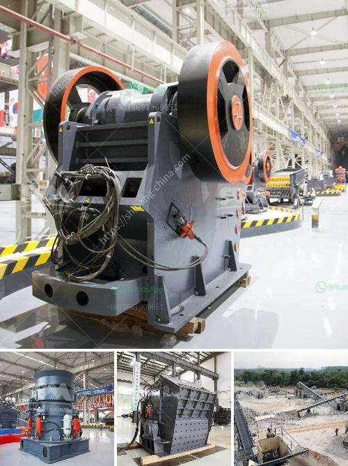

<h3>مصنعي آلات المحجر</h3>
مصنعي آلات المحجر: تقنية مبتكرة لتلبية الاحتياجات العالمية في مجال البناء

في عصرنا الحديث، نواجه ارتفاعاً ملحوظاً في الطلب على المواد الإنشائية، وخاصة الحصى والرمل، التي تعد أحجار الأساس في صناعة البناء. من أجل تلبية هذا الطلب المتزايد، ازدهرت صناعة مصنعي آلات المحاجر.

يعد المحجر مكاناً حيوياً لاستخراج المواد الصلبة والمتميزة المستخدمة في صناعة البناء. ولكن من أجل تحسين وتسهيل عملية استخراج هذه المواد، تم تطوير آلات المحاجر، والتي تلعب دوراً رئيسياً في تحقيق الكفاءة والإنتاجية في هذا القطاع.

تتنوع آلات المحاجر في الأحجام والأنواع والوظائف المختلفة. فمنها ما يستخدم لنقل وتحميل المواد الصلبة، ومنها ما يستخدم لتكسير وغربلة الحصى والصخور، ومنها ما يستخدم لتخزين وتنظيم المواد الخام المستخرجة. تتميز هذه الآلات بتقنيات حديثة ومتطورة، تسمح بزيادة الإنتاجية وتقليل التكاليف وتحسين نوعية المنتج النهائي.

يعتبر قطاع صناعة المحاجر من القطاعات الحيوية في العديد من الدول الرئيسية في العالم، حيث يلتزم مصنعو آلات المحاجر بتقديم أفضل الحلول التكنولوجية لهذا القطاع. يعتبر جودة المنتج وقدرته على تلبية متطلبات السوق والمتعاملين الرئيسيين أمراً أساسياً لنجاح أي مصنع للمحجر. يقوم مصنعو آلات المحاجر بتزويد المهندسين والعمال بمعدات متطورة وآليات متقدمة لضمان عمليات استخراج وإنتاج فعالة وآمنة.

ومن المهم أيضاً توفير خدمات ما بعد البيع الممتازة والدعم الفني المستمر للعملاء. يساهم هذا الدعم في زيادة الموثوقية والاستدامة للآلات، ويساعد في تقليل تكاليف الصيانة وتحسين كفاءة الإنتاج.

في النهاية، تعتبر صناعة مصنعي آلات المحاجر حجر الزاوية لتحقيق التطور والتقدم في قطاع البناء. وتلعب هذه الآلات دوراً حيوياً في زيادة الإنتاجية وتحسين نوعية المنتجات، وهي تسهم في تلبية الاحتياجات المستدامة للمجتمع بشكل عام. إن تقنية مصنعي آلات المحاجر المبتكرة تمثل مستقبلًا واعدًا لقطاع البناء.
<h3>Contact us</h3><ul><li><strong>Whatsapp:&nbsp;<a href="https://wa.me/8613661969651">+8613661969651</a></strong></li><li><a href="https://swt.shibang-china.com/?git&amp;zhl&amp;مصنعي آلات المحجر"><strong>Online Service(chat now)</strong></a></li></ul><h3>Related</h3><ul><li><a href='كسارة متنقلة في اليابان.md'>كسارة متنقلة في اليابان</a></li><li><a href='مصانع المعالجة في الصين للحجر الجيري.md'>مصانع المعالجة في الصين للحجر الجيري</a></li><li><a href='نموذج لآلة التكسير.md'>نموذج لآلة التكسير</a></li><li><a href='مطحنة الكرة للجبس.md'>مطحنة الكرة للجبس</a></li><li><a href='مطاحن الكرة الأرجنتينية.md'>مطاحن الكرة الأرجنتينية</a></li></ul>