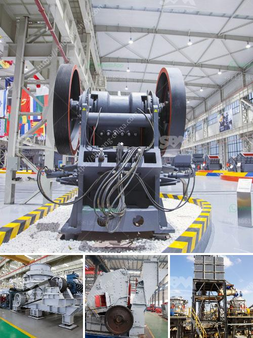

<h3>مصنعي آلات تكسير حجر المحجر</h3>
تعد آلات تكسير حجر المحجر أدوات مهمة في صناعة البناء والبناء. فهي تستخدم لتكسير الصخور الكبيرة إلى قطع صغيرة من الحصى أو الرمل المستخدم في بناء الطرق والمباني والجسور وغيرها من المشاريع الضخمة. تعتبر آلات تكسير حجر المحجر من بين أهم الأدوات في هذه الصناعة وتساهم بشكل كبير في تسريع عمليات البناء وتحسين كفاءتها.

يوجد العديد من الشركات المصنعة المتخصصة في تصنيع آلات تكسير حجر المحجر. تتنوع هذه الآلات وتختلف في الحجم والسعة والتقنيات المستخدمة. كما تتفاوت الأسعار والأداء بين الماركات المختلفة. إلا أن المصنعين الرائدين لهذا النوع من الآلات يمتلكون سمعة جيدة في السوق وتحظى منتجاتهم بثقة العملاء.

تولي الشركات المصنعة اهتمامًا كبيرًا لجودة المواد المستخدمة في تصنيع آلاتها. يتم استخدام معدات وتقنيات حديثة لضمان الأداء العالي والكفاءة العالية لهذه الآلات. تتم مراقبة الجودة بدقة في مراحل التصنيع والتجميع لضمان أن يتم توفير منتج ذو جودة عالية وأمان عند الاستخدام.

بالإضافة إلى ذلك، تعمل الشركات المصنعة على تطوير تصاميم آلاتها لتلبية احتياجات العملاء المتغيرة. يتم تقديم آلات بأحجام وقدرات مختلفة لتلبية الطلب المتزايد على هذه الآلات في قطاع البناء.

عند شراء آلة تكسير حجر المحجر، يجب على العملاء اختيار الشركة المصنعة الموثوقة التي توفر منتجات عالية الجودة وبأسعار تنافسية. ينبغي أيضًا مراجعة خدمة العملاء التي تقدمها هذه الشركات، بما في ذلك خدمات الصيانة وقطع الغيار للآلات.

باختصار، تعتبر آلات تكسير حجر المحجر أدوات حيوية في صناعة البناء والبناء. اختيار الشركة المصنعة المناسبة لشراء هذه الآلات يؤثر بشكل كبير على جودة وأداء الآلات. لذا، يجب على العملاء الاهتمام بجودة المواد المستخدمة وتقنيات التصنيع التي تتبعها الشركة المصنعة، بالإضافة إلى خدمة العملاء المقدمة منها.
<h3>Contact us</h3><ul><li><strong>Whatsapp:&nbsp;<a href="https://wa.me/8613661969651">+8613661969651</a></strong></li><li><a href="https://swt.shibang-china.com/?git&amp;zhl&amp;مصنعي آلات تكسير حجر المحجر"><strong>Online Service(chat now)</strong></a></li></ul><h3>Related</h3><ul><li><a href='مصنع تكسير البوكسيت في الجزائر.md'>مصنع تكسير البوكسيت في الجزائر</a></li><li><a href='تجهيز خام الحديد بي دي إف.md'>تجهيز خام الحديد بي دي إف</a></li><li><a href='مطاحن الكرة الفلسبار.md'>مطاحن الكرة الفلسبار</a></li><li><a href='اتصالات أحزمة الناقلات.md'>اتصالات أحزمة الناقلات</a></li><li><a href='شركة تصنيع آلات الحجر في إيروود.md'>شركة تصنيع آلات الحجر في إيروود</a></li></ul>