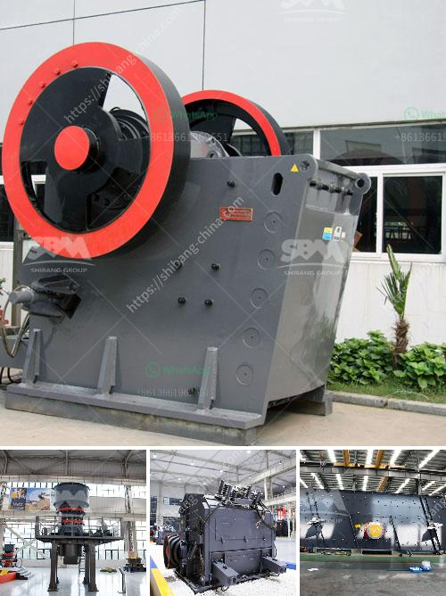

<h3>مصنعي أحزمة الناقلات في بنجلاديش</h3>
بنجلاديش هي واحدة من الدول الرائدة في صناعة النسيج والملابس في جنوب آسيا. يُعتبر قطاع الأحزمة للناقلات من الصناعات التي ازدهرت في البلاد وأثبتت نجاحها في السوق المحلية والعالمية.

تعد صناعة الأحزمة للنقلات في بنجلاديش من القطاعات الرئيسية في البلاد، حيث تساهم في توفير العديد من فرص العمل للأشخاص وتساهم أيضًا في تعزيز الاقتصاد المحلي. تقوم بنجلاديش بتصنيع مجموعة واسعة من الأحزمة للنقلات، بما في ذلك الأحزمة القطنية والأحزمة النايلونية والأحزمة الجلدية والمطاطية وغيرها.

من الملفت للنظر أن صناعة أحزمة الناقلات في بنجلاديش قد أصبحت رائجة في السوق العالمية، حيث يلتزم المصنعون بتقديم منتجات عالية الجودة وبأسعار تنافسية. تعمل العديد من المصانع الكبرى في البلاد بأحدث التقنيات والمعدات المتطورة لتلبية متطلبات العملاء وتقديم منتجات متميزة.

تعتبر صناعة أحزمة الناقلات في بنجلاديش قطاعًا فريدًا من نوعه، حيث يعمل المصنعون على الحفاظ على معايير الجودة العالمية واحترام حقوق العمال. تقوم الشركات المصنعة بتوفير بيئة عمل آمنة وصحية للعاملين وتضمن الامتثال لجميع قوانين العمل المحلية والدولية.

بالإضافة إلى ذلك، تتميز المصانع في بنجلاديش بقدرتها على تلبية احتياجات العملاء بسرعة وكفاءة. بفضل الارتباط الممتاز بين المصانع والموردين، يتم ضمان توفير المواد الخام عالية الجودة والتسليم في الوقت المحدد.

ولكن على الرغم من أن صناعة أحزمة الناقلات في بنجلاديش تواصل التطور والنمو، إلا أنها تواجه أيضًا تحديات. تشمل هذه التحديات التكلفة المرتفعة للطاقة والزيادة في تكاليف العمالة والتحديات البيئية والاستدامة. ومع ذلك، فإن المصانع تعمل بنشاط على مواجهة هذه التحديات عن طريق اتخاذ إجراءات توفير الطاقة وتنفيذ تقنيات صديقة للبيئة.

باختصار، تعتبر صناعة أحزمة الناقلات في بنجلاديش قطاعًا حيويًا ومزدهرًا يساهم في تعزيز الاقتصاد المحلي وتوفير العديد من فرص العمل. يلتزم المصنعون بتقديم منتجات عالية الجودة وبأسعار تنافسية، ويعملون بجد لتحقيق التميز المستدام في هذه الصناعة.
<h3>Contact us</h3><ul><li><strong>Whatsapp:&nbsp;<a href="https://wa.me/8613661969651">+8613661969651</a></strong></li><li><a href="https://swt.shibang-china.com/?git&amp;zhl&amp;مصنعي أحزمة الناقلات في بنجلاديش"><strong>Online Service(chat now)</strong></a></li></ul><h3>Related</h3><ul><li><a href='السعر على مطحنة التعدين 10 طن في الساعة.md'>السعر على مطحنة التعدين 10 طن في الساعة</a></li><li><a href='تكلفة مطحنة الخام ٢٠٠ شبكة.md'>تكلفة مطحنة الخام ٢٠٠ شبكة</a></li><li><a href='إقامة مصنع تكسير الفحم.md'>إقامة مصنع تكسير الفحم</a></li><li><a href='مصنع دوامة للبيع لخام الكروم.md'>مصنع دوامة للبيع لخام الكروم</a></li><li><a href='كسارة فكية صغيرة في المملكة المتحدة.md'>كسارة فكية صغيرة في المملكة المتحدة</a></li></ul>