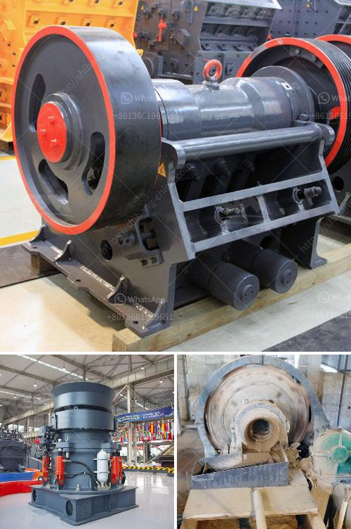

<h3>مصنعي كسارات التعدين</h3>
يعتبر قطاع التعدين من أهم القطاعات الصناعية التي تلعب دوراً حاسماً في تلبية احتياجات المجتمعات المعاصرة. فهو يعمل على استخراج المعادن القيمة والموارد الطبيعية الأخرى من باطن الأرض. ومن بين المعدات الأساسية المستخدمة في عمليات التعدين، تبرز أهمية مصنعي كسارات التعدين.

مصنعو كسارات التعدين هم الشركات المتخصصة في تصنيع وتوريد الكسارات التي تستخدم في عمليات سحق الصخور والمعادن الخام. وتعمل هذه الكسارات على تحويل المواد الصلبة إلى قطع صغيرة قابلة للتنقل والتخزين، وتستخدم في مراحل مختلفة من عملية التعدين.

تتميز كسارات التعدين بتصميمها القوي والمتين، مما يتيح لها تحمل الضغوط العالية التي تتعرض لها خلال عمليات السحق. وتعتمد تقنيات تصنيعها على التطور التكنولوجي المستمر في هذا القطاع، حيث تجهز بأحدث الأجهزة والماكينات التي تسهل عملية السحق وتحسن كفاءة الأداء.

ومن الشركات المعروفة في صناعة كسارات التعدين، نجد شركات عالمية مشهورة مثل ميتسو، وساندفيك، وتيروكس، وشركات أخرى عديدة. وتقدم هذه الشركات مجموعة واسعة من الكسارات المختلفة، التي تناسب مختلف أنواع الصخور والمواد الخام.

تتمتع كسارات التعدين بعدة فوائد، منها تقليل حجم الصخور والمواد الخام، مما يسهل عمليات تخزينها ونقلها. كما تساهم في زيادة كفاءة عمليات استخراج المعادن، حيث يتم تحسين جودة الفصل بين المعادن المتعددة بعد عملية السحق. وتسهم أيضاً في خفض التلوث البيئي، حيث يمكن إعادة تدوير بعض النفايات المتمثلة في بقايا الصخور والمواد الخام بواسطة الكسارات.

في الختام، يمثل مصنعو كسارات التعدين أهمية كبيرة في قطاع التعدين، حيث تسخدم هذه الكسارات في عمليات سحق المواد الخام وتحويلها إلى منتجات نهائية قابلة للاستخدام. وتقوم هذه الشركات بتوفير مجموعة متنوعة من الكسارات التي تلبي احتياجات الصناعة المتنوعة. وتستخدم أحدث التقنيات في تصنيعها، مما يسهم في تحسين كفاءة العمليات التعدينية والحد من التلوث البيئي.
<h3>Contact us</h3><ul><li><strong>Whatsapp:&nbsp;<a href="https://wa.me/8613661969651">+8613661969651</a></strong></li><li><a href="https://swt.shibang-china.com/?git&amp;zhl&amp;مصنعي كسارات التعدين"><strong>Online Service(chat now)</strong></a></li></ul><h3>Related</h3><ul><li><a href='مخططات تدفق لتصنيع الحديد الزهر.md'>مخططات تدفق لتصنيع الحديد الزهر</a></li><li><a href='خط إنتاج رمل السيليكا في ألمانيا.md'>خط إنتاج رمل السيليكا في ألمانيا</a></li><li><a href='سعر أحزمة الناقلات.md'>سعر أحزمة الناقلات</a></li><li><a href='تجار الكسارات المحمولة في جنوب أفريقيا.md'>تجار الكسارات المحمولة في جنوب أفريقيا</a></li><li><a href='شاشة اهتزازية للبيع في الفلبين.md'>شاشة اهتزازية للبيع في الفلبين</a></li></ul>