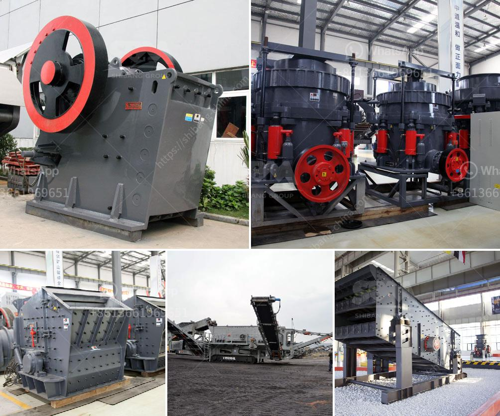

<h3>مصنعي كسارات الصدم في ألمانيا</h3>
تعد ألمانيا واحدة من الدول الرائدة في صناعة التكنولوجيا والهندسة، وتشتهر بإنتاج مجموعة واسعة من المعدات الصناعية عالية الجودة، بما في ذلك مصنعي كسارات الصدم. تتنوع هذه الكسارات من حيث الحجم والقدرات، مما يجعلها مثالية للعديد من الصناعات المختلفة.

يتم استخدام كسارات الصدم على نطاق واسع في صناعة التعدين ومواد البناء وإعادة التدوير. وبفضل التطورات التكنولوجية الحديثة، فإن الكسارات الألمانية تعتبر من أفضل الكسارات الموجودة في السوق على الإطلاق. تتميز هذه الكسارات بفعاليتها العالية في سحق المواد وكسرها إلى أحجام أصغر، بفضل تصميمها المبتكر واستخدامها لتقنيات القوة العالية.

إحدى أهم الميزات التي تميز الكسارات الصناعية الألمانية هي جودة المواد المستخدمة في تصنيعها. فهي تستخدم مواد عالية الجودة مثل الصلب المقاوم للصدأ والأكسدة، مما يجعلها قوية ومتينة وقادرة على تحمل الشروط القاسية لعمليات السحق. كما تعتمد الشركات الألمانية في تصنيع الكسارات على أحدث التقنيات والمعرفة الهندسية، مما يضمن أداءً ممتازًا وفعالية عالية.

تتميز كسارات الصدم الألمانية بتصميمها المرن والقابلية للتكيف، حيث يمكن تعديل الإعدادات وفقًا لمتطلبات العملاء ونوع المواد المسحوقة. وبفضل هذه الميزة، يمكن استخدام الكسارات الألمانية في مجموعة متنوعة من التطبيقات المختلفة، بدءًا من سحق الصخور الكبيرة في المناجم إلى إعادة تدوير الخرسانة والزجاج والأنقاض.

بالإضافة إلى ذلك، تضمن الكسارات الألمانية العاصمة الاستثمارية الجيدة لأصحاب العمل، حيث يكون تشغيلها استثمارًا ذكيًا ومربحًا على المدى الطويل. فتتميز بكفاءة استهلاك الطاقة المنخفضة وصيانتها المنخفضة التكلفة، مما يساعد على تقليل تكاليف التشغيل وزيادة الربحية.

بالنظر إلى هذه المميزات والمزايا، لا عجب أن الكسارات الألمانية حازت على شهرة عالمية. تستدل العديد من الشركات حول العالم على مصنعي كسارات الصدم في ألمانيا، للحصول على منتجات ذات جودة عالية وتقنيات متقدمة.

باختصار، تتفوق الكسارات الصناعية المصنعة في ألمانيا على معايير الجودة والأداء. فهي تجمع بين التصميم المبتكر والتكنولوجيا المتطورة، مما يجعلها خيارًا مثاليًا لعمليات السحق في مختلف الصناعات. إذا كنت تبحث عن كسارة صدم فعالة مع ضمان الجودة، فإن الكسارات الألمانية هي الخيار الأمثل.
<h3>Contact us</h3><ul><li><strong>Whatsapp:&nbsp;<a href="https://wa.me/8613661969651">+8613661969651</a></strong></li><li><a href="https://swt.shibang-china.com/?git&amp;zhl&amp;مصنعي كسارات الصدم في ألمانيا"><strong>Online Service(chat now)</strong></a></li></ul><h3>Related</h3><ul><li><a href='كسارة صخور صغيرة.md'>كسارة صخور صغيرة</a></li><li><a href='كسارات الحجر والرمل المحمولة على نطاق صغير.md'>كسارات الحجر والرمل المحمولة على نطاق صغير</a></li><li><a href='كسارة الحجر المحمولة للبيع في الفلبين.md'>كسارة الحجر المحمولة للبيع في الفلبين</a></li><li><a href='تعدين المحاجر ومعدات البناء.md'>تعدين المحاجر ومعدات البناء</a></li><li><a href='كسارات الحجر في نيجيريا.md'>كسارات الحجر في نيجيريا</a></li></ul>