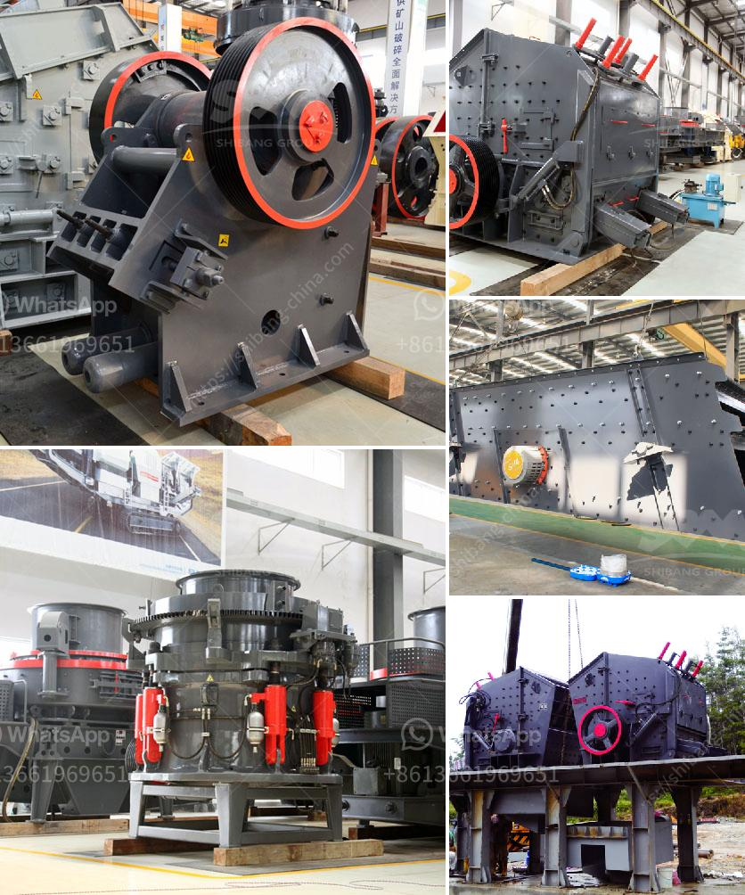

<h3>مصنعي مطحنة عمودية</h3>
المطاحن العمودية أو المطاحن الرأسية هي نوع من المعدات الصناعية المستخدمة في صناعة السميد والدقيق. تعتبر هذه المطاحن من أحدث التقنيات في مجال الطحن، وتغني عن استخدام المطاحن التقليدية التي تستهلك الكثير من الطاقة وتحتاج إلى صيانة دورية.

يعتبر اختيار مصنع المطحنة العمودية من أهم الأمور في عملية إنتاج السميد والدقيق عالي الجودة. هناك العديد من الشركات المصنعة للمطاحن العمودية حول العالم، وكل شركة لديها خصائصها ومزاياها الخاصة.

تقدم مصنعي المطاحن العمودية أجهزة متطورة تعتمد على تقنيات عالية الكفاءة والأداء. تتميز هذه المطاحن بعدة ميزات تجعلها تتفوق على المطاحن التقليدية. فمن أهم هذه الخصائص:

1. كفاءة عالية: توفر المطاحن العمودية عملية طحن فعالة وسريعة، مما يساهم في زيادة إنتاجية المصنع وتقليل تكلفة العمل.

2. استهلاك منخفض للطاقة: تتميز المطاحن العمودية بكفاءة عالية في استخدام الطاقة، مما يساهم في توفير تكاليف التشغيل والصيانة.

3. جودة المنتج النهائي: يعمل المصنعون على تطوير تقنيات خاصة لضمان جودة المنتج النهائي، حيث يمتاز السميد والدقيق المنتج بالنعومة والتوحيد.

4. سهولة الصيانة: تم تصميم المطاحن العمودية لتسهيل عمليات الصيانة والتنظيف، مما يقلل من توقف المصنع ويعزز كفاءة الإنتاج.

5. دقة التحكم: توفر المصانع التحكم الآلي والدقيق في عملية الطحن، مما يعزز دقة الإنتاج ويقلل من الهدر.

من المهم تحديد الاحتياجات والمتطلبات الخاصة للمصنع قبل شراء مطحنة عمودية. يجب أخذ العديد من العوامل في الاعتبار، مثل سعة الإنتاج، نوعية المنتج النهائي، تكلفة الاستثمار اللازمة، وغيرها. هذا سيساعد في اختيار المورد المناسب الذي يلبي احتياجات ومتطلبات المصنع بشكل أفضل.

بالاختيار الجيد لمصنع المطحنة العمودية واختيار التقنيات المناسبة، يمكن للمصانع تحقيق إنتاجية عالية وجودة منتج ممتاز، وتحسين توافر الآلات وكفاءة العمل.
<h3>Contact us</h3><ul><li><strong>Whatsapp:&nbsp;<a href="https://wa.me/8613661969651">+8613661969651</a></strong></li><li><a href="https://swt.shibang-china.com/?git&amp;zhl&amp;مصنعي مطحنة عمودية"><strong>Online Service(chat now)</strong></a></li></ul><h3>Related</h3><ul><li><a href='معالجة الذهب بنطاق صغير باستخدام طريقة CIP.md'>معالجة الذهب بنطاق صغير باستخدام طريقة CIP</a></li><li><a href='أفضل علامات تجارية للآلات في المحجر.md'>أفضل علامات تجارية للآلات في المحجر</a></li><li><a href='مصنع كسارة الحجر والجرانيت.md'>مصنع كسارة الحجر والجرانيت</a></li><li><a href='كسارة مخروطية بسعة 100 طن في الساعة.md'>كسارة مخروطية بسعة 100 طن في الساعة</a></li><li><a href='مصنع استخراج النحاس الصغير.md'>مصنع استخراج النحاس الصغير</a></li></ul>