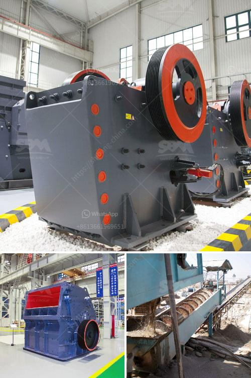

<h3>مصنعين كسارات في روسيا</h3>
تُعد روسيا من أكبر البلدان في العالم من حيث المساحة، وتمتلك تاريخاً طويلاً في صناعة المعدات الثقيلة بما في ذلك مصانع الكسارات. تعتبر ثروات روسيا الطبيعية والثروة المعدنية من أعلى الكميات في العالم، مما يدفع الحاجة إلى مصانع كسارات ذات تقنيات عالية لاستخراج وتجهيز هذه الثروات.

يُعد مصنع "Uralmashzavod" في مدينة إيكاترينبورغ واحدًا من أقدم مصانع الكسارات في روسيا. تأسس هذا المصنع في عام 1933، وهو معروف بتقديم تشكيلة واسعة من المعدات الثقيلة والكسارات عالية الجودة. تشمل المنتجات المصنعة محطات الكسارات المتنقلة والكسارات الفكية والمخروطية والصدمية، وتغطي القدرات المختلفة لتناسب متطلبات صناعة التعدين.

أيضًا، تمتلك روسيا مصنع "Stroydormash" في مدينة سانت بطرسبرغ، وهو متخصص في تصنيع معدات الكسارات وتكسير الصخور. يقدم المصنع مجموعة واسعة من المنتجات بما في ذلك الكسارات المختلفة والشاشات الاهتزازية وآلات تكسير الحجارة. مصنع "Stromashina" في مدينة سامارا هو مصنع آخر يتخصص في تصنيع وإنتاج معدات الكسارات وتكسير الصخور. يعمل المصنع في هذا المجال منذ عام 1942 وقد حصل على سمعة جيدة في توفير المعدات المتطورة عالية الجودة لصناعة التعدين.

كما يستحق مصنع "Mekhanobr-Tekhnika" في سانت بطرسبرغ الذكر، فهو واحد من أكبر مصنعي الكسارات في روسيا. يتمتع هذا المصنع بتقنيات حديثة وآلات متطورة تسمح بتصنيع مجموعة واسعة من المنتجات بجودة عالية. يتعاون المصنع مع عملائه في تطوير حلول مخصصة لتلبية احتياجاتهم الفردية.

بفضل هذه الشركات والعديد من المصانع الأخرى في روسيا، تستطيع الصناعة المحلية تلبية الاحتياجات المتنامية لقطاع التعدين والبناء في البلاد. بفضل توفر الثروات الطبيعية المعدنية الهائلة في روسيا، يعتبر قطاع صناعة الكسارات في البلاد مزدهرًا، مما يساهم في النمو الاقتصادي وتوفير فرص عمل للسكان المحليين.
<h3>Contact us</h3><ul><li><strong>Whatsapp:&nbsp;<a href="https://wa.me/8613661969651">+8613661969651</a></strong></li><li><a href="https://swt.shibang-china.com/?git&amp;zhl&amp;مصنعين كسارات في روسيا"><strong>Online Service(chat now)</strong></a></li></ul><h3>Related</h3><ul><li><a href='آلة سحق الحجر المحمولة.md'>آلة سحق الحجر المحمولة</a></li><li><a href='موردين لسحق الصخور في بريتوريا.md'>موردين لسحق الصخور في بريتوريا</a></li><li><a href='تكلفة حزام الناقل للتعدين.md'>تكلفة حزام الناقل للتعدين</a></li><li><a href='كسارة تأثير VSI.md'>كسارة تأثير VSI</a></li><li><a href='مصنع معالجة الحجر الجيري المحمول.md'>مصنع معالجة الحجر الجيري المحمول</a></li></ul>