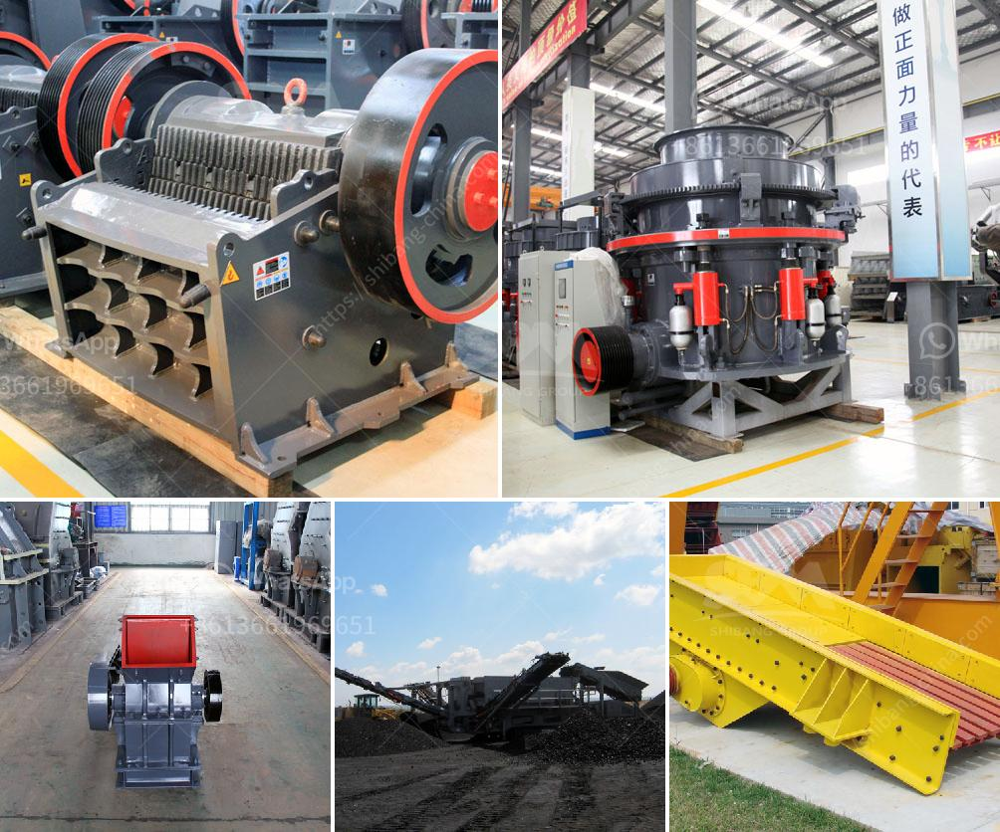

<h3>مصنعين للكسارات المتنقلة</h3>
تعتبر الكسارات المتنقلة أدوات حاسمة في صناعة البناء والتعدين، حيث تساهم في تكسير وسحق المواد الصلبة مثل الحجر والخرسانة والمعادن. وتعتبر هذه الكسارات متنقلة بحكم قدرتها على الانتقال بين المواقع بسهولة، وهو ما يجعلها مناسبة للاستخدام في مشاريع البناء الكبيرة التي تحتاج إلى تكسير المواد في أماكن مختلفة.

هناك العديد من الشركات المصنعة للكسارات المتنقلة في السوق. يتميز كل مصنع بمزاياه الفريدة التي تجعلها مفضلة لدى المستخدمين. بعضها يركز على تصنيع كسارات صلبة وقوية، في حين يركز الآخرون على استخدام أحدث التقنيات والابتكارات الهندسية.

للمصنعين الناجحين في هذا القطاع، تتحقق تحسينات مستمرة في الأداء والجودة. على سبيل المثال، بعض الشركات تعمل على زيادة سعة الإنتاج وفعالية الطاقة للكسارات المتنقلة، بينما تعمل الأخرى على تصميم نماذج جديدة تضم مميزات مبتكرة تسهم في تقليل الضوضاء والاهتزاز وتحسين سلامة المشغلين. كما أن بعض المصنعين يركز على توفير كسارات صغيرة الحجم وخفيفة الوزن للعمليات الصغيرة والمشاريع ذات الوصول المحدود.

يضع المصنعون أيضًا تركيزًا كبيرًا على استخدام التكنولوجيا الرقمية والأتمتة في تصميم وتشغيل الكسارات المتنقلة. تساهم هذه التقنيات في تحسين كفاءة التشغيل وتقليل التكاليف فيما يتعلق بالصيانة والإصلاح، وتوفير بيئة عمل أكثر أمانًا.

يعمل المصنعون أيضًا على تصميم الكسارات المتنقلة بشكل مرن وسهولة الاستخدام. تتميز بعض الكسارات بأنها يمكن توجيهها وتحريكها بسهولة، مما يجعلها قادرة على الوصول إلى الأماكن الضيقة. تأتي بعض الطرازات مع أنظمة تحكم عن بُعد، مما يسهل عملية التشغيل ويزيد من أمان المشغلين.

في النهاية، تجده في السوق العديد من المصنعين المتخصصين في تصنيع الكسارات المتنقلة. إن اختيار المصنع المناسب يعتمد على احتياجات المشروع ومفضلات المستخدم. يجب البحث والاستفسار عن استجابة المصنعين لمتطلبات الجودة والأداء والخدمات التقنية وأيضًا قدرتهم على تقديم الدعم الفني.
<h3>Contact us</h3><ul><li><strong>Whatsapp:&nbsp;<a href="https://wa.me/8613661969651">+8613661969651</a></strong></li><li><a href="https://swt.shibang-china.com/?git&amp;zhl&amp;مصنعين للكسارات المتنقلة"><strong>Online Service(chat now)</strong></a></li></ul><h3>Related</h3><ul><li><a href='شركة تصنيع معدات تعدين الذهب في الصين.md'>شركة تصنيع معدات تعدين الذهب في الصين</a></li><li><a href='متطلبات أعمال مصنع الكسارة في باكستان.md'>متطلبات أعمال مصنع الكسارة في باكستان</a></li><li><a href='كسارة الفك المزدوجة بسعة 10 طن في الساعة.md'>كسارة الفك المزدوجة بسعة 10 طن في الساعة</a></li><li><a href='مجفف رمل مستعمل للبيع.md'>مجفف رمل مستعمل للبيع</a></li><li><a href='مصنع كسارة الفك في ولاية جوجارات الهند.md'>مصنع كسارة الفك في ولاية جوجارات الهند</a></li></ul>