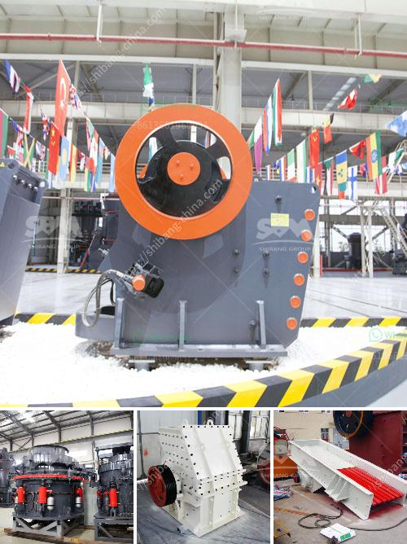

<h3>مصنعين لمصانع الأسمنت في الهند</h3>
تُعد الهند واحدة من أكبر الأسواق لمصانع الأسمنت في العالم، حيث تحتل المرتبة الثانية بعد الصين في إنتاج الأسمنت. تعد صناعة الأسمنت في الهند من القطاعات الاقتصادية الرئيسية والمهمة، حيث تساهم بشكل كبير في النمو الاقتصادي وتوفير فرص العمل للملايين من العمال.

تسعى الهند إلى استخدام التكنولوجيا الحديثة وتحسين عملياتها الصناعية لزيادة إنتاجية المصانع وتحقيق التنمية المستدامة. توجد العديد من الشركات الهندية المعروفة في قطاع صناعة الأسمنت، مثل شركة "أمبوجا سيمنت" و "أولترا تكنو لوجيستك" و "لافارج هولسيم" و "شركة دالميا سيمنت" و "شركة شرق الهند سيمنت".

تعمل شركة "أمبوجا سيمنت" في الهند منذ عقود، وهي واحدة من أكبر الشركات المصنعة للأسمنت في البلاد. تقدم الشركة أسمنت عالي الجودة ومتنوع، وتضم مصانعها أحدث التقنيات والمعدات لضمان جودة المنتجات. وتسعى الشركة إلى توفير المزيد من فرص العمل وتدريب الموظفين على المهارات الحديثة في صناعة الأسمنت.

أيضًا، تعتبر شركة "أولترا تكنو لوجيستك" واحدة من الشركات الرائدة في مجال تصنيع الأسمنت في الهند. تهدف الشركة إلى تعزيز قدراتها التصنيعية وتعزيز الابتكار في صناعة الأسمنت من خلال التحديث المستمر للتكنولوجيا وتحسين العمليات.

من جهة أخرى، تمتلك شركة "لافارج هولسيم" الفرنسية استثمارات في عدة مصانع للأسمنت بالهند. تعتبر الشركة من أكبر اللاعبين الدوليين في صناعة الأسمنت، وتعمل على تطوير وتحسين معايير الاستدامة والبيئة في عملياتها.

تعمل شركة "شرق الهند سيمنت" على تصنيع الأسمنت منذ عدة عقود، ويتميز منتجها بالجودة والمتانة. تعتبر الشركة أحد الأعمدة الرئيسية في صناعة الأسمنت في الشمال الهندي، وتركز على توفير حلول بناء مستدامة ومواد بناء ذات جودة عالية.

في النهاية، تلعب مصانع الأسمنت الهندية دورًا حاسمًا في تلبية احتياجات البنية التحتية والتنمية الاقتصادية في الهند، بالإضافة إلى توفير فرص العمل والاستثمار في هذا القطاع. تحرص الشركات المصنعة للأسمنت على تقديم منتجات ذات جودة عالية والاستثمار في البحث والتطوير وتكنولوجيا الإنتاج لتحقيق التنمية المستدامة والمستدامة في صناعة الأسمنت في الهند.
<h3>Contact us</h3><ul><li><strong>Whatsapp:&nbsp;<a href="https://wa.me/8613661969651">+8613661969651</a></strong></li><li><a href="https://swt.shibang-china.com/?git&amp;zhl&amp;مصنعين لمصانع الأسمنت في الهند"><strong>Online Service(chat now)</strong></a></li></ul><h3>Related</h3><ul><li><a href='آلة تصنيع الرمل M.md'>آلة تصنيع الرمل M</a></li><li><a href='آلات معالجة الأحجار الكريمة لإثيوبيا.md'>آلات معالجة الأحجار الكريمة لإثيوبيا</a></li><li><a href='مطحنة صخرة الرخام.md'>مطحنة صخرة الرخام</a></li><li><a href='كسارة المطرقة بسعة ١٠ طن في الساعة وحجمها.md'>كسارة المطرقة بسعة ١٠ طن في الساعة وحجمها</a></li><li><a href='معدات طحن مطحنة ريموند.md'>معدات طحن مطحنة ريموند</a></li></ul>