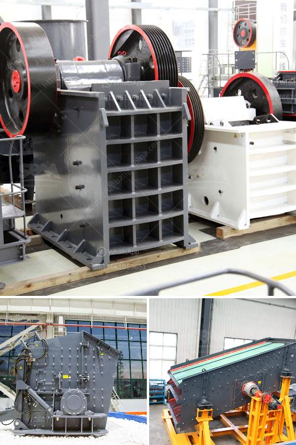

<h3>مصنعين محطم في جنوب أفريقيا</h3>
تعتبر جنوب أفريقيا واحدة من الدول النامية التي تعاني من العديد من التحديات الاقتصادية والاجتماعية. وعلى الرغم من التقدم الذي حققته في السنوات الأخيرة في مجال التصنيع والإنتاج الصناعي، إلا أنها لا تزال تفتقر إلى مصانع محطمة كافية.

إن مصانع النفايات والتدمير الصناعي مهمة جداً في التخلص من النفايات الصلبة والسوائل الضارة. فهي تساهم في حماية البيئة والصحة العامة، كما تعد مصدرًا مهمًا للعمل وتنمية الاقتصاد في المنطقة.

إلا أن، من المؤسف أن جنوب أفريقيا تفتقر إلى عدد كافٍ من هذه المصانع. فالنفايات والمواد الضارة غالباً ما يتم تجميعها في مكمنات غير ملائمة وتهديد البيئة وصحة المجتمعات المحيطة. هذا يعرض الأفراد للعديد من المخاطر، بما في ذلك التلوث الجوي وتلوث المياه وتأثيرات صحية سلبية أخرى.

واقتصادياً، فإن جنوب أفريقيا تعتبر واحدة من الدول النامية التي بحاجة إلى توسيع قاعدة صناعتها وتحسين قدرتها التنافسية. توفير مصانع محطمة في البلاد سيعزز النمو الاقتصادي ويساهم في إحداث تنمية مستدامة على المدى الطويل.

تتطلب إنشاء مصانع محطمة في جنوب أفريقيا تعاونًا بين القطاع العام والقطاع الخاص. يجب على الحكومة توفير الدعم والتشريعات اللازمة لجذب الاستثمارات وتشجيع المصانع على العمل في البلاد. كما يجب على الشركات المهتمة بالتصنيع أن تدرس الفرص المتاحة في جنوب أفريقيا وتستثمر في هذا القطاع المحوري.

يجب أيضًا على الحكومة أن تعمل على تحسين البنية التحتية وتوفير بيئة تشجيعية للصناعة. يعتبر التدريب والتطوير المهني للعمالة المحلية أيضًا أمرًا ضروريًا. فبتوفير الكفاءات والمهارات اللازمة، يمكن للمصانع المحطمة أن تعمل بكفاءة وتحقق المزيد من الإنتاجية.

وفي الختام، يمكن القول إن جنوب أفريقيا بحاجة ماسة إلى مزيد من المصانع المحطمة للتعامل مع مشكلة النفايات وتحقيق التنمية الاقتصادية. يجب على الحكومة والشركات الاستثمار في هذا القطاع الحيوي للبلاد، وتوفير الدعم والتشريعيات اللازمة لتطويره. إن تطوير قدرات العمالة المحلية وتحسين البنية التحتية يعدان أيضًا أمورًا حيوية لتحقيق نمو مستدام وازدهار للاقتصاد الجنوب أفريقي.
<h3>Contact us</h3><ul><li><strong>Whatsapp:&nbsp;<a href="https://wa.me/8613661969651">+8613661969651</a></strong></li><li><a href="https://swt.shibang-china.com/?git&amp;zhl&amp;مصنعين محطم في جنوب أفريقيا"><strong>Online Service(chat now)</strong></a></li></ul><h3>Related</h3><ul><li><a href='خط إنتاج الجرانيت.md'>خط إنتاج الجرانيت</a></li><li><a href='مغذي اهتزازي لخام السنتر.md'>مغذي اهتزازي لخام السنتر</a></li><li><a href='آلة مطحنة الكرة في الصين.md'>آلة مطحنة الكرة في الصين</a></li><li><a href='معدات غسيل الباريت.md'>معدات غسيل الباريت</a></li><li><a href='كسارة في أنتيوكيا، كولومبيا.md'>كسارة في أنتيوكيا، كولومبيا</a></li></ul>