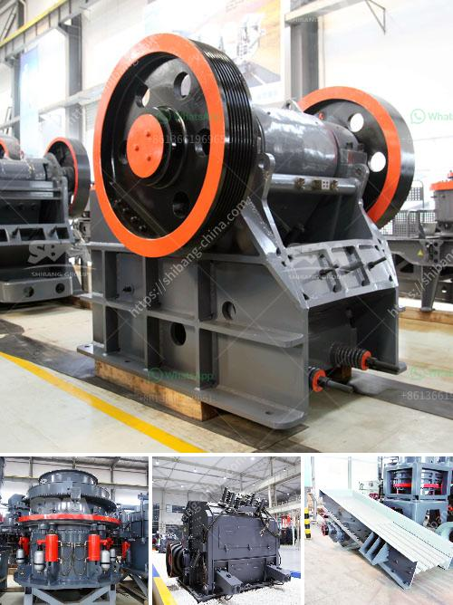

<h3>مطاحن الأسطوانات في الدول</h3>
تعتبر مطاحن الأسطوانات من الأدوات المهمة في صناعة الطحين، حيث تستخدم لطحن الحبوب إلى مسحوق ناعم يستخدم في إنتاج الخبز والمعجنات والمنتجات الحبوبية الأخرى. وقد تطورت هذه المطاحن على مر العصور وأصبحت تعتمد على التكنولوجيا الحديثة.

تعتبر مطاحن الأسطوانات صخورًا مسطحة وطويلة تدور ببطء في اتجاه معاكس، ويتم وضع الحبوب بين هذه الأسطوانات ليتم سحقها وتكسيرها. وعندما تمر هذه الحبوب بين الأسطوانات، يتم تفتيتها إلى قطع صغيرة تعرف بالطحين.

تتميز مطاحن الأسطوانات بعدة ميزات. فتصميمها يتيح تحكمًا أفضل في عملية الطحن وبالتالي جودة الطحين الناتج. كما تعمل بكفاءة عالية وبسرعة متناسقة، مما يسهم في زيادة الإنتاجية. وبفضل استخدام التكنولوجيا الحديثة، فإن هذه المطاحن تتمتع بوظائف ذكية مثل التحكم في درجة الحرارة وسرعة الأسطوانات، مما يضمن تحقيق أفضل النتائج.

تستخدم مطاحن الأسطوانات على نطاق واسع في دول العالم، خاصة في الدول التي يتم فيها إنتاج الحبوب بكميات كبيرة مثل الصين والهند والولايات المتحدة وروسيا. فهذه المطاحن تعتبر جزءًا أساسيًا من سلسلة إنتاج الغذاء في هذه الدول. ومن المهم أيضًا أنظمة طحن مشابهة تستخدم في تحويل الحبوب الخام إلى منتجات أخرى مثل العلف لتربية الحيوانات.

بالإضافة إلى ذلك، تسهم مطاحن الأسطوانات في تحسين جودة الطحين المنتج، حيث يتم تحديد طحن الحبوب ونسبة الضرر الذي تعانيه الحبوب قبل الطحن. وهذا يؤدي إلى إنتاج طحين أكثر جودة وخلو من الشوائب.

إن مطاحن الأسطوانات تعتبر تكنولوجيا مهمة وحديثة في صناعة الطحين، وتسهم في تلبية احتياجات العالم المتزايدة من المنتجات الحبوبية الجودة. وبالنظر إلى التطور المستمر في التكنولوجيا، يمكننا أن نتوقع المزيد من التحسينات في مجال مطاحن الأسطوانات القادمة.
<h3>Contact us</h3><ul><li><strong>Whatsapp:&nbsp;<a href="https://wa.me/8613661969651">+8613661969651</a></strong></li><li><a href="https://swt.shibang-china.com/?git&amp;zhl&amp;مطاحن الأسطوانات في الدول"><strong>Online Service(chat now)</strong></a></li></ul><h3>Related</h3><ul><li><a href='أسعار كسارة الحجر بسعة 500 طن في الساعة.md'>أسعار كسارة الحجر بسعة 500 طن في الساعة</a></li><li><a href='كسارة الفك تيرميناتور.md'>كسارة الفك تيرميناتور</a></li><li><a href='بيع آلة مطحنة الأسطوانة.md'>بيع آلة مطحنة الأسطوانة</a></li><li><a href='غسيل الرمال الصغيرة.md'>غسيل الرمال الصغيرة</a></li><li><a href='كسارة تأثير في المملكة العربية السعودية.md'>كسارة تأثير في المملكة العربية السعودية</a></li></ul>