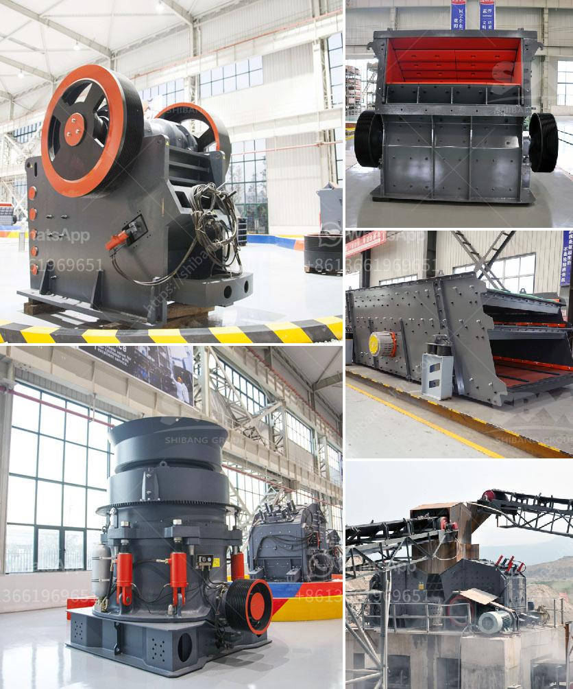

<h3>مطاحن الأسطوانة العليا للبيع</h3>
مطاحن الأسطوانة العليا هي أدوات أساسية في صناعة الطحين والعديد من الصناعات الأخرى التي تعتمد على طحن المواد الخام. تعد هذه المطاحن ضرورية لتحقيق جودة عالية وإنتاجية كبيرة في صناعة الطحن. وعند البحث عن مطاحن الأسطوانة العليا للبيع، يمكن أن تكون هناك العديد من الخيارات المتاحة.

تتميز مطاحن الأسطوانة العليا بأنها تتكون من اثنين أو ثلاثة أسطوانات ضخمة متساوية الحجم ومصنوعة من الصلب المقاوم للصدأ. تعتمد عملية الطحن على مرور المواد الخام بين هذه الأسطوانات والضغط العالي المفروض عليها، مما يؤدي إلى تفتيت المواد إلى جزيئات أصغر.

تتوفر مطاحن الأسطوانة العليا في مجموعة متنوعة من الأحجام والقدرات، حيث يمكن العثور على مطاحن صغيرة تناسب الحاجة الشخصية ومطاحن كبيرة تستخدم في المصانع الكبيرة. بعض هذه المطاحن تأتي مع نظام تبريد المياه للحفاظ على درجة حرارة المطحنة، بينما تعتمد البعض الآخر على تقنيات التشحيم المتقدمة.

يتم استخدام مطاحن الأسطوانة العليا في صناعة الطحين لتطحين مختلف أنواع الحبوب مثل القمح والشعير والذرة. تحظى هذه المطاحن بشعبية كبيرة بسبب قدرتها على إنتاج طحين عالي الجودة وإزالة الشوائب بفعالية. بالإضافة إلى ذلك، تعتبر هذه المطاحن سهلة الاستخدام وتوفر إمكانية التحكم في درجة الطحن وسرعة الإنتاج.

عند البحث عن مطاحن الأسطوانة العليا للبيع، يجب مراعاة عدة عوامل. أحد هذه العوامل هو السعر، حيث تتوفر مطاحن بأسعار مختلفة تتناسب مع ميزانيتك. يجب أيضًا التحقق من نوعية المطاحن المعروضة للبيع وتقييم سمعة الشركة المصنعة. بالإضافة إلى ذلك، قد تكون المواصفات التقنية للمطاحن مهمة، مثل السعة الإنتاجية وكفاءة الطحن.

في النهاية، يمكن القول إن مطاحن الأسطوانة العليا للبيع هي أدوات حيوية في صناعة الطحين والصناعات المرتبطة به. إذا كنت ترغب في تحسين جودة طحنك وزيادة إنتاجيتك، يجب أن تنظر في شراء مطحنة أسطوانة عليا عالية الجودة والموثوقة.
<h3>Contact us</h3><ul><li><strong>Whatsapp:&nbsp;<a href="https://wa.me/8613661969651">+8613661969651</a></strong></li><li><a href="https://swt.shibang-china.com/?git&amp;zhl&amp;مطاحن الأسطوانة العليا للبيع"><strong>Online Service(chat now)</strong></a></li></ul><h3>Related</h3><ul><li><a href='كسارات لآلة إعادة التدوير في الإمارات.md'>كسارات لآلة إعادة التدوير في الإمارات</a></li><li><a href='مصنع معالجة رمل السيليكا.md'>مصنع معالجة رمل السيليكا</a></li><li><a href='مطرقة إندونيسيا للبيع.md'>مطرقة إندونيسيا للبيع</a></li><li><a href='أسعار وحدات طحن الكلنكر.md'>أسعار وحدات طحن الكلنكر</a></li><li><a href='كسارات الفك في تنزانيا.md'>كسارات الفك في تنزانيا</a></li></ul>